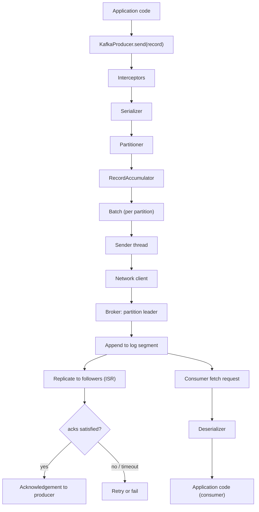

# The Kafka Mental Model

**Question this document answers:** what exactly happens between
`producer.send(record)` and a consumer receiving that record?

This is a conceptual walkthrough, not an API tutorial. Every subsequent document in
`docs/producer/`, `docs/consumer/`, `docs/replication/`, and `docs/storage/` expands
one stage of this walkthrough in depth, with Java implementations and failure
experiments. Read this first so you have a map before you get the detail.

## Why start here instead of with the API

Most Kafka tutorials start with `KafkaProducer<K, V>` and a `send()` call and treat
everything past that line as "the network." That framing produces engineers who can
write a producer but cannot explain a latency spike, a duplicate message, or a lost
record. Kafka's guarantees — ordering, durability, delivery semantics — are all
consequences of what happens in the steps below. If you understand this path, you
can derive most of Kafka's configuration surface instead of memorizing it.

## The end-to-end path

### 1. Application calls `send()`

The call is **asynchronous**. It returns a `Future<RecordMetadata>` (or invokes a
callback) immediately; it does not wait for the broker. This single fact explains
why producer throughput can be high even though each record eventually requires a
network round trip: the application is not blocked per-record. See
`docs/producer/` for `Future` vs. callback usage and why blocking on every `send()`
destroys throughput.

### 2. Interceptors and serialization

Before anything is sent, any configured `ProducerInterceptor`s run, and then the
key and value are converted from Java objects to bytes by the configured
serializers. Kafka itself only ever stores and moves bytes — it has no idea what a
"customer" or an "order" is. This is why schema governance (`docs/schema-registry/`)
is a separate, explicit concern: nothing in the broker enforces a schema unless you
build that enforcement into the serialization layer.

### 3. Partitioning

The partitioner decides which partition of the topic the record goes to. When a
key is supplied, Kafka's standard producer partitioning behavior uses the
serialized key to deterministically select a partition, which normally keeps
records sharing the same key on the same partition for as long as the topic's
partition count stays unchanged — this is what makes per-key ordering possible.
The exact algorithm behind that mapping is version-dependent and configurable;
it is examined precisely, including what changes if the topic is repartitioned,
in `docs/partitioning/` and the producer/partitioning labs rather than here. If
no key is present, records are distributed across partitions instead of being
pinned to one. See `docs/partitioning/` for why this single decision determines
your ordering guarantees, your scalability ceiling, and your exposure to hot
partitions.

### 4. Batching in the `RecordAccumulator`

The record is not sent immediately. It is appended to an in-memory batch specific
to its destination partition, buffered in the `RecordAccumulator`. A batch is sent
when it fills up (`batch.size`) or after a bounded wait (`linger.ms`), whichever
happens first. This is a deliberate latency-for-throughput trade: a small
`linger.ms` minimizes per-record latency; a larger one lets more records
accumulate into fewer, larger, more efficient (and more compressible) requests.
See `docs/producer/` for the full batching and `buffer.memory` back-pressure story.

### 5. The `Sender` thread and the network

A background `Sender` thread drains ready batches and sends them to the broker
that leads each partition. The producer maintains its own view of cluster
metadata (which broker leads which partition) and refreshes it as leadership
changes. This is why a producer can keep working across a leader election without
the application code knowing anything happened.

### 6. The broker appends to the partition leader's log

Every partition is an **append-only log** — records are only ever added at the
end, never edited in place. The leader broker appends the batch to its local log
segment (`docs/storage/`). This append is a sequential disk write, which is a large
part of why Kafka achieves throughput that random-access systems cannot: sequential
I/O is dramatically faster than random I/O on both spinning disks and, to a lesser
extent, SSDs, and the OS page cache absorbs most of the read traffic for recent
data.

### 7. Replication to the ISR

The partition's follower replicas fetch newly appended records from the leader,
the same way a consumer would. A follower that is sufficiently caught up is a
member of the **in-sync replica set (ISR)**. Durability is a function of how many
ISR members must acknowledge a write before it is considered committed —
controlled by the producer's `acks` setting together with the topic's
`min.insync.replicas`. See `docs/replication/` for exactly how the high watermark,
ISR membership, and `acks` interact, and what happens to each combination when a
broker dies mid-write.

### 8. Acknowledgement (or retry, or failure)

Once the durability condition implied by `acks` is met, the broker responds and
the producer's `Future`/callback completes successfully. If the condition is not
met in time, the producer retries (subject to `retries`, `retry.backoff.ms`, and
`delivery.timeout.ms`) or ultimately fails the record. Whether retries can
introduce duplicates — and how idempotent producers and transactions prevent
that — is covered in `docs/delivery-semantics/`.

### 9. The consumer fetches, not receives

Kafka does not push records to consumers. A `KafkaConsumer` **polls**, issuing
fetch requests for records after a given offset on each partition it is assigned.
This pull model is what allows a slow consumer to fall behind without the broker
needing to buffer per-consumer state — the broker just serves whatever offset is
requested, from the log it already has. The trade-off is that consumer lag
becomes a first-class, must-monitor concept: nothing stops a slow consumer from
falling arbitrarily far behind except retention. See `docs/consumer/`.

### 10. Fetch, position, processing, side effects, and committed offset are five different things

It is tempting to say a consumer "received" a record once `poll()` returns it.
That single word hides five distinct events that this repository treats as
separate for the rest of the curriculum, because conflating them is the single
most common source of duplicated or lost processing:

1. **Broker delivery / fetch** — the broker returned bytes at a given
   `(topic, partition, offset)` in response to a fetch request. This only
   proves the broker had the record; it says nothing about what the consumer
   does with it next.
2. **Consumer position** — the consumer's in-memory next-offset-to-fetch for
   that partition has advanced. This is local, uncommitted state, and it is
   lost if the consumer process dies before it commits anything.
3. **Application processing** — the application's `poll()` loop has run its
   business logic against the record (deserialized it, validated it, updated
   in-memory state).
4. **External / business side effect** — something outside the consumer's own
   memory changed because of this record: a database row written, a payment
   charged, an email sent, a downstream event published. This is usually what
   actually matters to the business, and Kafka has no visibility into it at
   all.
5. **Committed consumer-group offset** — the consumer has told the broker "this
   group has finished up through this offset," recorded in the internal
   `__consumer_offsets` topic. This is the only one of the five that survives
   the consumer process restarting or a rebalance moving the partition to a
   different consumer.

**Committing an offset does not prove the business operation succeeded, and
processing the business operation does not, by itself, commit the offset.**
These are two independent actions an application must deliberately order, and
the order chosen determines the failure mode on a crash:

- **process → side effect → crash before commit.** On restart (or after a
  rebalance), the group's last committed offset is still behind this record, so
  it is fetched and processed again. If the side effect is not idempotent, it
  happens twice — a **duplicate**. This is the shape of **at-least-once**
  processing.
- **commit → crash before the side effect completes.** The next consumer to own
  the partition starts fetching *after* this offset and never runs this
  record's business logic — a **skipped** business operation. This is the shape
  of **at-most-once** processing, and it is rarely what an application actually
  wants for anything that matters.

Neither ordering is "wrong" in the abstract — at-most-once can be an acceptable,
even preferable, choice where an occasional gap is cheaper than a duplicate
(some metrics or logs, for instance). What matters is that the ordering is a
deliberate choice. Precisely how to reason about and control this trade-off —
manual vs. automatic commits, idempotent producers, transactions, and
idempotent-consumer patterns — is the subject of `docs/delivery-semantics/` and
its labs; this section exists only so you have the vocabulary and the two
failure shapes in mind before you get there.

## What this model does and does not guarantee

Understanding the path above lets you derive the following without memorizing
them as separate facts:

- **Ordering** is only guaranteed within a partition, because a partition is the
  unit of both appending and fetching. Ordering across partitions is not
  meaningful — there is no global sequence.
- **Durability** is a spectrum controlled by `acks` and `min.insync.replicas`,
  not a boolean. "Kafka is durable" is not a complete sentence.
- **"Exactly-once"** describes what happens when idempotent producers and
  transactions eliminate the specific duplication windows created by retries and
  by the separation between processing and committing — it is not a property
  Kafka has by default.
- **Throughput** comes from batching, sequential I/O, and the pull model, all of
  which trade some latency and some client-side complexity to get there.

## Where to go next

- [`docs/roadmap/KAFKA_ZERO_TO_PRINCIPAL_ENGINEER.md`](../roadmap/KAFKA_ZERO_TO_PRINCIPAL_ENGINEER.md)
  for the full curriculum this document is the entry point to.
- `docs/producer/` (added in a later work package) for the producer internals in
  full depth, including the exact configuration knobs at each stage above.
- `docs/consumer/` and `docs/consumer-groups/` for the consumer side, including
  rebalancing and lag.
- `docs/storage/` for why the log/segment/index design makes Kafka fast.
- `docs/replication/` and `docs/kraft/` for how the cluster stays durable and
  agrees on metadata without a single point of failure.
