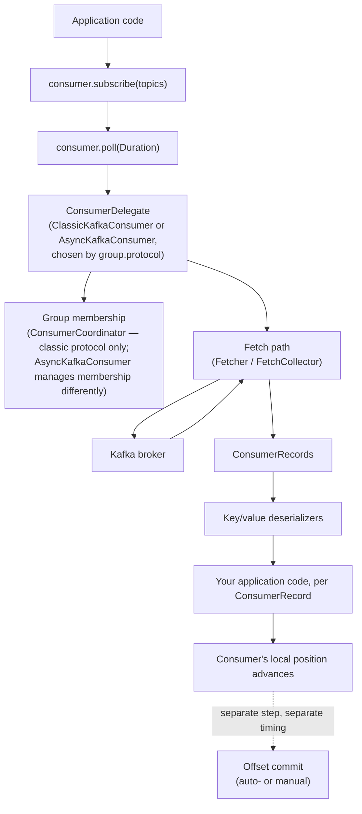

# Consumer Internals — Light Introduction

This document gives you enough of a mental model of `KafkaConsumer`'s
internal path to make sense of what
[`labs/lab-02-native-java-producer-consumer`](../../labs/lab-02-native-java-producer-consumer/README.md)
has you observe experimentally. Like its producer counterpart
([`docs/producer/PRODUCER_INTERNALS_INTRO.md`](../producer/PRODUCER_INTERNALS_INTRO.md)),
this is deliberately light — group-membership protocols, heartbeats,
rebalancing strategy, and static membership get their full treatment in
WP-05. The goal here is the shape of the pipeline, verified against real
source, not a complete internals reference.

Every class name below was confirmed against the actual
`kafka-clients:4.3.1` jar by disassembling the relevant classes. One
finding from that check is itself directly relevant to
[`docs/roadmap/PRINCIPAL_ENGINEER_FAILURE_MATRIX.md`](../roadmap/PRINCIPAL_ENGINEER_FAILURE_MATRIX.md)'s
consumer poll-interval row: `KafkaConsumer` does not contain its own logic
directly. It holds a `ConsumerDelegate`, and there are **two different,
real implementation classes** behind that interface —
`ClassicKafkaConsumer` and `AsyncKafkaConsumer` — selected based on
`group.protocol`. This is not a simplification for teaching purposes; it is
how the client is actually built, and it's exactly why that failure-matrix
row refuses to describe one fixed heartbeat/rebalance mechanism as
universal.

## The conceptual path

The dotted arrow is doing the same job here that it did in the producer
diagram: **advancing past a record and committing that you're done with it
are two different events**, on two different schedules. This is the same
distinction
[`docs/architecture/KAFKA_MENTAL_MODEL.md`](../architecture/KAFKA_MENTAL_MODEL.md#10-fetch-position-processing-side-effects-and-committed-offset-are-five-different-things)
draws out in full — this diagram is that same idea, drawn at the level of
the Java client's own moving parts.

## Walking the path

1. **`consumer.subscribe(topics)`** — tells this consumer which topics it
   wants; this alone does not fetch anything or join a group yet.
2. **`consumer.poll(Duration)`** — the one method your application calls
   in a loop. It is not "just fetch" — it is also where group membership
   is maintained (joining, rebalancing, and — depending on the protocol —
   sending or relying on heartbeats), metadata is refreshed, and previously
   fetched records are returned to your code.
3. **The delegate split** — `KafkaConsumer.poll(...)` immediately forwards
   to a `ConsumerDelegate`. Two real classes implement it:
   - **`ClassicKafkaConsumer`**, which owns a `ConsumerCoordinator` field
     and implements the traditional group-membership protocol
     (`group.protocol=classic`).
   - **`AsyncKafkaConsumer`**, implementing the newer consumer-group
     protocol (`group.protocol=consumer`, KIP-848), which manages group
     membership differently — notably, with heartbeats and session timing
     controlled server-side rather than by a client-side background
     thread.
   Which one your consumer actually runs is decided by configuration, not
   by anything visible in your application code — `KafkaConsumer`'s public
   API is identical either way.
4. **The fetch path** — internally (`Fetcher`/`FetchCollector` in the
   classic implementation), the client issues fetch requests for the
   partitions it's assigned, at the offsets it's currently positioned at,
   and assembles the results into the `ConsumerRecords` batch `poll()`
   returns to you.
5. **Deserialization** — the configured key/value `Deserializer`s convert
   the raw bytes the broker returned back into your application's types,
   the mirror image of the producer's serialization step.
6. **Your processing loop** — for each `ConsumerRecord`, your code runs.
   This is where a business side effect (a database write, an email, a
   charge) would happen in a real consumer — see
   [`ConsumerApp`](../../labs/lab-02-native-java-producer-consumer/src/main/java/com/kafkalab/nativeclient/consumer/ConsumerApp.java)'s
   comments for why this step completing successfully is not the same
   event as the offset being committed.
7. **Position vs. committed offset** — the consumer's local *position*
   (the next offset it will fetch) advances as records are returned by
   `poll()`, regardless of whether your processing loop has actually
   finished with them. The *committed offset* — what the broker's
   `__consumer_offsets` topic remembers for this group — only changes when
   a commit, automatic or manual, actually happens. For automatic commits
   under the classic group-protocol implementation, that happens as a side
   effect of *this consumer's own thread calling `poll()`* once the
   configured interval has elapsed — not from an independent,
   application-unaware timer that fires on its own regardless of whether
   this consumer is doing anything (verified against the
   `kafka-clients:4.3.1` source; see
   [`ConsumerApp`](../../labs/lab-02-native-java-producer-consumer/src/main/java/com/kafkalab/nativeclient/consumer/ConsumerApp.java)'s
   comments for the full mechanics and the two opposite-direction risks
   this creates). **Never treat position and committed offset as the same
   value.**

## The four things this document keeps separate

Reinforcing the mental model's distinction in Java-client terms:

| Term | What it actually is |
|---|---|
| `ConsumerRecord.offset()` | This one record's fixed position in its partition. Never changes. |
| Consumer position (`consumer.position(partition)`) | This consumer instance's own next-offset-to-fetch. Local, in-memory, lost on restart unless recovered from a commit. |
| Committed offset (`consumer.committed(...)`) | What the broker remembers for this *group* as "done through here." Survives restarts and rebalances. |
| Business side effect | Whatever your processing loop actually did with the record. Kafka has no visibility into this at all. |

## What this does and does not cover

This introduction does not explain heartbeat intervals, session timeouts,
rebalance listeners in depth, static membership, or exactly how
`ClassicKafkaConsumer` and `AsyncKafkaConsumer` differ operationally under
failure — that full treatment, verified experimentally against this
repository's pinned client version, is WP-05's job
(`docs/consumer-groups/`). What you should take from this document is
narrower: `poll()` is not a simple fetch call, there are genuinely two
different implementations behind the same public API, and position ≠
committed offset ≠ business side effect.

## Where to look yourself

Clone [`apache/kafka`](https://github.com/apache/kafka) (see
[`REFERENCE_REPOSITORIES.md`](../references/REFERENCE_REPOSITORIES.md)),
check out the tag matching this repository's pinned client version, and
start at
`clients/src/main/java/org/apache/kafka/clients/consumer/KafkaConsumer.java`
— follow the `delegate` field into `internals/ClassicKafkaConsumer.java`
and `internals/AsyncKafkaConsumer.java` to see the two implementations
firsthand.
