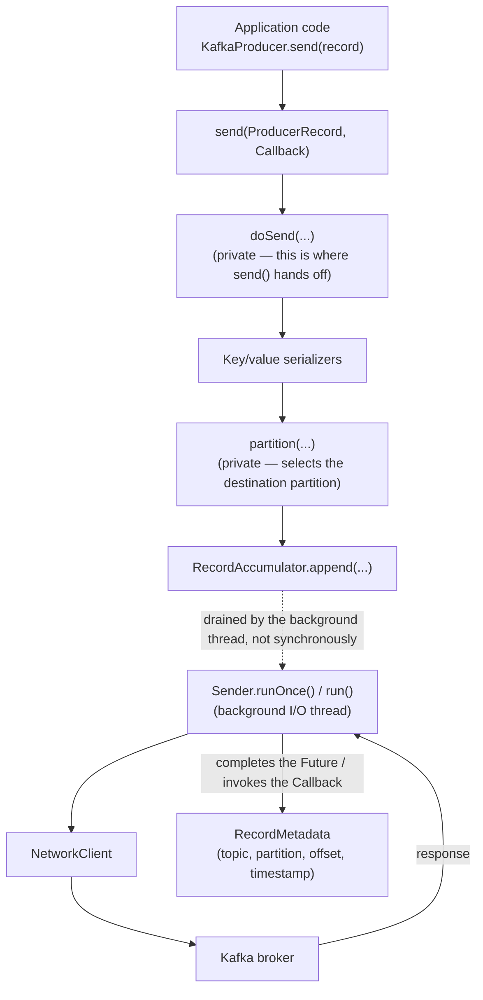

# Producer Internals — Light Introduction

This document gives you enough of a mental model of `KafkaProducer`'s
internal path to make sense of what
[`labs/lab-02-native-java-producer-consumer`](../../labs/lab-02-native-java-producer-consumer/README.md)
has you observe experimentally. It deliberately stops short of a full
producer-internals deep dive — batching configuration
(`batch.size`/`linger.ms`), `buffer.memory` back-pressure, and the full
retry/idempotence story are later-work-package topics (see the roadmap's
Level 2 and "client resilience engineering" topics). The goal here is
narrower: know the *shape* of the pipeline well enough that later, deeper
material has something to attach to.

Every class and method name below was verified against the actual
`kafka-clients:4.3.1` jar (the version this repository pins) by
disassembling the relevant classes, not copied from a tutorial or an
older version's source. Kafka's internal package layout is not a public
API and can change between releases — re-verify before trusting any of
these names against a different version.

## The conceptual path



The dotted arrow is the single most important detail in this diagram: your
application thread's call into `send()` returns after the record is
buffered in the `RecordAccumulator` — it does **not** wait for the `Sender`
thread to drain that buffer, talk to the broker, and get a response. That
happens later, on a different thread, which is exactly why `send()` gives
you back a `Future`/invokes a `Callback` instead of a `RecordMetadata`
directly. See
[`docs/architecture/KAFKA_MENTAL_MODEL.md`](../architecture/KAFKA_MENTAL_MODEL.md)
for the fuller version of this story that also covers what happens on the
broker and replica side once the `Sender` thread's request arrives.

## Walking the path

1. **`KafkaProducer.send(ProducerRecord, Callback)`** — the only method your
   application code calls. It has two public overloads (with and without a
   `Callback`); both delegate to a private `doSend(...)` method, which is
   where the actual work described below happens.
2. **Serialization** — the configured key and value `Serializer`s convert
   your Java objects to bytes before anything else happens. Kafka's broker
   never sees your `String`/`Long`/whatever type; it only ever sees bytes.
3. **Partition selection** — a private `partition(...)` method decides
   which partition of the topic this record goes to (using the configured
   `Partitioner`, the record's key if present, and current cluster
   metadata). This is the step [`lab-02`'s key-affinity and null-key
   experiments](../../labs/lab-02-native-java-producer-consumer/README.md)
   are built to make you observe directly rather than take on faith.
4. **Buffering — `RecordAccumulator.append(...)`** — the serialized record
   is appended into an in-memory batch for its destination partition. This
   call returning does not mean the record has gone anywhere near the
   network yet.
5. **The background sender thread — `Sender.runOnce()` (driven by
   `Sender.run()`)** — a dedicated I/O thread continuously drains
   ready batches from the accumulator and sends them to the appropriate
   broker via the client's `NetworkClient`. This is the thread that
   actually talks to Kafka; your application thread has already moved on
   by the time this runs for any given record.
6. **The broker responds; the `Future`/`Callback` completes** — once the
   broker's response comes back (whatever that implies given the
   configured `acks`), the `Sender` thread completes the record's `Future`
   and invokes its `Callback` with a `RecordMetadata` (success) or an
   `Exception` (failure). This is the earliest point at which your
   application can know anything concrete about what happened to this
   specific record — which is exactly why
   [`ProducerBasicApp`](../../labs/lab-02-native-java-producer-consumer/src/main/java/com/kafkalab/nativeclient/producer/ProducerBasicApp.java)
   prints `(topic, partition, offset)` from inside the callback, never from
   the line that called `send()`.

## What this does and does not cover

This introduction does not explain: how `batch.size`/`linger.ms` decide
*when* the accumulator's batches become "ready" for the sender, what
`buffer.memory` back-pressure looks like when the accumulator fills up,
how the `Partitioner`'s default implementation actually picks a partition,
or how idempotence/transactions change what "the broker responds" means.
Those all belong to later work packages (WP-04's partitioning lab, and the
delivery-semantics/transactions work in WP-08) — this document exists only
to establish the pipeline's shape.

## Source-reading exercise

> **Question:** Where in Apache Kafka's Java client does a producer record
> transition from application-facing `KafkaProducer.send()` into Kafka's
> internal send/buffering pipeline?

Work through this yourself before reading the answer below — the value is
in navigating the source, not in the specific line numbers.

```text
Question
   ↓
Where does KafkaProducer.send() actually hand off to internal machinery?
   ↓
Repository / module
   ↓
apache/kafka, clients module: org.apache.kafka.clients.producer
   ↓
Relevant class / method (verified against kafka-clients:4.3.1)
   ↓
KafkaProducer.send(ProducerRecord, Callback) — both public send() overloads
delegate to a private method, doSend(ProducerRecord, Callback). doSend is
where serialization, partition selection (a private partition(...) method),
and the handoff into org.apache.kafka.clients.producer.internals
.RecordAccumulator#append(...) all happen, in that order, before send()'s
caller ever gets control back.
   ↓
Call-path summary
   ↓
send() -> doSend() -> [serialize key/value] -> partition(...) ->
RecordAccumulator.append(...) -> (returns to caller here) -> ... later,
independently ... -> Sender.runOnce() drains the accumulator and talks to
the broker via NetworkClient -> the Future/Callback this call originally
received is completed once the broker responds.
   ↓
Relationship to observed lab behavior
   ↓
This is exactly why lab-02's ProducerBasicApp prints "send() returned" and
then, moments later and out of strict order relative to other sends, prints
each callback's (topic, partition, offset) — those two print statements are
on opposite sides of the accumulator hand-off described above, running on
two different threads.
   ↓
Write down what you found
   ↓
(Your own notes — the point of this exercise is doing it yourself, ideally
against the actual apache/kafka source tree at the tag matching 4.3.1, not
memorizing this page's summary of it.)
```

Where to actually look, if you want to do this yourself: clone
[`apache/kafka`](https://github.com/apache/kafka) (see
[`REFERENCE_REPOSITORIES.md`](../references/REFERENCE_REPOSITORIES.md)),
check out the tag matching this repository's pinned client version, and
open `clients/src/main/java/org/apache/kafka/clients/producer/KafkaProducer.java`.
