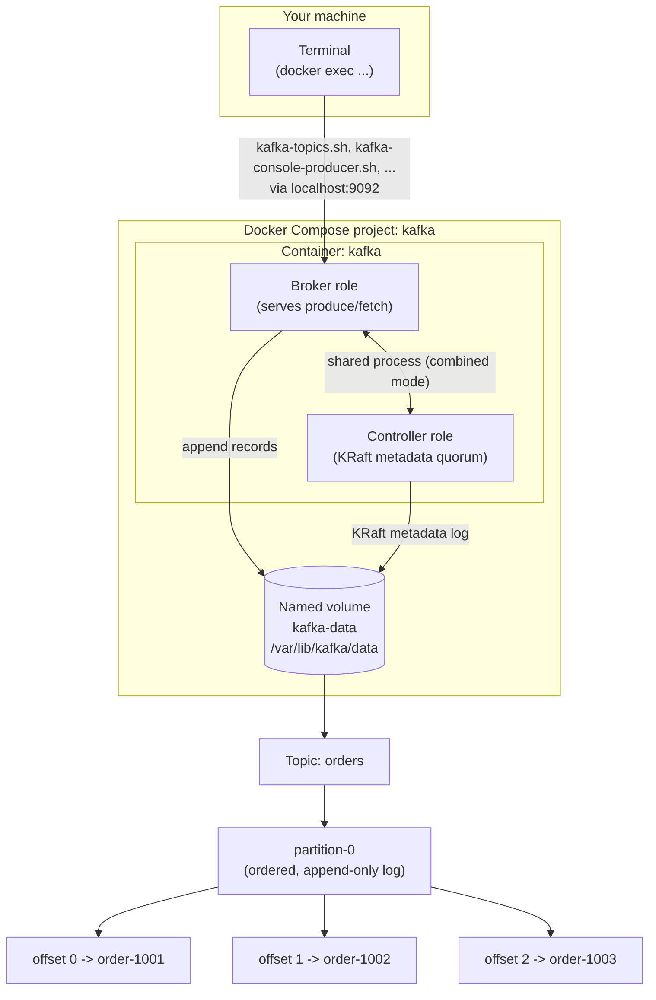

# Lab 01 — First Kafka Cluster

## Quick Summary

- **Why this lab:** To build the foundational mental model of what Kafka physically does with a record — broker, controller, topic, partition, offset — before any Java code enters the picture. CLI-only, deliberately: no producer/consumer application, no framework.
- **How to run:** `docker compose -f platform/kafka/docker-compose.yml up -d`, then run every command via `docker exec kafka /opt/kafka/bin/<tool> --bootstrap-server localhost:9092 ...` (topics, console producer/consumer, consumer-groups, metadata-quorum).
- **Expected input:** No prior Kafka experience, no Java, no local Kafka install — just Docker and a terminal. You create topics and type/pipe records in via the console producer.
- **Expected output:** A healthy single-node KRaft cluster; a topic you can describe (leader/replicas/ISR); records you produce, consume, and replay identically every time; consumer-group offset/lag readable via `kafka-consumer-groups.sh`.
- **What we learned:** Kafka doesn't delete a record on consumption — only retention does. Offsets belong to a partition, not a topic. Ordering is guaranteed only within a partition, never across a whole topic. The container is not the data — a named volume is; deleting the container preserves state, deleting the volume destroys it. A container reporting "healthy" is not the same claim as the Kafka service being usable.

## Objective

Understand what Kafka physically and logically does with a record by
creating and inspecting a real, local Kafka cluster.

The central question this lab answers, and that you should be able to
answer for yourself by the end of it:

> **When I produce a record into Kafka, where exactly does it go, and how
> can I prove each step myself?**

This is a CLI-only, infrastructure-and-fundamentals lab. There is no Java
code in this lab — no producer/consumer application, no Spring, no Kafka
Streams, no schema registry. Those all depend on concepts this lab
establishes first, and are introduced starting with WP-03.

## Prerequisites

- Docker, with Docker Compose v2 (the `docker compose` subcommand, not the
  standalone `docker-compose` binary). This lab was built and validated
  against Docker Desktop / Rancher Desktop on Windows; the commands
  themselves are shell-agnostic (see the note in each experiment where Bash
  and PowerShell genuinely differ).
- A terminal (PowerShell, Windows Terminal, WSL, or Git Bash all work).
- A checkout of this repository.
- No Java, no local Kafka install, and no prior Kafka experience required.
  Every Kafka CLI command in this lab runs *inside* the Kafka container via
  `docker exec`, so nothing needs to be installed on your host beyond
  Docker itself.

## Architecture



- **Your terminal** never talks to Kafka's protocol directly in this lab —
  it runs `docker exec kafka <cli-tool>`, so the CLI tools execute *inside*
  the same container as the broker and connect over `localhost:9092`
  in-container. This sidesteps host-networking differences between Windows,
  macOS, and Linux entirely; see
  [`platform/kafka/README.md`](../../platform/kafka/README.md#listeners-and-advertised-listeners)
  for what changes if you instead run the CLI from your host.
- **One container, two roles.** The `kafka` container is simultaneously the
  broker (data plane) and the controller (control plane, via KRaft) — see
  [Concepts](#concepts) and
  [`docs/fundamentals/KAFKA_CLUSTER_FUNDAMENTALS.md`](../../docs/fundamentals/KAFKA_CLUSTER_FUNDAMENTALS.md).
- **The named volume is the durability boundary.** Everything Kafka
  persists — topic data and KRaft metadata alike — lives under
  `/var/lib/kafka/data`, mapped to the `kafka-data` volume. The container
  can be destroyed and recreated freely; the volume is what actually holds
  state. Experiments 9 and 10 make this concrete.
- **A topic is a name; a partition is where data actually lives.** The
  diagram shows `orders` with one partition, `partition-0`, holding records
  at sequential offsets — this is the shape Experiment 3 onward builds by
  hand.

Full configuration-level detail (every environment variable in the Compose
file, and why) lives in
[`platform/kafka/README.md`](../../platform/kafka/README.md) — this lab
assumes you've skimmed it, or will refer to it when a command doesn't behave
the way you expect.

## Concepts

Kept intentionally brief — full definitions are in
[`docs/fundamentals/KAFKA_CLUSTER_FUNDAMENTALS.md`](../../docs/fundamentals/KAFKA_CLUSTER_FUNDAMENTALS.md).

| Term | In one sentence |
|---|---|
| Event / record | A single fact Kafka stores: a key, a value, optional headers, a timestamp, and (once written) a partition and an offset. |
| Broker | A Kafka node's data-plane role: appends records, serves fetches. |
| Cluster | A set of Kafka nodes sharing a `cluster.id` and agreeing on cluster metadata. |
| KRaft | Kafka's own Raft-based metadata consensus protocol; replaces ZooKeeper entirely in Kafka 4.x. |
| Controller | A Kafka node's control-plane role: participates in the KRaft metadata quorum. |
| Topic | A named, logical event stream with no ordering or size of its own. |
| Partition | An ordered, append-only log; the real unit of storage, ordering, and parallelism. |
| Offset | A record's position within one specific partition — not a topic-wide or global identifier. |
| Producer | A client that appends records to partitions. |
| Consumer | A client that pulls records from partitions by fetching at a given offset. |
| Consumer group | A named set of consumers dividing up a topic's partitions between them. |
| Log | The append-only, sequential on-disk structure backing every partition. |

## Setup

Start the environment (from the repository root, or `cd` into
`platform/kafka` first and drop that prefix):

```bash
docker compose -f platform/kafka/docker-compose.yml up -d
```

**What this does:** pulls `apache/kafka:4.3.1` if you don't already have it,
creates the `kafka-data` named volume if it doesn't exist, and starts one
container that is both the broker and the KRaft controller for a new
(or, if the volume already existed, pre-existing) single-node cluster.

**What you should observe** — check container status and wait for it to
report healthy:

```bash
docker compose -f platform/kafka/docker-compose.yml ps
```

```text
NAME    IMAGE                COMMAND   SERVICE   STATUS
kafka   apache/kafka:4.3.1   ...       kafka     Up ... (healthy)
```

The `(healthy)` qualifier comes from the healthcheck defined in
`docker-compose.yml`, which itself runs
`kafka-broker-api-versions.sh --bootstrap-server localhost:9092` inside the
container — it only turns healthy once the broker is actually answering
Kafka protocol requests, not merely once the process has started. In this
environment it typically reports healthy within 5–15 seconds.

**This proves:** the container process exists (`docker compose ps` would
show it even if Kafka itself had crashed on startup) *and* the Kafka broker
inside it is accepting protocol connections. These are different facts —
see [Troubleshooting](#kafka-container-does-not-start) for what it looks
like when only the first is true.

If you want to watch it initialize instead of polling `ps`:

```bash
docker compose -f platform/kafka/docker-compose.yml logs -f
```

Look for `Kafka Server started` near the end of the startup log, and
`===> Using provided cluster id ...` near the beginning — the second line is
the entrypoint script formatting or reusing the storage at
`/var/lib/kafka/data` under the `CLUSTER_ID` set in `docker-compose.yml`.
Press `Ctrl+C` to stop following logs (this does not stop the container).

### Kubernetes (k3d) alternative

Docker Compose (above) is this lab's primary, documented environment.
For a Kubernetes equivalent instead:

```bash
platform-k8s/bootstrap-cluster.sh   # once
platform-k8s/kafka/setup.sh
```

Every `docker exec kafka <tool>` command in this README becomes
`kubectl -n kafka exec deploy/kafka -- //opt/kafka/bin/<tool>` (the
double slash keeps Git Bash on Windows from mangling the path — see
[`platform-k8s/README.md`](../../platform-k8s/README.md)). Cleanup:
`platform-k8s/kafka/cleanup.sh` (add `--wipe` to also delete data).

## Commands

A quick reference for every CLI tool this lab uses, all invoked the same
way: `docker exec kafka /opt/kafka/bin/<tool> --bootstrap-server localhost:9092 <args>`.
`--bootstrap-server` is how every Kafka CLI tool and client finds the
cluster — it doesn't have to be every broker, just enough addresses to
discover the rest of the cluster's metadata (with one broker, there's only
one to give).

| Tool | Purpose |
|---|---|
| `kafka-broker-api-versions.sh` | Ask a broker what protocol APIs it supports — also used as this lab's liveness check. |
| `kafka-cluster.sh cluster-id` | Print the cluster's `cluster.id`. |
| `kafka-metadata-quorum.sh ... describe --status` | Show KRaft controller-quorum state (leader, voters). |
| `kafka-topics.sh` | Create, list, describe, and delete topics. |
| `kafka-console-producer.sh` | Produce records typed at a terminal (or piped in). |
| `kafka-console-consumer.sh` | Consume and print records. |
| `kafka-consumer-groups.sh` | List and describe consumer groups, offsets, and lag. |

## Implementation

This lab's "implementation" is the Compose file at
[`platform/kafka/docker-compose.yml`](../../platform/kafka/docker-compose.yml),
not application code. In summary, it declares one service (`kafka`) running
`apache/kafka:4.3.1` in combined broker+controller KRaft mode, with:

- Three named listeners (`PLAINTEXT_HOST`, `PLAINTEXT`, `CONTROLLER`), each
  with a distinct purpose — host access, future inter-container access, and
  KRaft quorum traffic respectively.
- A fixed `CLUSTER_ID`, matching the one used in Apache Kafka's own official
  Docker Compose examples, so this lab's output is reproducible and
  comparable to upstream documentation.
- A named volume (`kafka-data`) mounted at `/var/lib/kafka/data`, holding
  both topic data and KRaft metadata.
- A healthcheck based on `kafka-broker-api-versions.sh`, so `docker compose
  ps` can distinguish "container running" from "broker actually usable."

Every value has a one-line justification inline in the Compose file itself,
and a full explanation in
[`platform/kafka/README.md`](../../platform/kafka/README.md). This lab
does not repeat that explanation — it assumes you have it available and
focuses on what you can *observe* once the environment is running.

## Expected output

Each experiment below shows the exact command and the shape of output you
should see, with a short note on what that output does and does not prove.
Kafka CLI output includes some fields (topic IDs, exact timestamps, and —
for keyed records — partition assignment, which depends on hashing the key)
that will be consistent for you from run to run, but are not literal
copy-paste matches of what's printed in this document. Where that applies,
it's called out explicitly rather than presented as an exact expected
string.

## Verification

Before moving on to Experiment 1, and again once you've finished this lab,
confirm you can do — not just read about — every one of these:

- [ ] Start the environment and see it report `(healthy)`.
- [ ] Ask the running node for its `cluster.id` and KRaft quorum status.
- [ ] Create a topic and describe it, correctly reading partition, leader,
      replicas, and ISR from the output.
- [ ] Produce at least three records into that topic.
- [ ] Consume those records from the beginning, then do it again and get
      the same records back (replay).
- [ ] Run a consumer under a named consumer group, then read that group's
      current offset, log-end offset, and lag from `kafka-consumer-groups.sh`.
- [ ] Create a second topic with three partitions and observe records
      landing on different partitions.
- [ ] Restart the environment without deleting its volume and prove your
      data is still there.
- [ ] Deliberately delete the volume and prove the data is gone.
- [ ] Stop the broker, observe a client-side failure trying to use it, then
      restart it and confirm recovery.

If you can check every box above **and explain why each result happened**,
not just that it happened, you've met this lab's objective.

## Experiment

Each experiment below was run against this lab's exact environment while
writing it — commands and output shapes are real, not illustrative.

### Experiment 1 — Inspect the cluster

**What you're doing:** asking the running node, in its own words, who it is.

```bash
docker exec kafka /opt/kafka/bin/kafka-cluster.sh cluster-id --bootstrap-server localhost:9092
```

```text
Cluster ID: 4L6g3nShT-eMCtK--X86sw
```

**What this proves:** the cluster identity baked into on-disk storage on
first start (see [Cluster ID](../../platform/kafka/README.md#cluster-id)).
It does not prove anything about topics or data — a cluster can have an
identity and be completely empty.

```bash
docker exec kafka /opt/kafka/bin/kafka-metadata-quorum.sh --bootstrap-server localhost:9092 describe --status
```

```text
ClusterId:              4L6g3nShT-eMCtK--X86sw
LeaderId:               1
LeaderEpoch:            1
HighWatermark:          <varies>
MaxFollowerLag:         0
MaxFollowerLagTimeMs:   0
CurrentVoters:          [{"id": 1, "endpoints": ["CONTROLLER://kafka:29093"]}]
CurrentObservers:       []
```

**What this proves:** this is the *controller* (control-plane) view —
`LeaderId: 1` means node 1 is the current KRaft quorum leader, and
`CurrentVoters` lists every node whose vote counts toward metadata
decisions. With one node, there is exactly one voter and therefore no
possible majority if it's lost — the same fact `platform/kafka/README.md`
calls out under "Controller listener and controller quorum voters."
`HighWatermark` here is the metadata log's own high watermark (how far the
controller's internal log has been committed), not anything to do with your
`orders` topic yet — don't confuse the two once you create topics below.

```bash
docker exec kafka /opt/kafka/bin/kafka-broker-api-versions.sh --bootstrap-server localhost:9092
```

**What this proves:** this is the *broker* (data-plane) view — it lists
every Kafka protocol API this node's broker role supports and the version
ranges it accepts. This is also literally what the Compose healthcheck
runs; a broker that can't answer this has no business being called healthy.

### Experiment 2 — Create the first topic

```bash
docker exec kafka /opt/kafka/bin/kafka-topics.sh --bootstrap-server localhost:9092 \
  --create --topic orders --partitions 1 --replication-factor 1
```

```text
Created topic orders.
```

**Why these values:** one partition keeps the first pass simple — there is
exactly one place any record you produce can go, which is deliberately what
makes offsets easy to reason about before Experiment 8 introduces multiple
partitions. Replication factor 1 is not a recommendation; it's the only
value a one-broker cluster can satisfy (a replication factor of 2 or more
would require a second broker to hold the extra copy, and topic creation
would fail without one). **Replication and the in-sync replica set (ISR)
are studied properly once there's more than one broker for them to mean
anything — that's `docs/replication/` and WP-06, not this lab.**

```bash
docker exec kafka /opt/kafka/bin/kafka-topics.sh --bootstrap-server localhost:9092 --list
```

```text
orders
```

```bash
docker exec kafka /opt/kafka/bin/kafka-topics.sh --bootstrap-server localhost:9092 --describe --topic orders
```

```text
Topic: orders   TopicId: <topic-id>   PartitionCount: 1   ReplicationFactor: 1   Configs: min.insync.replicas=1
        Topic: orders   Partition: 0   Leader: 1   Replicas: 1   Isr: 1   Elr:   LastKnownElr:
```

**Reading this output:**

- `TopicId` — an internal, immutable identifier for the topic, distinct
  from its (renameable, in principle) name.
- `Partition: 0` — the only partition, numbered from 0.
- `Leader: 1` — broker ID 1 (this node) is currently the partition leader,
  i.e., the broker that accepts produces and fetches for this partition.
- `Replicas: 1` — the full list of brokers that should host a copy; with
  RF=1, that's just the leader itself.
- `Isr: 1` (in-sync replicas) — which of the replicas are currently caught
  up enough to be eligible for leader election. With one broker, ISR and
  Replicas are trivially the same set — this stops being trivial the moment
  there's more than one broker, which is exactly why the replication labs
  exist.

### Experiment 3 — Produce records

```bash
printf 'order-1001\norder-1002\norder-1003\n' | \
  docker exec -i kafka /opt/kafka/bin/kafka-console-producer.sh --bootstrap-server localhost:9092 --topic orders
```

On PowerShell, pipe the same way — `printf` isn't available, so use here:

```powershell
"order-1001`norder-1002`norder-1003" | docker exec -i kafka /opt/kafka/bin/kafka-console-producer.sh --bootstrap-server localhost:9092 --topic orders
```

No output on success — the console producer is silent unless something
goes wrong.

**What actually happened**, connecting back to
[the Kafka mental model](../../docs/architecture/KAFKA_MENTAL_MODEL.md):

```text
your terminal
   ↓
docker exec (into the kafka container)
   ↓
kafka-console-producer.sh (a minimal Kafka producer client)
   ↓
Kafka protocol produce request, to localhost:9092
   ↓
broker (this same container, in its broker role)
   ↓
orders topic → partition 0 (the only partition)
   ↓
appended to the partition's log segment on /var/lib/kafka/data
```

Each line you typed became one record, with no key, appended in order to
partition 0 (the only place it could go, with one partition) at the next
available offset.

### Experiment 4 — Consume records

```bash
docker exec kafka /opt/kafka/bin/kafka-console-consumer.sh --bootstrap-server localhost:9092 \
  --topic orders --from-beginning --timeout-ms 8000
```

```text
order-1001
order-1002
order-1003
Processed a total of 3 messages
```

(`--timeout-ms 8000` makes the console consumer exit on its own after 8
seconds of no new records, rather than hanging forever waiting for more —
useful for a scripted lab, not something you'd normally set. You'll see a
`TimeoutException` logged when it exits this way; that's this flag working
as intended, not a broker error.)

**Now run the exact same command again:**

```bash
docker exec kafka /opt/kafka/bin/kafka-console-consumer.sh --bootstrap-server localhost:9092 \
  --topic orders --from-beginning --timeout-ms 8000
```

```text
order-1001
order-1002
order-1003
Processed a total of 3 messages
```

**Same three records, again.** This is the critical mental-model moment:
**Kafka did not delete these records because you consumed them.** A
`--from-beginning` consumer just reads the partition's log starting at
offset 0, every single time — nothing about running a consumer mutates the
log itself. Kafka is not behaving like a destructive queue (where a
consumed message is typically gone); replay is possible for as long as the
records remain within the topic's retention. This is also why "did my
consumer actually process this record" and "is this record still in Kafka"
are two entirely separate questions — see
[the mental-model doc's section on fetch vs. processing vs. committed
offset](../../docs/architecture/KAFKA_MENTAL_MODEL.md#10-fetch-position-processing-side-effects-and-committed-offset-are-five-different-things)
for why conflating them is a real source of production bugs, not just a
technicality.

### Experiment 5 — Offsets

```bash
docker exec kafka /opt/kafka/bin/kafka-console-consumer.sh --bootstrap-server localhost:9092 \
  --topic orders --from-beginning --timeout-ms 8000 \
  --formatter-property print.partition=true --formatter-property print.offset=true
```

```text
Partition:0     Offset:0        order-1001
Partition:0     Offset:1        order-1002
Partition:0     Offset:2        order-1003
```

This is the concrete version of:

```text
Partition 0

offset 0 -> order-1001
offset 1 -> order-1002
offset 2 -> order-1003
```

**What this proves:**

- Offsets belong to a partition (`Partition:0` is printed alongside every
  one), not to the topic as a whole.
- Offsets are ordered and gapless here because nothing else has produced to
  this partition and nothing has been deleted — that won't remain true once
  there's more producers, retention, or compaction involved, but it holds
  for this lab.
- The offset identifies *where a record is*, not *what it is* — `order-1001`
  is a business-meaningful value your application chose to put in the
  record; `0` is a position Kafka assigned and has no business meaning
  whatsoever.

### Experiment 6 — Consumer group

```bash
docker exec kafka /opt/kafka/bin/kafka-console-consumer.sh --bootstrap-server localhost:9092 \
  --topic orders --group order-lab-consumer --from-beginning --timeout-ms 8000
```

```text
order-1001
order-1002
order-1003
Processed a total of 3 messages
```

```bash
docker exec kafka /opt/kafka/bin/kafka-consumer-groups.sh --bootstrap-server localhost:9092 \
  --describe --group order-lab-consumer
```

```text
Consumer group 'order-lab-consumer' has no active members.

GROUP                TOPIC     PARTITION  CURRENT-OFFSET  LOG-END-OFFSET  LAG  CONSUMER-ID  HOST  CLIENT-ID
order-lab-consumer   orders    0          3               3               0    -            -     -
```

**Reading each field:**

- `GROUP` / `TOPIC` / `PARTITION` — which group, consuming which
  topic-partition.
- `CURRENT-OFFSET` — the offset this group has **committed** for this
  partition: "we've finished up through here." Not the same thing as what
  the consumer has merely fetched into memory — see the mental-model doc's
  fetch/position/commit distinction linked above.
- `LOG-END-OFFSET` — the partition's current end: one past the last
  written offset (3 records at offsets 0–2 means the log-end-offset is 3).
- `LAG` — how far behind the committed offset is from the log end:

  ```text
  consumer lag ≈ log end offset − committed consumer-group offset
  ```

  Here, `3 − 3 = 0`: this group is fully caught up. Lag is reported per
  partition, and a group's total lag (something a dashboard would show you)
  is the sum across all the partitions it's assigned — worth remembering
  once topics have more than one partition.
- `CONSUMER-ID` / `HOST` / `CLIENT-ID` are all `-` because the console
  consumer already exited (it's the `--timeout-ms` flag again) — the
  "has no active members" line above says the same thing. Lag and committed
  offset persist in the broker regardless of whether a consumer is currently
  connected; only the identity columns need a live member.

**One thing worth noticing if you list all groups:**

```bash
docker exec kafka /opt/kafka/bin/kafka-consumer-groups.sh --bootstrap-server localhost:9092 --list
```

If you ran the plain (`--group`-less) console consumer in earlier
experiments, you'll see extra, auto-generated groups here too (something
like `console-consumer-<random-number>`) — in this Kafka version, the
console consumer registers an anonymous, randomly-named group even when you
don't ask for one. This isn't something to rely on architecturally; it's
mentioned here purely so the output doesn't surprise you. Consumer group
mechanics, membership, and rebalancing get their proper treatment in
`docs/consumer-groups/` (WP-05) — this lab only needs you to be able to read
the table above.

### Experiment 7 — Multiple partitions

```bash
docker exec kafka /opt/kafka/bin/kafka-topics.sh --bootstrap-server localhost:9092 \
  --create --topic orders-multi --partitions 3 --replication-factor 1
```

```bash
docker exec kafka /opt/kafka/bin/kafka-topics.sh --bootstrap-server localhost:9092 --describe --topic orders-multi
```

```text
Topic: orders-multi   TopicId: <topic-id>   PartitionCount: 3   ReplicationFactor: 1   Configs: min.insync.replicas=1
        Topic: orders-multi   Partition: 0   Leader: 1   Replicas: 1   Isr: 1   Elr:   LastKnownElr:
        Topic: orders-multi   Partition: 1   Leader: 1   Replicas: 1   Isr: 1   Elr:   LastKnownElr:
        Topic: orders-multi   Partition: 2   Leader: 1   Replicas: 1   Isr: 1   Elr:   LastKnownElr:
```

```text
orders-multi
   |
   +-- partition 0
   +-- partition 1
   +-- partition 2
```

All three partitions are led by the same broker here, because there is only
one broker — do not read anything into "Leader: 1" for all of them beyond
that. With multiple brokers, partition leadership is spread across the
cluster; that's part of what `docs/replication/` covers.

Produce a handful of **keyed** records so you can see them land on
different partitions:

```bash
printf 'a:order-2001\nb:order-2002\nc:order-2003\nd:order-2004\ne:order-2005\nf:order-2006\n' | \
  docker exec -i kafka /opt/kafka/bin/kafka-console-producer.sh --bootstrap-server localhost:9092 \
  --topic orders-multi --reader-property parse.key=true --reader-property key.separator=:
```

```bash
docker exec kafka /opt/kafka/bin/kafka-console-consumer.sh --bootstrap-server localhost:9092 \
  --topic orders-multi --from-beginning --timeout-ms 8000 \
  --formatter-property print.partition=true --formatter-property print.key=true
```

```text
Partition:1     a       order-2001
Partition:1     c       order-2003
Partition:2     b       order-2002
Partition:2     d       order-2004
Partition:2     e       order-2005
Partition:0     f       order-2006
```

**Do not treat the exact key-to-partition mapping above as a contract.**
It's the real result of hashing each key with this Kafka version's default
partitioner against a 3-partition topic — it will be *consistent* for you
(the same key keeps landing on the same partition, which is the property
that makes per-key ordering possible), but the specific assignment is an
implementation detail, not a documented guarantee, and it is not something
this lab tries to fully explain — see
[the mental model's partitioning section](../../docs/architecture/KAFKA_MENTAL_MODEL.md#3-partitioning)
and `docs/partitioning/` (WP-04) for the real depth here.

**What this proves, and what it explicitly does not:** records with
different keys can and do land on different partitions, and once you
consume across all three partitions together (as above), the overall order
you see is an interleaving of three independent, internally-ordered logs —
`a` and `c` are ordered relative to each other (both partition 1), but
`orders-multi` as a whole has no defined order between, say, `f` and `b` at all.
**Kafka guarantees ordering within a partition, not across an entire
multi-partition topic.**

### Experiment 8 — Restart Kafka (persistence)

```bash
docker compose -f platform/kafka/docker-compose.yml down
```

```text
Container kafka  Stopping
Container kafka  Stopped
Container kafka  Removing
Container kafka  Removed
Network kafka_default  Removed
```

Notice: no mention of the volume. `docker compose down` (no `-v`) removes
the **container** and the network Compose created for it — it does not
touch named volumes. Confirm it's still there:

```bash
docker volume ls
```

```text
DRIVER    VOLUME NAME
local     kafka-principal-engineer-lab_kafka-data
```

Now bring it back up and wait for `(healthy)` again:

```bash
docker compose -f platform/kafka/docker-compose.yml up -d
docker compose -f platform/kafka/docker-compose.yml ps
```

```bash
docker exec kafka /opt/kafka/bin/kafka-topics.sh --bootstrap-server localhost:9092 --list
```

```text
orders
orders-multi
```

```bash
docker exec kafka /opt/kafka/bin/kafka-console-consumer.sh --bootstrap-server localhost:9092 \
  --topic orders --from-beginning --timeout-ms 8000
```

```text
order-1001
order-1002
order-1003
Processed a total of 3 messages
```

**Both topics and all your records are still there**, in a completely new
container. This is the point: **the container is not the data.** The
`kafka` container that just started is a brand-new container process (a new
container ID, if you check `docker ps`) — but it mounted the same
`kafka-data` volume the old container was writing to, found already-
formatted storage under the same cluster ID, and picked up exactly where
the previous container left off. **Container lifecycle** (created, stopped,
removed, recreated) is completely separate from **Kafka's persistent
storage lifecycle** (formatted once, written to continuously, and destroyed
only when its volume is destroyed). This is the first real durability
mental model this repository asks you to build — deeper claims about
durability (replication, `acks`, `min.insync.replicas`) come once there's
more than one broker to make them meaningful.

### Experiment 9 — Delete storage

> **Warning: destructive.** This permanently deletes every topic and
> record in this local cluster. That's the point of the experiment, but
> don't run this against anything you want to keep.

```bash
docker compose -f platform/kafka/docker-compose.yml down -v
```

```text
Container kafka  Removed
Volume kafka-principal-engineer-lab_kafka-data  Removed
Network kafka_default  Removed
```

This time, the volume is explicitly listed as removed. Bring the
environment back up:

```bash
docker compose -f platform/kafka/docker-compose.yml up -d
```

```bash
docker exec kafka /opt/kafka/bin/kafka-topics.sh --bootstrap-server localhost:9092 --list
```

```text
(no output — no topics exist)
```

```bash
docker exec kafka /opt/kafka/bin/kafka-cluster.sh cluster-id --bootstrap-server localhost:9092
```

```text
Cluster ID: 4L6g3nShT-eMCtK--X86sw
```

**Read that last result carefully.** The cluster ID is identical to before
— but that does *not* mean any data survived. It's identical because this
lab's `docker-compose.yml` pins `CLUSTER_ID` to a fixed value for
reproducibility (see
[`platform/kafka/README.md`](../../platform/kafka/README.md#cluster-id));
with no formatted storage found under `/var/lib/kafka/data`, the entrypoint
script formatted a **brand-new, empty** cluster using that same configured
ID. A matching cluster ID tells you the *configuration* didn't change; it
tells you nothing about whether the *data* did. In a real deployment, where
you'd generate a fresh random cluster ID rather than pinning one, this
distinction would be even starker — but the underlying lesson is the same
either way: **the broker/container is not the data; the persisted log
storage and the KRaft metadata storage are.** Deleting storage is a
fundamentally different action from restarting a process — a restart
resumes from what's on disk, a storage deletion discards what's on disk
and starts over.

## Failure injection

### Failure: Kafka broker unavailable

**Setup:** make sure `orders` and `orders-multi` exist (recreate them if
you just ran the destructive Experiment 9), then stop the broker without
touching its storage:

```bash
docker compose -f platform/kafka/docker-compose.yml stop
```

**Try to use it anyway.** First, from the host, attempting to `docker exec`
into a container that isn't running:

```bash
docker exec kafka /opt/kafka/bin/kafka-topics.sh --bootstrap-server localhost:9092 --list
```

```text
Error response from daemon: container <id> is not running
```

This particular error is about Docker, not Kafka — it fires before any
Kafka client code even runs, because there's no running container to exec
into. It's still worth seeing, because in real operations "I can't reach
the tool I'd use to check Kafka" and "Kafka rejected my request" are
different failures with different next steps.

Now the Kafka-client-level failure: run a real Kafka client (a fresh,
temporary container) against the stopped broker's published port:

```bash
docker run --rm apache/kafka:4.3.1 /opt/kafka/bin/kafka-broker-api-versions.sh \
  --bootstrap-server host.docker.internal:9092
```

```text
[...] WARN [LegacyAdminClient clientId=admin-1] Connection to node -1 (host.docker.internal/<ip>:9092) could not be established. Node may not be available. (org.apache.kafka.clients.NetworkClient)
[...] WARN [LegacyAdminClient clientId=admin-1] Bootstrap broker host.docker.internal:9092 (id: -1 rack: null isFenced: false) disconnected (org.apache.kafka.clients.NetworkClient)
Request METADATA failed on brokers [host.docker.internal:9092 (id: -1 rack: null isFenced: false)]
java.lang.RuntimeException: Request METADATA failed on brokers [...]
```

**What this teaches:** a Kafka client's very first job, before it can do
anything else, is a metadata request — "which brokers exist, and who leads
what." With the broker down, that request can't even be answered, so
*every* operation fails the same way at this stage, regardless of whether
you were trying to list topics, produce, or consume. **A Kafka client
depends on a reachable broker with valid, current metadata; the container
merely reporting healthy a minute ago is not the same claim as the Kafka
service being usable right now.** This is deliberately a simple,
single-node failure — real leader election, and what happens to in-flight
produces when one broker among several disappears, is the subject of the
multi-broker replication-and-failure lab (WP-06), not this one.

**Recover:**

```bash
docker compose -f platform/kafka/docker-compose.yml start
```

Wait for `(healthy)` again, then confirm your topics and data are exactly
as you left them:

```bash
docker exec kafka /opt/kafka/bin/kafka-topics.sh --bootstrap-server localhost:9092 --list
```

Since this failure only stopped the process — it never touched the volume
— recovery is complete and immediate. This is a different (and much less
eventful) recovery story than Experiment 9's, and the difference is exactly
the point: **stopping a broker and deleting its storage are not the same
kind of failure**, even though both start with the broker becoming
unavailable.

## Troubleshooting

### Kafka container does not start

Work through, in order:

1. `docker compose -f platform/kafka/docker-compose.yml ps` — is the
   container even listed? If it exited immediately, that's your first clue.
2. `docker compose -f platform/kafka/docker-compose.yml logs` — the
   entrypoint script logs each configuration stage
   (`===> Configuring ...`, `===> Launching ...`); an error here usually
   names the exact invalid property.
3. **Port conflict:** if port `9092` is already in use on your machine
   (another Kafka, a leftover container), Compose will fail to publish it.
   `docker ps` (host-wide) to check what else is bound to it.
4. **Volume permission issues:** rare on Windows with Docker
   Desktop/Rancher Desktop, but if you see permission errors writing to
   `/var/lib/kafka/data`, try a destructive reset (Experiment 9) to rule out
   corrupted or partially-initialized storage from an earlier, interrupted
   run.
5. **Invalid KRaft configuration / storage mismatch:** if you've hand-edited
   `docker-compose.yml` (for example, changed `CLUSTER_ID` without also
   clearing the volume), the node may refuse to start because the storage
   on disk was formatted under a *different* cluster ID than the one now
   configured. The fix is Experiment 9's destructive reset — there is no
   safe way to "re-point" existing storage at a different cluster identity.
6. **Listener configuration:** a typo across `KAFKA_LISTENERS`,
   `KAFKA_ADVERTISED_LISTENERS`, `KAFKA_LISTENER_SECURITY_PROTOCOL_MAP`, or
   `KAFKA_CONTROLLER_LISTENER_NAMES` is the most common self-inflicted
   startup failure once you start customizing this file — the broker
   validates that every listener referenced by name in the other four
   variables actually appears in `KAFKA_LISTENERS`, and fails fast with a
   configuration error if not.

### CLI cannot connect

This is almost always a **`listeners` vs. `advertised.listeners`**
confusion (see
[`platform/kafka/README.md`](../../platform/kafka/README.md#listeners-and-advertised-listeners)
for the full explanation) — they answer two different questions:

- `listeners` — where the broker process itself binds and accepts
  connections, from inside its own network namespace.
- `advertised.listeners` — what address the broker tells a *client* to use,
  which is only correct if that client can actually route to it.

Concretely, in this lab: every command uses `docker exec kafka ... 
--bootstrap-server localhost:9092` because, from *inside* the `kafka`
container, `localhost:9092` is both where the broker is bound and what it
advertises for `PLAINTEXT_HOST`. If you instead try to run a Kafka CLI
tool from a *different* container on the same Docker network using
`localhost:9092`, it will fail or silently connect to the wrong thing —
that container needs `kafka:19092` (the `PLAINTEXT` listener), because
`localhost` inside a different container means that container. If you
install a Kafka CLI directly on your host and try `localhost:9092`, that
works too, because the host is exactly who `PLAINTEXT_HOST`'s advertised
address is for. Symptom either way: a client "cannot connect" or, more
confusingly, connects and then times out on further requests
because the address it was told to use for follow-up requests
(post-metadata-lookup) isn't reachable from where it's running.

Also check the basics: is `docker compose ps` actually showing `(healthy)`
right now, and does your `--bootstrap-server` value have the right host
*and* port for where you're running the command from?

### Topic command fails

- **`Error while executing topic command: ...`** — check the exact message;
  `kafka-topics.sh` reports specific causes (invalid replication factor,
  topic already exists) rather than a generic failure.
- **Broker unreachable** — see "CLI cannot connect" above; a topic command
  is a Kafka client like any other and fails the same way.
- **`Topic 'X' already exists`** — you likely already ran Experiment 2 or 7;
  either reuse the existing topic or delete it first with
  `kafka-topics.sh --delete --topic <name>` before recreating it.
- **Invalid replication factor** — `--replication-factor` greater than the
  number of brokers in the cluster (1, here) always fails; this is
  expected, not a bug, and is exactly why this lab uses RF=1 throughout.

### Data disappeared after restart

Check, in order:

1. Did you (or a script) run `docker compose down -v`, or
   `docker volume rm kafka-principal-engineer-lab_kafka-data` directly?
   Either one deletes the data on purpose — see Experiment 9.
2. `docker volume ls` — is `kafka-principal-engineer-lab_kafka-data` still
   there at all? If it's gone, so is everything that was in it.
3. Did `KAFKA_LOG_DIRS` or the volume's mount path change in
   `docker-compose.yml` between the old run and this one? Kafka would then
   be looking in a directory that was never formatted, which looks
   identical to "the data disappeared" from the outside, even though the
   old volume (under its old name) may still technically exist un-mounted.

## Cleanup

Two genuinely different operations — read both before running either.

**Safe stop** — keeps all Kafka data, so you can pick up exactly where you
left off later:

```bash
docker compose -f platform/kafka/docker-compose.yml down
```

**Destructive reset** — permanently deletes the `kafka-data` volume and
everything in it. There is no undo:

```bash
docker compose -f platform/kafka/docker-compose.yml down -v
```

If you only want to remove the two topics this lab created, without
touching the cluster itself:

```bash
docker exec kafka /opt/kafka/bin/kafka-topics.sh --bootstrap-server localhost:9092 --delete --topic orders
docker exec kafka /opt/kafka/bin/kafka-topics.sh --bootstrap-server localhost:9092 --delete --topic orders-multi
```

## Production considerations

| This lab | Production consideration |
|---|---|
| 1 Kafka node (broker + controller combined) | Multiple brokers; controller quorum sometimes run on dedicated nodes once cluster size or blast-radius requirements justify it |
| 1 controller voter — no control-plane fault tolerance | An odd-sized voter set (commonly 3 or 5) so metadata decisions survive losing a minority of controllers |
| Replication factor 1 (the only value 1 broker can satisfy) | RF chosen deliberately based on the durability the data actually needs |
| No authentication, `PLAINTEXT` only | TLS and/or SASL plus ACLs, sized to the organization's security requirements |
| One Docker named volume on one machine | Storage sized, monitored, and placed according to the failure domains the platform must survive |
| No monitoring beyond a container healthcheck | Broker/controller/client metrics exported and alerted on |
| Manual `docker compose` commands | Provisioned and changed through the organization's standard infrastructure automation |
| A learner running one CLI command at a time | Concurrent producers and consumers, at a scale a single container was never sized for |

As in `platform/kafka/README.md`: none of the right-hand entries are
universal defaults to copy uncritically. "3 controller voters" and
"replication factor 3" are common, not mandatory — the correct choice
always depends on the specific workload, SLOs, and failure tolerance
required, which is exactly what capacity planning and the Principal
Engineer decision framework (later WPs) are for.

## Principal Engineer questions

Answer these out loud, to yourself or someone else, before considering this
lab done. Shallow one-line answers mean you've memorized the lab, not
understood it.

**1. Why is Kafka called a distributed log rather than simply a message
queue?**

A traditional message queue's defining behavior is that a message is
typically removed once a consumer takes it, and it usually has no strong
notion of an ordered, durable, replayable history. Kafka's partition is an
append-only log: records are retained by a time/size (or compaction)
policy independent of consumption, multiple independent consumers (or
consumer groups) can read the same data at different positions
simultaneously, and the log's order is a first-class, durable property, not
an incidental one. "Queue" undersells the fact that the log itself, not
just in-flight delivery, is the durable artifact.

**2. Why doesn't consuming a Kafka record normally delete it?**

Because deletion and consumption are deliberately decoupled: a partition's
retention policy (age, size, or compaction) is the only thing that removes
records, and a consumer's position is tracked separately (per consumer
group) from the log itself. This is what makes replay, multiple independent
consumer groups reading the same topic, and reprocessing after a bug fix
all possible without any special "undelete" mechanism — they're just
reading the log again from an earlier offset.

**3. What is the relationship between topic, partition, and offset?**

A topic is a name for a logical stream; it is implemented as one or more
partitions, each an independently ordered, append-only log; and an offset
is a record's position within exactly one of those partitions. The complete
address of any record is the triple `(topic, partition, offset)` — none of
the three alone identifies a record's location.

**4. Why is ordering guaranteed only within a partition?**

Because a partition is the actual unit Kafka appends to and reads from —
there is no shared, cross-partition sequence number or coordination point
that would let the system meaningfully order records from different
partitions relative to each other, and enforcing one would destroy the
independence between partitions that makes parallel writes and reads
possible in the first place. Ordering is a consequence of a partition being
a single log; it was never designed to exist at the topic level.

**5. What happens to useful consumer parallelism if a topic has one
partition?**

It's capped at one: only one consumer within a given consumer group can
ever be actively assigned that partition at a time, so adding a second
consumer to the group does not increase throughput — it sits idle unless
the first consumer fails. Partition count is the hard ceiling on
intra-group read parallelism, which is precisely why Experiment 2 uses one
partition (to keep the mental model simple) and Experiment 7 introduces
three (to make this ceiling, and the ordering trade-off that comes with
raising it, visible).

**6. Why is a single-node Kafka cluster useful for learning but unsuitable
for high availability?**

It's useful for learning because it minimizes the moving parts you need to
reason about while you build a first mental model — one process, one log
directory, no cross-node coordination to get lost in. It's unsuitable for
high availability for the same reason: with one broker there is no second
copy of any data (replication factor is forced to 1), and with one
controller voter there is no way to keep making cluster-metadata decisions
if that single node fails. Every failure mode in this lab (Experiment 9,
the broker-unavailable failure injection) took the *entire* cluster down
with it, because there was only ever one node to fail.

**7. What problem does KRaft solve?**

It replaces an external, separately-operated ZooKeeper ensemble — with its
own consensus protocol, its own failure modes, and (at scale) its own
throughput ceiling on metadata writes — with a Raft-based quorum built from
Kafka nodes themselves, using the same log-based storage model Kafka
already uses for topic data. The result is one operational and consensus
model instead of two, and it removes ZooKeeper's metadata-write throughput
as a separate scaling limit on how many partitions a cluster can support.

**8. Why are `listeners` and `advertised.listeners` different concepts?**

Because "where I bind" and "what address I hand to a client" are genuinely
different questions the moment a broker is reachable by more than one path
— which is the normal case, not an edge case: a container reachable both
from other containers (by service name) and from the host (by a published
port and `localhost`) cannot correctly advertise a single address for both.
`listeners` governs what the process itself accepts; `advertised.listeners`
governs what it tells clients to use next, and the two must be configured
to actually match how each category of client can route to the broker.

**9. Why did records survive a container restart?**

Because the records were never inside the *container* to begin with — they
were written to the `kafka-data` named volume, which is a Docker-managed
storage resource with its own lifecycle, independent of any specific
container instance mounting it. `docker compose down` (no `-v`) removes the
container and network but explicitly leaves named volumes alone; the next
`docker compose up` created a *new* container that happened to mount the
*same* volume, found already-formatted storage there, and resumed exactly
where the data left off.

**10. Why did deleting the volume destroy the data?**

Because the volume, not the container, was always the actual location of
every log segment and every piece of KRaft metadata. `docker compose down
-v` removes that storage resource itself. The next container to start finds
no formatted storage at `/var/lib/kafka/data` and — using the entrypoint's
default first-start behavior — formats fresh, empty storage there, under
whatever `CLUSTER_ID` is currently configured. Nothing about the old data
carries over, because the thing that held it no longer exists.

**11. What is the difference between a broker being alive and the Kafka
service being usable?**

"Alive" can mean as little as "the OS process exists" — which tells a
client nothing about whether it can actually get a produce or fetch request
served. "Usable" requires the broker to be listening on the address the
client is trying to reach, to be past its own startup/recovery, and to hold
(or be able to serve) current metadata for whatever topic-partitions the
client cares about. This lab's healthcheck deliberately tests usability
(`kafka-broker-api-versions.sh`, a real protocol round-trip) rather than
mere process liveness, and the failure-injection experiment shows a case
where the container had *been* healthy moments before but was not usable at
all once stopped.

**12. If a topic has 20 partitions, is offset 100 globally unique?
Explain.**

No — offset 100 exists independently, and almost certainly refers to a
completely unrelated record, in each of the 20 partitions. The only
globally meaningful, unique identifier is the triple
`(topic, partition, offset)`; "offset 100" alone is meaningless without
also specifying which of the 20 logs you mean. This is precisely what
Experiment 5's emphasis on printing `Partition:` alongside every offset is
meant to make impossible to forget.

**13. What information would you need before deciding the number of
partitions for a production topic?**

At minimum: the target consumer parallelism (partition count is its hard
ceiling, per question 5), the expected throughput per partition your
consumers and producers can actually sustain, whether and how strictly
records need to stay ordered relative to each other (which drives whether —
and by what key — records must be co-located in one partition), how many
partitions the cluster's brokers and controller can handle well operationally
(there are practical, not just theoretical, per-broker and per-cluster
limits), and whether partition count might need to grow later, given that
growing it does not repartition existing keyed data. This lab intentionally
doesn't answer "the right number" — that's `docs/partitioning/` and
capacity planning (later WPs), once there's a real workload to reason
about instead of a hypothetical one.

**14. What additional mechanisms are required before we can claim
resilience to broker failure?**

At least: more than one broker (so a failed broker's partitions have a
surviving copy somewhere), a replication factor greater than 1 for the
topics that need to survive that failure, an in-sync replica set that
Kafka actually tracks and uses for leader election, an `acks` setting on
the producer side strong enough that "acknowledged" actually means
"durably replicated" rather than just "written to the (soon-to-fail)
leader," and — separately — enough controller voters that the *cluster's
metadata itself* survives losing a node, not just its topic data. This lab
demonstrates none of these; it demonstrates their absence, deliberately, so
the multi-broker replication lab (WP-07) has something concrete to add.

**15. If the business says "we cannot lose an acknowledged payment event,"
what additional Kafka concepts must we study before promising that
guarantee?**

At minimum: replication factor and `min.insync.replicas` together (so
"acknowledged" requires more than one durable copy), the producer's `acks`
setting (so the producer actually waits for that durability before
considering the write successful), idempotent producers and transactions
(so retries after a timeout don't silently create duplicates or, worse,
inconsistent state across multiple topics/partitions written together),
and the consumer side's processing-vs-commit ordering (per the mental
model's discussion of at-least-once vs. at-most-once) so that "acknowledged
by Kafka" and "successfully acted upon by the business" aren't silently
conflated. None of these exist in this lab's single-broker, RF=1
environment — which is exactly why this question belongs at the end of
Lab 01 rather than being answerable from it: it's a map of everything
between here and being able to make that promise honestly, covered across
WP-06 (offset management and delivery semantics — the consumer-side
processing-vs-commit ordering above, now implemented), WP-07 (replication),
WP-09 (transactions), and the Principal Engineer capstone (WP-20).
