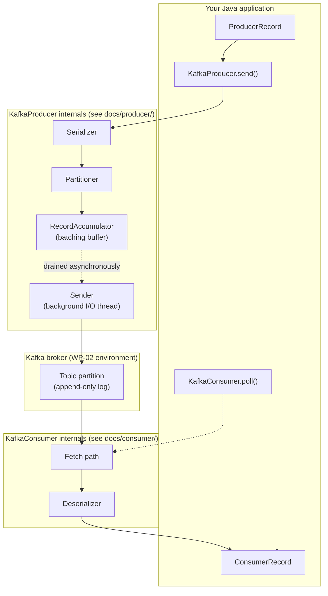

# Lab 02 — Native Java Producer & Consumer Fundamentals

## Objective

This is the transition from Kafka CLI user to Java Kafka client developer.
The central question this lab answers, and that you should be able to
answer and demonstrate yourself by the end of it:

> **When my Java application calls `KafkaProducer.send()`, what actually
> happens before that record becomes visible to a Java `KafkaConsumer`?**

You should finish able to trace, and have personally observed evidence for,
every step of:

```text
Java application -> ProducerRecord -> Serializer -> Partition selection ->
Producer batching/buffer -> Kafka broker -> Topic partition ->
Offset assigned -> Consumer fetch/poll -> Deserializer -> ConsumerRecord ->
Application processing
```

and you should be able to clearly distinguish **record offset**,
**consumer position**, **committed offset**, **log-end offset**, and
**business side effect** — five things this lab (and
[`docs/architecture/KAFKA_MENTAL_MODEL.md`](../../docs/architecture/KAFKA_MENTAL_MODEL.md))
refuse to treat as interchangeable.

This lab uses only the **native Apache Kafka Java client**
(`org.apache.kafka:kafka-clients`). No Spring Boot, no Spring Kafka, no
Kafka Streams, no Schema Registry/Avro/Protobuf, no Kafka Connect/Debezium,
no transactions, no elaborate retry/DLQ framework — those all depend on
what this lab establishes, and are introduced starting with later work
packages. Native client fundamentals come first deliberately: you cannot
evaluate what a framework like Spring Kafka is doing *for* you until you've
felt what doing it yourself requires.

## Prerequisites

- The WP-02 local Kafka environment
  ([`platform/kafka/`](../../platform/kafka/README.md)), running.
- A JDK. This lab targets **Java 21 (LTS)** — see
  [Java baseline](#java-baseline) below for why, and for what JDK this lab
  was actually built and validated with.
- Docker, for the Testcontainers-based integration test (same Docker setup
  the WP-02 environment already needs — no separate install).
- Comfort with [`labs/lab-01-first-kafka-cluster`](../lab-01-first-kafka-cluster/README.md)'s
  CLI-level concepts (topic, partition, offset, consumer group) — this lab
  builds directly on them rather than re-explaining them.
- No prior Kafka Java client experience required.

### Java baseline

This is the first Java project in this repository, so there was no
existing convention to inherit. **Java 21 (LTS)** was chosen because:

- It is a current, widely-deployed LTS release.
- `org.apache.kafka:kafka-clients:4.3.1` (this repository's pinned client
  version, matching the broker version pinned in
  [`platform/kafka/docker-compose.yml`](../../platform/kafka/docker-compose.yml))
  fully supports it — Kafka's own clients require Java 11 at minimum and
  are fully supported on 17 and 21.
- JUnit Jupiter 6.x (this lab's test framework) requires Java 17 at
  minimum, so 21 comfortably clears every dependency's floor with room to
  spare.

This lab's `build.gradle` declares `sourceCompatibility`/
`targetCompatibility` as Java 21 — that is a portability *contract*
(the compiled bytecode targets Java 21+), not a claim about which exact
JDK produced the build. This repository's build/validation environment
actually runs JDK 26 (`javac --release 21` support is what makes this
combination work); any JDK 21 or newer works identically for anyone
cloning this repository.

## Architecture



The dotted arrows are the two places this lab most wants you to notice
asynchrony and pull-based fetching: your `send()` call returns once the
record is *buffered*, not once it's durably stored (see
[`docs/producer/PRODUCER_INTERNALS_INTRO.md`](../../docs/producer/PRODUCER_INTERNALS_INTRO.md)),
and `poll()` actively *fetches* from the broker rather than having records
pushed to it (see
[`docs/consumer/CONSUMER_INTERNALS_INTRO.md`](../../docs/consumer/CONSUMER_INTERNALS_INTRO.md)).
Read both of those documents alongside this lab — they hold the internals
depth this README deliberately keeps light.

## Concepts

Kept brief — full depth is in the two internals documents linked above and
in [`docs/architecture/KAFKA_MENTAL_MODEL.md`](../../docs/architecture/KAFKA_MENTAL_MODEL.md).

| Term | In one sentence |
|---|---|
| `KafkaProducer<K,V>` | The native client class your application uses to send records. |
| `ProducerRecord<K,V>` | One record you're about to send: topic, optional key/partition, value. |
| Serializer/Deserializer | Converts your Java types to/from the bytes Kafka actually stores and moves. |
| `RecordMetadata` | What a successful send tells you: the actual `(topic, partition, offset, timestamp)`. |
| `Future`/`Callback` | How `send()` reports a result *later*, since it doesn't wait for the broker itself. |
| `KafkaConsumer<K,V>` | The native client class your application uses to fetch records. |
| `ConsumerRecord<K,V>` | One record `poll()` handed back to you, with its own fixed offset. |
| Consumer group | A named set of consumers sharing partitions of a topic between them. |
| Position | This consumer instance's own next-offset-to-fetch — local, in-memory. |
| Committed offset | What the broker remembers this *group* has finished, in `__consumer_offsets`. |

## Setup

1. Start the WP-02 Kafka environment (from the repository root):

   ```bash
   docker compose -f platform/kafka/docker-compose.yml up -d
   ```

2. Create this lab's topic with **3 partitions** (multiple partitions are
   needed from the start for the consumer-group and null-key experiments
   later) via the CLI skills from Lab 01 — topic administration stays a
   CLI concern in this lab, not something the Java code does for you:

   ```bash
   docker exec kafka /opt/kafka/bin/kafka-topics.sh --bootstrap-server localhost:9092 \
     --create --topic orders-java --partitions 3 --replication-factor 1
   ```

3. From this directory (`labs/lab-02-native-java-producer-consumer/`),
   build the project (this also downloads dependencies the first time):

   ```bash
   ./gradlew build
   ```

   On Windows, `gradlew.bat build` from PowerShell/cmd works identically.

**Windows + Testcontainers note:** on a Windows/Rancher Desktop setup like
the one this lab was validated against, Testcontainers' Docker
auto-detection did not reliably find the daemon inside a Gradle-forked test
JVM without an explicit `DOCKER_HOST`. If `./gradlew test` hangs rather
than completing within well under a minute, set (check `docker context ls`
for your actual endpoint first — this is the value observed on this
lab's own setup):

```bash
export DOCKER_HOST="npipe:////./pipe/docker_engine"
```

```powershell
$env:DOCKER_HOST = "npipe:////./pipe/docker_engine"
```

before running Gradle. See [Troubleshooting](#testcontainers-test-hangs-or-times-out)
for more detail. This is a Windows-specific Docker-detection quirk, not a
Kafka or Testcontainers module issue — Linux/macOS Docker setups typically
need no such override.

## Commands

| Gradle task | What it runs |
|---|---|
| `./gradlew build` | Compile, run tests (Testcontainers), assemble. |
| `./gradlew test` | Just the Testcontainers integration tests. |
| `./gradlew runProducerBasic` | Experiment 1 — send, callback, flush/close. |
| `./gradlew runProducerKeyAffinity -Pkey=order-1001 -Pcount=5` | Experiment 2 — same-key partition affinity. |
| `./gradlew runProducerNullKey -Pcount=6` | Experiment 3 — null-key distribution (observed, not assumed). |
| `./gradlew runProducerExplicitPartition -Ppartition=0` | Experiment 4 — bypassing the partitioner. |
| `./gradlew runConsumer -PgroupId=<id> -PclientId=<id>` | Experiments 5–8 — poll loop, groups, offsets, replay. |
| `./gradlew runProducerBrokerDown` | Failure experiment — run while stopping/restarting the broker. |

Every task accepts `-PbootstrapServers=...` and `-Ptopic=...` too, defaulting
to `localhost:9092` and `orders-java`.

## Implementation

This lab's Java sources live under `src/main/java/com/kafkalab/nativeclient/`:

```text
producer/
  ProducerBasicApp.java              Experiment 1
  ProducerKeyAffinityApp.java        Experiment 2
  ProducerNullKeyApp.java            Experiment 3
  ProducerExplicitPartitionApp.java  Experiment 4
  ProducerBrokerDownApp.java         Failure experiment
consumer/
  ConsumerApp.java                   Experiments 5-8, poll loop + graceful shutdown
support/
  LabConfig.java                     Tiny system-property reader shared by every app above
```

Every class configures **only** the properties it actually needs
(`bootstrap.servers`, `key`/`value.serializer`/`deserializer`, and —
for the consumer — `group.id`), each with an inline comment explaining why
it's there. Two configuration values are deliberately shortened from their
defaults, and only in `ProducerBrokerDownApp`, purely to make the
broker-unavailable failure experiment observable within a reasonable lab
session instead of the client's default two-minute delivery window
(`request.timeout.ms` 30000→5000, `delivery.timeout.ms` 120000→15000) — see
that class's Javadoc. Nowhere in this lab does a class set a property
"because production configs usually include it" — every property answers
what it controls, why it's set, what happens without it, and whether it's
application-specific or load-bearing, per this repository's
"no unexplained configuration" rule.

One thing worth knowing before you run the producer experiments: this
client enables **idempotence by default** (a modern `kafka-clients`
default, not something this lab's code requests) — you'll see
`Instantiated an idempotent producer.` in the logs of every producer app.
This lab does not otherwise rely on or explain idempotence (that's WP-09's
job); it's noted here only so the log line doesn't look like an
unexplained surprise.

### Producer and consumer internals

Read these two documents alongside this lab, not after it — they hold the
"why does the code do this" depth this README intentionally keeps light,
each verified against the actual `kafka-clients:4.3.1` source:

- [`docs/producer/PRODUCER_INTERNALS_INTRO.md`](../../docs/producer/PRODUCER_INTERNALS_INTRO.md)
  — `send()` → `doSend()` → serialize → partition → `RecordAccumulator` →
  `Sender`, plus a source-reading exercise.
- [`docs/consumer/CONSUMER_INTERNALS_INTRO.md`](../../docs/consumer/CONSUMER_INTERNALS_INTRO.md)
  — `poll()`'s real internal split between `ClassicKafkaConsumer` and
  `AsyncKafkaConsumer`, and why that split is precisely why the failure
  matrix refuses to describe one fixed poll-interval mechanism as
  universal.

### Testing strategy

Per the testing progression established in
[`docs/references/REFERENCE_REPOSITORIES.md`](../../docs/references/REFERENCE_REPOSITORIES.md#testing-strategy--first-class-from-wp-03-onward):

```text
JUnit                -> structure and assertions for this lab's tests
Testcontainers Kafka  -> real KRaft-mode broker, containerized, for real client
                         integration behavior (src/test/java/.../ProducerConsumerIntegrationTest.java)
Docker Compose        -> the manual, multi-experiment platform environment this
                         README's hands-on sections use directly (platform/kafka/)
Future multi-broker environment -> replication/failure engineering (WP-06+)
```

`ProducerConsumerIntegrationTest` starts a real `apache/kafka:4.3.1`
container (the exact image and version `platform/kafka/` uses), creates a
topic via `Admin`, sends one record with the native producer, and asserts
a native consumer sees the identical key/value/partition/offset — proving
this lab's central claim end to end, automatically, on every build. A
second test, `consumerWakeupInterruptsBlockingPoll`, proves the exact
mechanism `ConsumerApp`'s graceful shutdown relies on: that
`consumer.wakeup()` interrupts a blocking `poll()` by throwing
`WakeupException`, almost immediately rather than after poll's own
30-second duration — asserted via a bounded latch wait, not a fixed sleep.
No test in this lab uses a mocked `KafkaProducer`/`KafkaConsumer` as its
primary strategy.

### Observability

`src/main/resources/simplelogger.properties` raises `org.apache.kafka.clients*`
categories to `INFO` (confirmed to exist in `kafka-clients:4.3.1` by
inspecting the actual jar) while leaving everything else at `WARN`, so you
see metadata refreshes, batching/send activity, and consumer group/rebalance
events without being buried in noise. Bump any one category to `DEBUG`
temporarily while working through a specific experiment; leaving everything
at `DEBUG` permanently would defeat the point.

## Expected output

Each experiment below shows real output captured while validating this
lab, not illustrative text. Offsets, timestamps, and generation IDs will
differ on your own run (they depend on what you've already produced/consumed
against this topic) — the *shape* and the specific claims each experiment
makes are what should reproduce, not the literal numbers.

## Verification

- [ ] Send records and read `(topic, partition, offset)` back from the
      producer's callback, not from the `send()` call site.
- [ ] Observe `send()` returning before its callback fires.
- [ ] Prove same-key records land on the same partition, repeatedly.
- [ ] Observe null-key distribution and describe it without overclaiming a
      universal rule.
- [ ] Send to an explicit partition and explain why that's usually a bad
      idea in business code.
- [ ] Run a consumer poll loop and read `(topic, partition, offset, key,
      value, timestamp)` from `ConsumerRecord`.
- [ ] Run two consumers in one group against a 3-partition topic and read
      the partition split from both the Java logs and `kafka-consumer-groups.sh`.
- [ ] Run a third consumer in a different group and prove independent
      consumption of the same data.
- [ ] Replay records via a new group id, and separately via a CLI offset
      reset on an existing group.
- [ ] Run the broker-unavailable failure experiment and describe what you
      actually observed — not what you expected to observe.
- [ ] Stop and restart a consumer under the same group id and observe it
      resume from its committed offset, then repeat with a new group id.
- [ ] Run `./gradlew test` and get a passing Testcontainers-backed
      integration test.

## Experiment

### Experiment 1 — Producer basics: send(), callback, flush/close

```bash
./gradlew runProducerBasic
```

```text
send() returned for key=order-1001 -- broker has not necessarily stored it yet
send() returned for key=order-1002 -- broker has not necessarily stored it yet
send() returned for key=order-1003 -- broker has not necessarily stored it yet
Sent: key=order-1003 topic=orders-java partition=1 offset=0 timestamp=1789821144816
Sent: key=order-1001 topic=orders-java partition=0 offset=0 timestamp=1789821144806
Sent: key=order-1002 topic=orders-java partition=0 offset=1 timestamp=1789821144815
```

**What this proves:** all three `send() returned` lines are printed before
*any* `Sent:` callback line — the calling thread finished issuing all three
sends before the first one was even acknowledged. Note the callback order
too: `order-1003` (which landed on a different partition, 1) completed
*before* `order-1001`/`order-1002` (partition 0) even though it was sent
last — callbacks complete independently, per-partition-batch, on Kafka's
own background thread, not in your call order. `send()` returning tells you
nothing about durability; only the callback receiving a `RecordMetadata`
does. `flush()`/`close()` (via try-with-resources) is what guarantees every
outstanding send has actually completed before the program exits — killing
the JVM instead risks silently dropping records `send()` had accepted but
the background sender hadn't gotten to yet.

### Experiment 2 — Same key, repeated: partition affinity

```bash
./gradlew runProducerKeyAffinity -Pkey=order-1001 -Pcount=5
```

```text
key=order-1001 -> topic=orders-java partition=0 offset=2
key=order-1001 -> topic=orders-java partition=0 offset=3
key=order-1001 -> topic=orders-java partition=0 offset=4
key=order-1001 -> topic=orders-java partition=0 offset=5
key=order-1001 -> topic=orders-java partition=0 offset=6

Every line above should show the same partition number.
That consistency, not the specific number, is what this experiment proves.
```

**What this proves:** every send with key `order-1001` landed on partition
0 — consistently, across five separate `send()` calls. This is what makes
per-key ordering possible. The *specific* partition number (`0`) is not the
claim; the *consistency* is. See
[`docs/producer/PRODUCER_INTERNALS_INTRO.md`](../../docs/producer/PRODUCER_INTERNALS_INTRO.md)
for where in the client this decision is actually made.

### Experiment 3 — Null keys: observe, don't assume

```bash
./gradlew runProducerNullKey -Pcount=6
```

```text
null-key record 0 -> partition=0
null-key record 1 -> partition=0
null-key record 2 -> partition=0
null-key record 3 -> partition=0
null-key record 4 -> partition=0
null-key record 5 -> partition=0

Observed distribution (this run only, this client version):
  partition 0: 6 record(s)

Do not generalize this into a universal null-key partitioning rule --
see the lab README for why.
```

**What this actually shows, and what it does not:** all six null-key
records landed on the same partition in this run. This is **not** evidence
of "null keys go to one fixed partition," and it is equally **not**
evidence of round-robin distribution — it's most consistent with modern
Kafka's default **sticky partitioner** behavior for keyless records, which
deliberately keeps assigning an entire batch to one partition (to produce
larger, more efficient batches) before switching to another, rather than
spreading every individual record across partitions immediately. Send a
larger count, or introduce a delay between sends so each one forms its own
batch, and you may well see different partitions appear. **The durable
lesson is narrower than any specific distribution pattern:**

```text
keyed records      -> partition affinity (Experiment 2)
null-key records   -> no business-key partition affinity guarantee
```

### Experiment 4 — Explicit partition: powerful, usually a bad idea

```bash
./gradlew runProducerExplicitPartition -Ppartition=0
```

```text
Sent with explicit partition request: requested=0 actual=0 offset=13

requested == actual here because the partition you named exists.
If it did not (e.g., you asked for a partition beyond the topic's
current partition count), send() would fail instead of falling back
to the partitioner -- explicit means explicit.
```

**Why this is usually the wrong tool for business code:** it couples your
application directly to this topic's current partition layout; if the
partition count changes later, a hard-coded number doesn't adapt, it just
keeps writing wherever that number now points; every caller of this code
path writes to the *same* partition regardless of key or volume, an
easy way to manufacture a hot partition; and it gives up the free,
consistent per-key routing a normal partitioner already gives you. Reach
for this only when you have a specific, deliberate reason to override
partition selection — not as a default.

### Experiment 5 — Consumer basics: the poll loop

```bash
./gradlew runConsumer -PgroupId=java-orders-group -PclientId=consumer-a
```

```text
Starting consumer: clientId=consumer-a groupId=java-orders-group topic=orders-java
Press Ctrl+C for a graceful shutdown.

...
clientId=consumer-a topic=orders-java partition=0 offset=0 key=order-1001 value=CREATED timestamp=1789821144806
clientId=consumer-a topic=orders-java partition=0 offset=1 key=order-1002 value=CREATED timestamp=1789821144815
clientId=consumer-a topic=orders-java partition=0 offset=2 key=order-1001 value=EVENT-0 timestamp=1789821154870
...
clientId=consumer-a topic=orders-java partition=1 offset=0 key=order-1003 value=CREATED timestamp=1789821144816
```

**What this proves:** `poll()` returned records from **both** partitions 0
and 1 to this single consumer (a brand-new group defaults to
`auto.offset.reset=earliest` in this lab, so it replays everything already
produced). Every printed line carries its own `(topic, partition, offset)`
— nothing here is "the consumer's offset"; each record has its own fixed
one. Press Ctrl+C to stop: the shutdown hook calls `consumer.wakeup()`,
which interrupts the blocked `poll()` call with a `WakeupException` (proved
directly, without relying on OS signal delivery, by
`consumerWakeupInterruptsBlockingPoll` in the Testcontainers test) rather
than requiring you to kill the process.

### Experiment 6 — Consumer groups: ownership split and independence

Start one consumer, let it settle, then start a second in the **same**
group against the 3-partition topic:

```bash
./gradlew runConsumer -PgroupId=java-orders-group-demo -PclientId=consumer-a
# in a second terminal, once consumer-a has joined:
./gradlew runConsumer -PgroupId=java-orders-group-demo -PclientId=consumer-b
```

Real log output from exactly this sequence:

```text
# consumer-a alone:
Finished assignment for group at generation 1: {consumer-a-...=Assignment(partitions=[orders-java-0, orders-java-1, orders-java-2])}

# after consumer-b joins:
Revoke previously assigned partitions [orders-java-0, orders-java-1, orders-java-2]
Finished assignment for group at generation 2: {consumer-a-...=Assignment(partitions=[orders-java-0, orders-java-1]), consumer-b-...=Assignment(partitions=[orders-java-2])}
```

Then a **third** consumer in a **different** group, against the same topic:

```bash
./gradlew runConsumer -PgroupId=java-orders-audit-group -PclientId=consumer-audit
```

```text
Finished assignment for group at generation 1: {consumer-audit-...=Assignment(partitions=[orders-java-0, orders-java-1, orders-java-2])}
```

**What this proves:**

```text
same group      -> partitions distributed among members (2 partitions to
                    consumer-a, 1 to consumer-b — not necessarily an even
                    split; the default "range" assignor doesn't promise one)
different groups -> independent consumption of the same topic (consumer-audit
                    got all 3 partitions to itself and replayed everything
                    from the start, entirely independently of the other group)
```

### Experiment 7 — Offsets: connecting Java to the CLI

While the consumers from Experiment 6 are running (or right after), inspect
the same groups from the broker's point of view:

```bash
docker exec kafka /opt/kafka/bin/kafka-consumer-groups.sh --bootstrap-server localhost:9092 --describe --group java-orders-group-demo
```

```text
GROUP                  TOPIC        PARTITION  CURRENT-OFFSET  LOG-END-OFFSET  LAG  CONSUMER-ID        HOST            CLIENT-ID
java-orders-group-demo orders-java  0          14              14              0    consumer-a-...     /192.168.127.1  consumer-a
java-orders-group-demo orders-java  1          1               1               0    consumer-a-...     /192.168.127.1  consumer-a
java-orders-group-demo orders-java  2          0               0               0    consumer-b-...     /192.168.127.1  consumer-b
```

**What this proves:** the CLI's `CONSUMER-ID`/`CLIENT-ID` columns match
exactly what the Java logs already showed you — partitions 0 and 1 owned by
`consumer-a`, partition 2 by `consumer-b`. This is the same broker-side
state (`__consumer_offsets`) both views are reading; neither is more
"real" than the other. Connect this back to
[`ConsumerApp`](src/main/java/com/kafkalab/nativeclient/consumer/ConsumerApp.java)'s
`printCommittedOffsets` helper, which reads the identical information
(`consumer.committed(...)`) from inside the Java process itself — and never
confuse `CURRENT-OFFSET` (committed) with a record's own fixed `offset()`
or with this consumer's local, uncommitted position.

### Experiment 8 — Replay, two ways

**Way 1 — a new consumer group.** Every `runConsumer` invocation with a
group id that has never committed an offset for this topic starts from
`auto.offset.reset=earliest` — which is exactly what Experiment 6's
`consumer-audit` group demonstrated: a full, independent replay of
everything already produced, with zero effect on the underlying data.

**Way 2 — resetting an existing group's offsets via the CLI.** Reuse a
group that's already caught up:

```bash
docker exec kafka /opt/kafka/bin/kafka-consumer-groups.sh --bootstrap-server localhost:9092 \
  --group java-orders-group --topic orders-java --reset-offsets --to-earliest --execute
```

```text
GROUP             TOPIC        PARTITION  NEW-OFFSET
java-orders-group orders-java  0          0
java-orders-group orders-java  1          0
java-orders-group orders-java  2          0
```

Then run the consumer again with that same group id:

```bash
./gradlew runConsumer -PgroupId=java-orders-group -PclientId=consumer-a
```

Real result: **all 15 previously-consumed records were read again**, from
offset 0, identical to the first time. Note that resetting offsets requires
the group to have **no active members** — the CLI will refuse otherwise.

**What both ways prove together:** consuming a record does not delete it.
The data was never at risk in either case; only each group's *position*
changed.

## Failure injection

### Failure: broker unavailable while a producer is running

```bash
./gradlew runProducerBrokerDown
```

While it runs, stop the broker, wait, then restart it:

```bash
docker compose -f platform/kafka/docker-compose.yml stop
# ... wait ...
docker compose -f platform/kafka/docker-compose.yml start
```

This lab was validated with **two** real runs, with two different outage
durations, and they produced two genuinely different outcomes — both are
shown here because the difference itself is the lesson.

**Run 1 — a ~25-second outage.** Every single record eventually
succeeded; none of this run's callbacks reported failure. One record's
callback (the one in flight right as the broker went down) took
**28496ms** to complete, instead of its usual single-digit milliseconds:

```text
[309ms] key=heartbeat-0 OK: partition=1 offset=1
...
[10ms] key=heartbeat-5 OK: partition=0 offset=17
18:08:46 ... Node 1 disconnected. ... (broker stopped here)
... repeated "Connection to node -1 ... could not be established" and
    "Rebootstrapping with [localhost/127.0.0.1:9092]" for the outage's duration ...
18:09:15 ... Cluster ID: 4L6g3nShT-eMCtK--X86sw (broker back, metadata refreshed)
[28496ms] key=heartbeat-6 OK: partition=1 offset=3
[21ms] key=heartbeat-7 OK: partition=1 offset=4
```

Despite `delivery.timeout.ms` being shortened to 15000 specifically to make
a failure observable quickly, the client's retry and metadata-rediscovery
logic kept that one in-flight record alive and eventually successful
anyway, well past the shortened delivery window's naive 15-second
expectation.

**Run 2 — a ~55-second outage.** This time, two consecutive records
genuinely failed, with two *different* error causes:

```text
[19ms] key=heartbeat-11 OK: partition=1 offset=21
18:1x:xx ... broker stopped here ...
[15033ms] key=heartbeat-12 FAILED: TimeoutException: Expiring 1 record(s) for orders-java-2:15013 ms has passed since batch creation. The request has not been sent, or no server response has been received yet.
[60001ms] key=heartbeat-13 FAILED: TimeoutException: Topic orders-java not present in metadata after 60000 ms.
[205ms] key=heartbeat-14 OK: partition=0 offset=38
[24ms] key=heartbeat-15 OK: partition=1 offset=22
```

`heartbeat-12` failed almost exactly at this class's configured
`delivery.timeout.ms` (15033ms observed vs. 15000ms configured) — the
failure this class's Javadoc originally expected. `heartbeat-13` failed for
a **different reason entirely**, after **60001ms**: the producer had lost
its cached metadata for the topic during the outage and couldn't refresh
it, hitting the client's default `max.block.ms` (60 seconds) — a config
this class never touched. Both failures are genuine `TimeoutException`s,
but they come from two independent timeout mechanisms inside the client,
not one.

**What both runs together actually teach:** whether — and *why* — a given
in-flight record fails during a broker outage depends on precisely when in
the outage it was attempted, which of several independent client-side
timeout mechanisms it happens to hit first (delivery timeout vs. metadata
availability, in this case), and how long the outage lasts relative to
each of them. **Do not conclude from either run alone that
`delivery.timeout.ms` "doesn't work" or "always works"** — run this
experiment yourself, with your own outage timing, and report exactly what
you observe. Both of the outcomes above are real, and neither is the
universal case.

**What this teaches regardless of which outcome you get:**
`producer.send()` returning a `Future` proves nothing about whether the
broker has stored anything — the *callback*, whenever it actually fires,
is the only source of truth, and "whenever it actually fires" can be far
later than you'd assume from the configured timeouts alone.

### Failure: consumer interruption and restart

1. Run a consumer (`./gradlew runConsumer -PgroupId=java-orders-group -PclientId=consumer-a`),
   let it consume, then stop it (Ctrl+C).
2. Produce a few more records (any of the producer experiments).
3. Restart the consumer with the **same** `groupId`/`clientId` — real
   result: it resumed from committed offset 14 on partition 0 (not from
   the beginning), consuming only what was new.
4. Repeat with a **new** `groupId` — it replays the entire topic from the
   start, per Experiment 8.

**What this proves:** a restarted consumer's starting point is entirely a
function of its group's *committed offset* (or the absence of one), never
of what the consumer process itself remembers — the process has no memory
across restarts; the broker's `__consumer_offsets` topic does.

## Troubleshooting

### Testcontainers test hangs or times out

On Windows (validated against Rancher Desktop): Testcontainers' Docker
auto-detection can fail silently inside a Gradle-forked test JVM, producing
no error at all — just a hang until Gradle's own test timeout (5 minutes,
set in this project's `build.gradle`) kills it. Fix: find your Docker
endpoint (`docker context ls`) and export it as `DOCKER_HOST` before
running Gradle — see [Setup](#setup). No orphaned containers is a symptom
consistent with this: if `docker ps -a` shows nothing Testcontainers
created, the hang happened before Docker was ever contacted.

### `Connection to node ... could not be established`

The Kafka broker isn't reachable at the configured `bootstrapServers`.
Confirm `docker compose -f platform/kafka/docker-compose.yml ps` shows
`(healthy)` — see Lab 01's own troubleshooting section for the
`listeners`/`advertised.listeners` distinction if it's running but still
unreachable.

### `UNKNOWN_TOPIC_OR_PARTITION` / consumer never receives anything

Confirm the topic actually exists with the partition count this lab
expects: `docker exec kafka /opt/kafka/bin/kafka-topics.sh --bootstrap-server localhost:9092 --describe --topic orders-java`.
This lab's Java code never creates topics for you outside of the
Testcontainers test — see [Setup](#setup).

### `Reset-offsets` refuses to run

`kafka-consumer-groups.sh --reset-offsets` requires the target group to
have **no active members**. Stop every running consumer using that group
id first.

### Gradle can't find a JDK / wrong Java version errors

This project does not use a Gradle toolchain (deliberately, to avoid a
network-dependent JDK auto-download) — it compiles with whatever JDK runs
Gradle, targeting Java 21 bytecode. Any JDK 21 or newer on your `PATH`
(or pointed to by `JAVA_HOME`) works.

## Cleanup

This lab adds no persistent state beyond the `orders-java` topic and the
consumer groups you created against it, all inside the WP-02 Kafka
environment. Reuse Lab 01's cleanup:

```bash
# Safe stop — keeps all Kafka data, including this lab's topic/groups:
docker compose -f platform/kafka/docker-compose.yml down

# Destructive reset — deletes everything, including this lab's topic/groups:
docker compose -f platform/kafka/docker-compose.yml down -v
```

To remove only this lab's topic without touching the rest of the
environment:

```bash
docker exec kafka /opt/kafka/bin/kafka-topics.sh --bootstrap-server localhost:9092 --delete --topic orders-java
```

Testcontainers' own container (used only during `./gradlew test`) is
stopped and removed automatically at the end of the test run — there is
nothing to clean up manually for it.

## Production considerations

| This lab | Production consideration |
|---|---|
| One Kafka node (WP-02 environment) | Multiple brokers, sized for the workload |
| `RF=1` (forced by one broker) | RF chosen from the durability the data actually needs |
| Plain `String` keys/values | Governed schemas (Avro/Protobuf + Schema Registry — later WP) |
| No authentication, `PLAINTEXT` only | Authentication and authorization appropriate to the environment |
| Manually run Java classes, one at a time | A managed application (a service, a Spring Boot app — later WP) |
| `System.out.println` for observability | Structured logging, metrics, tracing |
| Auto-commit, default `acks`, no retries tuned | An explicit delivery-semantics and client-resilience strategy (WP-06 for offset commit/delivery semantics, WP-09 for transactions, and the client-resilience curriculum topic) |
| A single hard-coded topic, created by hand | Topic governance: naming, ownership, partition/replication policy |

None of the right-hand column is a checklist to copy uncritically — as
throughout this repository, the correct choice for each of these depends on
the actual workload, SLOs, and failure tolerance required, which is exactly
what later work packages (delivery semantics, security, observability,
platform governance) exist to teach properly.

## Principal Engineer questions

Answer these with reasoning, not a memorized line — if you can't defend an
answer by walking through what you observed in this lab, you haven't
finished it yet.

**1. Why is `KafkaProducer.send()` asynchronous?**

Because waiting synchronously for a broker round trip on every single
record would cap throughput at whatever one network round trip per record
allows, regardless of how much the broker itself could otherwise handle.
Returning immediately lets the calling thread keep producing records while
a background thread (`Sender`) batches and sends them, which is also what
makes Kafka's batching-for-throughput story possible at all — you can't
batch records you're blocking on individually.

**2. When does `send()` actually fail?**

`send()` itself can throw synchronously for a small set of immediate,
local problems (e.g., serialization failure, or the record exceeding
`max.request.size` before it's ever queued). Everything else — the broker
being unreachable, the topic not existing, running out of retries within
`delivery.timeout.ms` — surfaces later, through the returned `Future`
completing exceptionally or the callback receiving a non-null `Exception`,
never as a synchronous throw from `send()` itself.

**3. What does `RecordMetadata.offset()` represent?**

The offset the broker actually assigned to *this specific record*, within
*its* partition, once the broker accepted it. It is fixed forever once
assigned — it is not this producer's or this application's "current"
anything; it's a fact about one record's permanent location.

**4. Why does a key matter?**

Because it's the input the partitioner uses to route the record — and
because Kafka's ordering guarantee is per-partition, giving related records
the same key is how you get them ordered relative to each other at all.
Without a key, you get no such affinity and therefore no such ordering
guarantee between records that might actually be related.

**5. What guarantee exists for records with the same key?**

That they land on the same partition, consistently, **for as long as that
topic's partition count doesn't change** (Experiment 2) — not a documented
guarantee about *which* partition, and not a guarantee that survives a
partition-count change (see question 6).

**6. What changes if partition count increases?**

New records hash against the new, larger partition count — which for most
partitioners can send a given key to a *different* partition than it
mapped to before the change. Existing, already-written records do not
move. The practical consequence: a key's "partition affinity" is not
permanent across a topology change, and any ordering assumption built on
it needs to account for that discontinuity — this is exactly why partition
count is treated as an operationally-easy-but-semantically-significant
decision (see the roadmap's partition lifecycle engineering topic, a
future work package).

**7. Why is an explicit partition dangerous?**

Because it silently disconnects the record's destination from both the key
and the topic's actual layout — see Experiment 4's four specific risks
(topology coupling, silent staleness after a partition-count change, hot
partitions, and losing the partitioner's free per-key consistency). It's a
real capability with real, narrow uses; it is not a substitute for normal
key-based partitioning in business code.

**8. What is the difference between consumer position and committed
offset?**

Position is this one consumer instance's own, local, in-memory
next-offset-to-fetch — it exists only for as long as this process runs and
is lost on restart. The committed offset is what the broker remembers, on
behalf of the *entire consumer group*, as "finished through here," durable
in `__consumer_offsets` and what any future member of this group (this
instance restarted, or a different instance after a rebalance) resumes
from. Experiment 5's poll loop advances position on every batch; nothing
about that touches the committed offset until a commit — auto- or
manual — actually happens.

**9. Does processing a record remove it from Kafka?**

No. A partition's retention policy is the only thing that removes records;
consuming (or processing, or committing) only ever changes a *consumer
group's* position in an unchanged log. Experiment 8 demonstrated this
directly, twice, with two different replay mechanisms.

**10. Why can the same record be processed twice?**

Because "processed" and "committed" are different events on different
schedules (Experiment 5's auto-commit discussion). If a consumer crashes
— or is simply restarted — after processing a record but before that
record's offset is committed, the next consumer to own that partition
resumes from the last *committed* offset, which is still behind the
already-processed record, and fetches (and hands to your application
again) exactly that record.

**11. Why can different consumer groups read the same record?**

Because a committed offset is scoped to one consumer group, not to the
record or the topic — Experiment 6's `java-orders-audit-group` reading
everything from the start, completely independently of
`java-orders-group-demo`'s own progress through the same topic, is that
fact made concrete.

**12. What happens if the consumer dies after a business side effect but
before offset commit?**

The business side effect already happened and cannot be un-happened by
anything Kafka does. On restart (same group), the consumer resumes from
the last committed offset — still behind the record whose side effect
already ran — and processes it again, running that side effect a second
time unless the application itself is built to tolerate or detect the
duplicate. Kafka has no mechanism to know or care that the first
side effect already occurred; that knowledge exists only in your
application (or doesn't, which is the actual problem).

**13. Why doesn't Kafka EOS automatically solve an external
database/email/payment duplicate?**

Because Kafka's exactly-once semantics (idempotent producers,
transactions, `read_committed`) are guarantees about Kafka's *own* state —
no duplicate records from producer retries, no partially-visible
transactional writes across topics/partitions. None of that has any
visibility into, or control over, a side effect your application performs
*outside* Kafka in response to a record. A database write, an email send,
or a payment charge succeeding or failing is entirely your application's
and that external system's problem to solve — with idempotency keys,
processed-event tables, or unique constraints, the tools introduced as
their own first-class curriculum topic in
[the roadmap](../../docs/roadmap/KAFKA_ZERO_TO_PRINCIPAL_ENGINEER.md),
not something Kafka's transactional guarantees extend to for free.

**14. What is the role of `poll()`?**

Far more than "fetch records": while (and between) blocking, `poll()` also
drives group membership — joining, rebalancing, and (depending on the
active consumer-group protocol) sending heartbeats or relying on a
protocol-specific background mechanism to do so — and refreshes cluster
metadata. See
[`docs/consumer/CONSUMER_INTERNALS_INTRO.md`](../../docs/consumer/CONSUMER_INTERNALS_INTRO.md)
for the real internal split (`ClassicKafkaConsumer` vs. `AsyncKafkaConsumer`)
behind that single public method, and
[`docs/roadmap/PRINCIPAL_ENGINEER_FAILURE_MATRIX.md`](../../docs/roadmap/PRINCIPAL_ENGINEER_FAILURE_MATRIX.md)
for what happens when an application calls it too infrequently — a topic
WP-05 owns in depth, not this lab.

**15. Why do we learn the native Kafka client before Spring Kafka?**

Because every convenience Spring Kafka provides — listener containers,
configurable acknowledgment modes, retry topics — is a decision about how
to use these exact same native primitives (`KafkaProducer`, `KafkaConsumer`,
`poll()`, commits) on your behalf. Without having felt what those
primitives require directly — the asynchrony, the position/committed-offset
distinction, the poll loop's actual responsibilities — there's no way to
evaluate whether a given Spring Kafka default matches what your application
actually needs, or to debug it when it doesn't. This repository's rule
(`CONTRIBUTING.md` and the roadmap's non-goals) is explicit: native before
abstraction, always.
