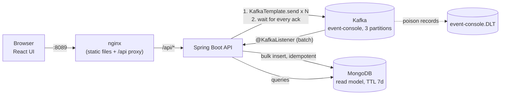

# Lab 02b — Spring Boot Event Console

## Quick Summary

- **Why this lab:** Lab-02 taught the native producer/consumer client with no framework. This lab puts the same two ideas — a producer whose callback is the only proof of durability, and a consumer whose committed offset is its only memory — behind a Spring Boot REST API, a MongoDB read model and a React UI, and hardens it the way a real service would be: idempotent writes, a dead-letter topic, outage-aware retries, non-root containers, secrets, network policies.
- **How to run:** `platform-k8s/kafka/setup.sh` then `platform-k8s/event-console/setup.sh`, then open **http://localhost:8089**. Publish events in bulk (generated or pasted) and watch them arrive in the table. `./gradlew test` for the Testcontainers suite (real Kafka + real MongoDB).
- **Expected input:** Docker, k3d, kubectl, JDK 26 (to build); a count and key strategy (or pasted `key|value` lines) in the UI.
- **Expected output:** `1,000 of 1,000 acknowledged by Kafka` with the per-partition split the broker actually used, then the same events appearing in the consumed-events table (stored in MongoDB), filterable by key, partition and value.
- **What we learned:** see [Principal Engineer questions](#principal-engineer-questions) and the measured [failure injection](#failure-injection) results below.

## Objective

Answer, with a working system: *what changes between a lab-grade Kafka client and a service you would let run unattended?* The Kafka mechanics are unchanged (see [lab-02](../lab-02-native-java-producer-consumer/README.md)); what changes is everything around them — what happens when the database is slow, when a record is bad, when the pod is killed, when a caller sends garbage.

This lab depends on lab-02 and does not modify it. Spring Kafka itself is studied in [lab-14](../lab-14-spring-kafka/README.md); this lab *uses* it the way an application would.

## Prerequisites

- The single-node Kafka from `platform-k8s/kafka/` (or any Kafka on `localhost:9092` for local runs).
- JDK 26, Docker, k3d, kubectl. Node 22 only if you run the UI outside a container.
- Familiarity with lab-02 (callbacks, partitions, committed offsets) and lab-12 (idempotent consumer, DLQ).

## Architecture



| Piece | Role |
|---|---|
| React UI (Vite) | Bulk-publish form (generate or paste), consumed-events table with filters/paging/live refresh, per-partition distribution bars |
| nginx (unprivileged) | Serves the static build, proxies `/api`, sets security headers |
| Spring Boot API | `POST /api/publish/bulk`, `GET /api/events`, `/api/events/stats`, `/api/jobs`, `/api/config`, `DELETE /api/events` |
| Kafka | System of record |
| MongoDB | A *read model* of consumed events plus an audit log of publish jobs. Disposable: rebuild it by replaying the topic |

## Concepts

| Term | In one sentence |
|---|---|
| Read model | A query-friendly copy of event data; Kafka remains the source of truth, so the copy may expire and be rebuilt. |
| Idempotent write | Storing the same Kafka record twice leaves one document — the `_id` is `topic-partition-offset`, the record's only globally unique address. |
| Dead-letter topic (DLT) | Where a record that can *never* be processed is parked, instead of being retried forever or silently dropped. |
| Outage vs poison | "The database is down" and "this record is bad" are different failures and need different handling. |

## Setup

```bash
platform-k8s/bootstrap-cluster.sh        # once; maps host ports (this lab uses 8089)
platform-k8s/kafka/setup.sh
platform-k8s/event-console/setup.sh      # builds the jar + 2 images, imports them, deploys
```

`setup.sh` generates the MongoDB password on first run (random, stored only in a Kubernetes Secret, never printed or committed) and adds the 8089 port mapping in place on a cluster created before this lab existed. `SKIP_BUILD=1` reuses the images.

**Run locally instead** (MongoDB in Docker, app and UI on the host):

```bash
docker run -d --name ec-mongo -p 27017:27017 mongo:7.0
./gradlew bootRun                      # API on :8080, Kafka on localhost:9092
cd frontend && npm install && npm run dev   # UI on :5173, proxies /api to :8080
```

## Commands

| Command | What it does |
|---|---|
| `./gradlew test` | 11 integration tests against real Kafka + MongoDB (Testcontainers) |
| `./gradlew bootJar` | Builds `build/libs/event-console.jar` |
| `cd frontend && npm run build` | Production build of the UI |
| `platform-k8s/event-console/cleanup.sh [--wipe]` | Remove (and with `--wipe`, also delete data and the Secret) |

## Implementation

Design decisions, each with the reason it is there:

| Decision | Why |
|---|---|
| Producer callbacks awaited, not `send()` | `send()` returning proves nothing (lab-02). The job result reports what Kafka acknowledged, per partition. |
| `acks=all`, idempotence on, `lz4`, bounded `max.block.ms` | Durability over latency; no duplicates from retries; a down broker fails the request quickly instead of hanging a thread. |
| `delivery.timeout.ms >= linger.ms + request.timeout.ms` | Kafka refuses to build a producer otherwise — found the hard way here (a startup 500). |
| No `topic` field in the publish request | A free-form topic on an HTTP endpoint lets any caller write to any topic on the cluster. |
| Key/value-prefix restricted to `[A-Za-z0-9._:-]` | They are embedded in generated JSON; this makes injection impossible rather than relying on escaping. |
| Request body capped at 8 MB (header check) + per-field and per-list limits | Bean validation runs *after* the body is in memory; the filter bounds it before. |
| Batch `@KafkaListener` + unordered bulk insert | One poll becomes one write — a 100,000-record backlog drains in seconds. |
| `_id = topic-partition-offset` | Redelivery (at-least-once) cannot create duplicates; no extra bookkeeping. |
| Per-record fallback via `BatchListenerFailedException` | When a bulk write fails for a non-duplicate reason, find the exact bad record so only *it* is retried/dead-lettered and everything before it is committed. |
| Outage → retry forever with capped backoff; poison → bounded retries then DLT | Dead-lettering every record during a MongoDB blip would empty the topic into the DLT. A stalled consumer (growing lag) is the correct, alertable behavior. |
| MongoDB TTL index (7d) + compound index for the default sort | The read model must not grow without bound; Kafka is the system of record. |
| Extends `ResponseEntityExceptionHandler` | A bare catch-all `@ExceptionHandler(Exception)` silently turns 404/405/415 into 500. |
| Graceful shutdown (25s) with `terminationGracePeriodSeconds: 40` | In-flight requests finish and the consumer commits before the pod dies. |
| Non-root, read-only root FS, all capabilities dropped, `seccomp: RuntimeDefault`, Pod Security `restricted` | Standard container hardening; enforced by the namespace, not just requested. |
| MongoDB authentication + password in a generated Secret | No default-open database, no password in git. |
| NetworkPolicies: MongoDB only from the API, API only from the UI | Least privilege between tiers (verified, below). |
| Init container waits for MongoDB | A fresh MongoDB initializes slower than the app's 30s index-creation window; the first deploy used to crash-loop once. |
| nginx upstream/resolver from environment, resolved per request | nginx ignores pod DNS search domains (a real 502 found here) and would otherwise cache a stale pod IP. |

## Expected output

Publishing 1,000 events (5 cycled keys) in the UI:

```text
1,000 of 1,000 acknowledged by Kafka · 328 ms
Where the broker actually stored them:   P0 400   P1 400   P2 200
```

and 1,000 rows in the table, five distinct keys, each key on exactly one partition — lab-02's key-affinity result, now visible at scale.

## Verification

- [ ] `platform-k8s/event-console/setup.sh` finishes; all three pods `1/1 Ready` with `0` restarts.
- [ ] http://localhost:8089 shows "Backend connected".
- [ ] Generate 1,000 events; the acknowledged count and per-partition bars appear, and the table fills.
- [ ] Paste three `key|value` lines; they appear with the exact keys and values.
- [ ] Filter by key and by partition; totals change accordingly.
- [ ] `./gradlew test` passes.

## Experiment

1. **Key strategy vs. distribution.** Publish 3,000 events with *Unique key per event*, then *Cycle through 5 keys*, *One key for all*, and *No key*. Compare the partition bars: even, uneven-but-affine, one hot partition, sticky batches. (Same findings as lab-03, now one click each.)
2. **Clear is not delete.** Click *Clear*: the table empties, and restarting the API brings nothing back, because the consumer group already committed those offsets. To rebuild the read model from Kafka: scale the API to 0 (offsets can only be reset for a group with no active members), run `kafka-consumer-groups.sh --reset-offsets --to-earliest --group event-console-group --topic event-console --execute` in the Kafka pod, scale the API back to 1, and the history is replayed into MongoDB.
3. **Same key, same partition.** Filter by one key: every row shows the same `P`.

## Failure injection

Measured on the k3d cluster (`kafka-lab`), final images.

**MongoDB down, then up.** MongoDB scaled to 0, 10,000 events published (Kafka accepted all), 40 seconds waited — well past the retry budget a poison record gets:

```text
during outage:  DLT records=0   consumer lag=10000   backend restarts=0
after recovery: stored=25000 (expected 25000)   DLT=0   lag=0
```

The consumer stalled (lag held at 10,000 — the alertable signal) instead of dropping records or crashing, and resumed exactly where it stopped.

**Consumer killed while draining a 100,000-record backlog.** The API was stopped, 100,000 records produced directly, the API started, then force-killed three times (no graceful shutdown) while it drained:

```text
stored=125000 expected=125000   DLT=0   lag=0
```

Caveat, stated plainly: I cannot prove each of the three kills landed *mid-batch* — only that three forced kills occurred during the drain window and the final count was exact. The no-duplicates guarantee is proven deterministically by the integration test that stores a batch mixing an already-stored record with new ones.

**Poison record** (integration test): one record MongoDB rejects every time, between two good ones. The good ones are stored, the bad one lands on `event-console.DLT`, and nothing is lost or blocked.

**Security properties verified on the cluster:** pods run as UID 999 / 10001 / 101; an unauthenticated MongoDB query returns `Unauthorized`; a throwaway pod in another namespace *and* the UI pod are both blocked from reaching MongoDB.

## Troubleshooting

| Symptom | Cause / fix |
|---|---|
| UI says "Backend unreachable" | API pod not ready: `kubectl -n event-console get pods`, then `logs deploy/event-console-backend`. |
| `502 Bad Gateway` on `/api` | nginx cannot resolve the backend. `BACKEND_UPSTREAM` must be fully qualified (`…event-console.svc.cluster.local`) — nginx's resolver ignores search domains. |
| API crashes at start: `delivery.timeout.ms should be equal to or larger than linger.ms + request.timeout.ms` | Producer timeout settings in `application.properties` violate Kafka's rule. |
| API crash-loops on first deploy with `MongoTimeoutException` | MongoDB still initializing. The init container normally prevents this; check it ran. |
| `port 8089` not reachable | Cluster created before this lab: `setup.sh` adds it with `k3d cluster edit … --port-add`; or recreate with `bootstrap-cluster.sh`. |
| Events show but counts exceed what you published | The topic already held records; a fresh MongoDB + a *new* consumer group replays them. |

## Cleanup

```bash
platform-k8s/event-console/cleanup.sh          # keeps MongoDB data and the Secret
platform-k8s/event-console/cleanup.sh --wipe   # deletes the namespace: data AND Secret
```

## Production considerations

What is production-shaped here, and what deliberately is not:

| Done | Not done (and what a real deployment adds) |
|---|---|
| Idempotent, batch, outage-aware consumer with DLT | **Authentication/authorization on the API and UI.** Anyone who can reach port 8089 can publish. Put it behind an identity-aware proxy / OIDC. |
| Validated inputs, size caps, no free-form topic | **Rate limiting** on `POST /api/publish/bulk` (a 50,000-event request is cheap to send, costly to serve). |
| Non-root, read-only FS, NetworkPolicies, Secret | **TLS** between tiers and to Kafka/MongoDB (this lab's Kafka is PLAINTEXT; see lab-17 for SASL_SSL). |
| Health probes, graceful shutdown, resource limits | **High availability**: one replica of each; MongoDB is a single instance, not a replica set. Add replicas + PodDisruptionBudgets. |
| Metrics counters (`eventconsole.*`) at `/actuator/metrics` | **A metrics pipeline** (Prometheus scrape + alert on consumer lag and DLT growth). |
| Synchronous bulk publish, bounded to 50,000 events | **Async jobs** (return 202 + job id) if you need much larger batches than one request can hold. |
| Topic auto-created by `KafkaAdmin` | **Topic provisioning as code** (partition count and replication are capacity decisions, not app startup side effects). |

## Principal Engineer questions

1. The consumer's offset commit and the MongoDB write are two separate systems. Walk through every crash point between them and say what each leaves behind. Why is the write safe to repeat?
2. Why is "MongoDB is down" handled differently from "this record is bad"? What would happen to the DLT, to consumer lag, and to on-call if you treated them the same?
3. `BatchListenerFailedException` takes an index. What goes wrong if you throw a plain exception from a batch listener instead?
4. The default sort is `consumedAt desc`, with a TTL index on the same field. What are the trade-offs of using one field for both?
5. Why does the publish endpoint not accept a topic name? What would you add if you genuinely needed multi-topic support?
6. The UI's "Clear" empties MongoDB but not Kafka. Which of this system's guarantees does that rely on, and what would break if the consumer used `auto.offset.reset=latest`?
7. This lab found a real nginx behavior (search domains ignored by `resolver`) and a real Kafka producer rule (`delivery.timeout.ms`). What does that say about testing against the real thing instead of mocks?
8. What would you have to change to run two replicas of the API? (Consider the consumer group, the publish-job audit log, and the TTL index.)
