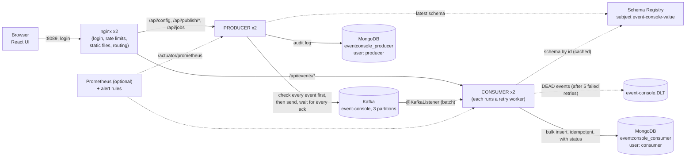
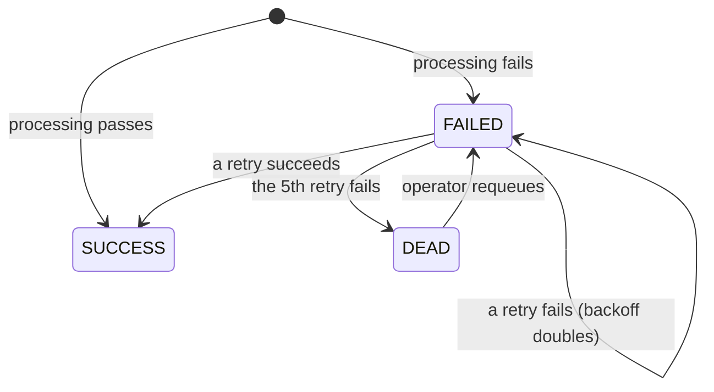
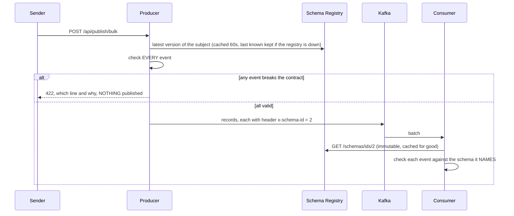

# Lab 02b — Event Console: independent producer and consumer services

## Quick Summary

- **Why this lab:** Lab-02 taught the native producer/consumer client with no framework. This lab turns those two halves into **two separately deployable Spring Boot services** — a *producer* that publishes events in bulk, and a *consumer* that stores them in a MongoDB read model — behind one React UI. They share nothing but the Kafka topic: separate code, separate builds, separate databases, separate database users, separate failure domains.
- **How to run:** `platform-k8s/kafka/setup.sh` then `platform-k8s/event-console/setup.sh`, then open **http://localhost:8089** and sign in (`platform-k8s/event-console/credentials.sh` prints the generated logins). Publish events in bulk (generated or pasted) and watch them arrive in the table. Each service builds and tests on its own: `cd producer && ./gradlew build`, `cd consumer && ./gradlew build`. The default stack runs two replicas of each service and a Schema Registry — about 1.5 GB of memory in total; `SINGLE_REPLICA=1 ./setup.sh` runs one of each on a small machine.
- **Expected input:** Docker, k3d, kubectl; a count and key strategy (or pasted `key|value` lines) in the UI. Gradle downloads JDK 26 itself.
- **Expected output:** `1,000 of 1,000 acknowledged by Kafka` with the per-partition split the broker actually used — then the same events appearing in the consumed-events table, filterable by key, partition and value.
- **What we learned:** a producer and a consumer that share only a topic really can fail and scale independently — the producer keeps accepting writes while the consumer is down and the backlog waits safely in Kafka, the read side keeps serving while the producer is down — and a database-per-service with least-privilege users is enforced by the database, not by good intentions. Production-grade then means more than splitting: an **explicit event contract** held in a Schema Registry (a bad event is refused at the edge, and a breaking schema change is refused by the registry), **failures as data** (status, retry worker, dead letters, never a blocked partition), **a login and rate limits** at the edge, **alerts that are tested**, and **two replicas of everything** (plus an opt-in MongoDB replica set) — each shown working, and failing, in [Failure injection](#failure-injection).

## Objective

Answer, with a working system: *what does it take to split a Kafka application into a producer and a consumer that are genuinely independent — and what do you have to be careful about when you do?*

This lab builds on [lab-02](../lab-02-native-java-producer-consumer/README.md) (the native client) and does not modify it. Spring Kafka itself is studied in [lab-14](../lab-14-spring-kafka/README.md); this lab *uses* it the way a real application would.

## Prerequisites

- The single-node Kafka from `platform-k8s/kafka/` (or any Kafka on `localhost:9092` for local runs).
- Docker, k3d, kubectl. A JDK that can run Gradle — the toolchain then downloads **JDK 26** by itself if it is missing. Node 22 only if you run the UI outside a container.
- Familiarity with lab-02 (callbacks, partitions, committed offsets) and lab-12 (idempotent consumer, DLQ).

## Architecture



| | **Producer** (`producer/`) | **Consumer** (`consumer/`) |
|---|---|---|
| Job | Publish events on request; record what Kafka acknowledged | Consume the topic into a read model; serve it |
| HTTP | `GET /api/config`, `POST /api/publish/bulk`, `GET /api/jobs` | `GET /api/events` (`?status=`), `/api/events/stats`, `/api/events/config`, `POST /api/events/{id}/requeue`, `DELETE /api/events` |
| Kafka | Produces to `event-console` | Consumes `event-console`; produces **only** to `event-console.DLT` |
| MongoDB | database `eventconsole_producer`, collection `publish_jobs` (TTL 30d) | database `eventconsole_consumer`, collection `events` (SUCCESS events expire after 7d; FAILED and DEAD never do) |
| DB user | `producer` — `readWrite` on its own database only | `consumer` — `readWrite` on its own database only |
| Scale | Stateless: scale horizontally | Up to the partition count (3); more replicas would idle |

Each is its **own Gradle project** (own wrapper, own `build.gradle`, own image, own tests). They can be built, tested, versioned and released separately.

## Concepts

| Term | In one sentence |
|---|---|
| Service independence | The only contract between producer and consumer is the topic: either can be down, redeployed or scaled without the other noticing. |
| Database per service | Each service owns its data; the other cannot read or write it, enforced by MongoDB users rather than convention. |
| Read model | A query-friendly copy of event data; Kafka remains the source of truth, so the copy may expire and be rebuilt by replaying the topic. |
| Idempotent write | Storing the same Kafka record twice leaves one document — the `_id` is `topic-partition-offset`, the record's only globally unique address. |
| Outage vs. bad event | "The database is down" and "this event is bad" need different handling: wait and retry the same batch, versus record the failure and move on. |
| Failure as data | An event that fails processing is stored as `FAILED` with the reason and a retry time, so its Kafka offset can be committed and its partition never blocks. |
| Retry worker | A scheduler inside the consumer that retries `FAILED` events with exponential backoff and parks them as `DEAD` after the last allowed retry. |
| Lease | A worker claims an event with one atomic update that hides it from other workers for a while; a worker that dies simply lets the lease run out. |
| Event contract | A JSON Schema, versioned in a Schema Registry, that every event must satisfy. The producer checks before sending; the consumer checks against the version the event names. |
| Closed content model | `additionalProperties: false`: an event may carry only the declared fields. A misspelt field becomes a refused event instead of silently lost data — and it is what lets the registry's BACKWARD rule allow a new *optional* field later. |
| Compatibility rule | The registry refuses to register a new schema version that would break the rule (here BACKWARD: data written under the old version must still be valid under the new one). |
| Edge | nginx in front of both services: it authenticates, authorises by role, rate-limits writes and strips credentials before proxying. |

## Setup

```bash
platform-k8s/bootstrap-cluster.sh        # once; maps host ports (this lab uses 8089)
platform-k8s/kafka/setup.sh
platform-k8s/event-console/setup.sh      # builds 2 jars + 3 images, imports them, deploys
```

`setup.sh` generates random passwords on first run — MongoDB `root`, one per service, and the two UI logins (`viewer`, `operator`) — stores each only in a Kubernetes Secret, and never prints or commits them (`credentials.sh` prints the two UI logins when you ask). A Job then creates the two least-privilege MongoDB users (idempotent, so it also works against an existing volume), the Schema Registry starts, and `contracts/register.sh` registers the event contract before the services take traffic. Switches: `SKIP_BUILD=1` reuses the images; `SINGLE_REPLICA=1` runs one replica of each service instead of two; `MONGO_HA=1` runs MongoDB as a three-member replica set. The images are tagged `0.4.2`; **bump the tag when you change code**, otherwise Kubernetes sees an unchanged manifest and keeps running the old image (or run `kubectl -n event-console rollout restart deploy/<name>`).

### Layout

```text
lab-02b-spring-boot-event-console/
├── producer/   independent Gradle project  -> image kafkalab/event-console-producer
├── consumer/   independent Gradle project  -> image kafkalab/event-console-consumer
└── frontend/   React (Vite) + nginx        -> image kafkalab/event-console-frontend
```

### Profiles: `local`, `k3d`, `aws` (both services)

Pick one with `SPRING_PROFILES_ACTIVE=local|k3d|aws`; with nothing set, **`local`** is used. Configuration is YAML (`application.yml` + `application-<profile>.yml`).

| Profile | Where it runs | Kafka | MongoDB | Needs from you |
|---|---|---|---|---|
| `local` (default) | Your machine: IDE or `./gradlew bootRun` | `localhost:9092` | `localhost:27017`, no auth, the service's own database | Kafka on 9092 and Mongo (`docker compose -f producer/docker-compose.mongo.yml up -d`). Override with `KAFKA_BOOTSTRAP` / `MONGODB_URI`. |
| `k3d` | A pod in the k3d cluster | `kafka.kafka.svc.cluster.local:19092` (the in-cluster listener) | From the service's own Secret | `MONGODB_URI` (the manifest injects it). |
| `aws` | Containers on AWS | Amazon MSK: `SASL_SSL` + `SCRAM-SHA-512`, RF 3, `min.insync.replicas` 2 | Amazon DocumentDB / Atlas | `KAFKA_BOOTSTRAP`, `KAFKA_SASL_JAAS_CONFIG`, `MONGODB_URI` — all required, **no defaults** |

`k3d` and `aws` have no defaults for endpoints or secrets on purpose: a missing one stops the service at startup and **names it**, instead of quietly connecting to localhost.

**The `aws` profile is not verified against real AWS services.** It follows the documented MSK and DocumentDB settings and is covered by `ProfilesTest` (the properties bind and mean what they claim), but this repository never ran it against MSK or DocumentDB. MSK IAM authentication is not configured (it needs `aws-msk-iam-auth`); DocumentDB needs `retryWrites=false` and the Amazon CA bundle in the JVM trust store.

**Run on your machine (profile `local`):**

```bash
docker compose -f producer/docker-compose.mongo.yml up -d     # MongoDB on localhost:27017
(cd producer && ./gradlew bootRun)                            # producer on :8080
(cd consumer && ./gradlew bootRun --args='--server.port=8081') # consumer on :8081
cd frontend && npm install && npm run dev                     # UI on :5173
```

(`npm run dev` mirrors nginx: `/api/events` goes to the consumer on :8081, the rest of `/api` to the producer on :8080.)

## Commands

Run in `producer/` or `consumer/`:

| Command | What it does |
|---|---|
| `./gradlew build` | Compile, run the **unit tests** and the **integration tests**, assemble. Works on any machine: with no Docker it skips the integration tests *with a loud warning* and still succeeds. |
| `./gradlew test` | Unit tests only (no Docker, no network). Includes `ProfilesTest`, which loads each profile's real configuration. |
| `./gradlew integrationTest` | Tests against real Kafka + MongoDB (Testcontainers). Needs Docker; run it from a shell that has it (WSL). |
| `./gradlew bootJar` | Builds `build/libs/event-console-{producer,consumer}.jar` |
| `cd frontend && npm run build` | Production build of the UI |
| `platform-k8s/event-console/cleanup.sh [--wipe]` | Remove (and with `--wipe`, also delete data and the Secrets) |

### Why `build` works without Docker, but CI never skips the integration tests

A build that fails on a laptop without Docker teaches people to run `-x test`. A build that silently skips the Docker tests in CI produces a green check for code that was never run against Kafka. Each service does neither: `integrationTest` is part of `check`/`build`, is skipped locally only when no Docker engine is reachable (with a warning), and is **always enforced when `CI` or `JENKINS_URL` is set** — there, a missing Docker is a failed build, not a skipped one.

## Implementation

What segregation changed, and why each piece is where it is:

| Decision | Why |
|---|---|
| Two Gradle projects, not modules | Each service has its own wrapper, version and lifecycle; nothing can quietly depend on the other. A little duplication (the exception handler, the startup validator) is the price of that independence. |
| `/api/config` exposes no broker addresses or group names | A public endpoint should not tell callers about infrastructure. Each service reports only what its consumers of the API need. |
| Producer creates the topic; consumer also declares it (and owns the DLT) | Whichever starts first creates it, so neither depends on the other's start order. `KafkaAdmin` never alters an existing topic. Real platforms provision topics as code. |
| New consumer group `event-console-consumer` | The consumer is a new service with a new database: a new group replays the topic from the beginning and rebuilds the read model — the same property that makes a read model disposable. |
| One MongoDB user **per database** (`readWrite` on that database only) | Compromising one service no longer exposes the other's data. Created by an idempotent Job, because MongoDB's init-script mechanism only runs on an empty volume. |
| The nginx proxy routes `/api/events` to the consumer and the rest of `/api` to the producer | The UI stays unchanged; the split is a deployment fact, not a UI concern. |
| NetworkPolicies: MongoDB only from the two services; each service only from nginx | The producer and consumer cannot call each other — they only share the topic. |
| `wait-for-mongo` init container authenticates as the service's own user | It waits for MongoDB *and* for the Job to have created the user, so first deploys don't crash-loop. |

Everything from the single-app version still applies per service: callbacks awaited (never `send()` alone), `acks=all` + idempotence + `lz4`, validated and size-capped input with no free-form topic, a batch idempotent consumer, TTL'd collections, graceful shutdown, non-root read-only containers, correct framework status codes. How failures are handled changed — see the next section.

## Failure handling: status, retry worker, dead letters

Every consumed event is stored as **one document** whose `status` only moves forward:



**What counts as a failure.** The consumer applies a processing step to each event before accepting it (`EventProcessor`). Today the step is the smallest real contract: *the value must be a JSON object*. The producer service lets a user paste arbitrary text, so a non-JSON value is a realistic bad event. A proper schema (Schema Registry) would replace that one class, not the machinery around it.

**The three paths**

| What went wrong | What the consumer does | Who owns it next |
|---|---|---|
| The event fails processing | Stores it as `FAILED` (payload, reason, `nextRetryAt`) in the **same bulk write** as its neighbours, and commits the offset. The partition never blocks and nothing is replayed. | The retry worker |
| MongoDB is unreachable | The listener throws; the error handler waits (500 ms doubling to 5 s) and retries **the same batch forever**. Nothing is skipped, dead-lettered or counted against any event. Lag grows — that is the alert. | Kafka (the offset is not committed) |
| A retry keeps failing | The worker retries at 5 s, 10 s, 20 s, 40 s, 80 s (capped at 5 min). When the 5th retry fails the event becomes `DEAD`, then is published to `event-console.DLT` with headers (`x-event-id`, `x-retries`, `x-last-error`, original topic/partition/offset). | An operator: `POST /api/events/{id}/requeue` (the *Requeue* button) gives it a fresh budget |

**Why the retry worker lives inside the consumer, not as a third application.** The events and their state belong to the consumer's database. A separate retry application would need credentials for that database (undoing database-per-service) or its own copy of the data (and a cross-database move that cannot be atomic). Instead the worker is a scheduled component of the consumer; any number of consumer instances can run one, because they share the work safely:

| Guarantee | How |
|---|---|
| Two workers never take the same event | Claiming is one atomic `findAndModify` that stamps `lockedUntil`. |
| A worker that dies loses nothing | Its lease expires and the event becomes claimable again. |
| A worker that was paused past its lease cannot overwrite the worker that took over | Every transition is conditional on the state *and retry count* it claimed; a stale update matches nothing. |
| An outage does not burn retries | If MongoDB is unreachable the attempt cannot be recorded, so it is not counted. |
| No event is left half-moved | One event is one document; every transition is one single-document update — no transaction needed. |
| `DEAD` is never silently deleted | The TTL index is **partial** (`status = SUCCESS` only). A plain TTL index would expire failed events too. |
| An existing database upgrades safely | On startup the old all-statuses TTL index is dropped, `status` is back-filled on older events, and a changed TTL is applied in place. |

**Honest limits**

- **Processing is at-least-once.** If a worker dies after processing but before recording the result, the event runs once more. `EventProcessor` implementations must be idempotent.
- **The dead-letter topic is at-least-once too.** `DEAD` is committed in MongoDB first and the topic is written second, then confirmed (`dltPublished`). A broker outage leaves it unconfirmed and it is written later; a crash between the write and the confirmation can produce a duplicate. Each record carries `x-event-id` so a reader of the DLT can de-duplicate. Requeueing does not delete the old DLT copy.
- **Retrying a deterministic failure cannot succeed.** A non-JSON value fails five times and dies. Retries earn their keep for transient causes (a downstream call, a rule not yet deployed); for permanent ones they only delay the verdict. `DEAD` + requeue is how a fixed deployment recovers them.
- **Ordering is not preserved for a failed event.** It is processed after later events with the same key.
- **`DEAD` events accumulate** until an operator requeues them or clears the read model. Nothing deletes them automatically — on purpose.
- **Rolling upgrade overlap:** an old-version pod running beside a new one stores events without `status`; they are back-filled at the next restart. Rolling *back* to the old version re-creates the old TTL index, which would start expiring failed events — do not roll back without dropping it.

## The event contract (Schema Registry)

Until now "what is a valid event" was whatever the consumer happened to tolerate. It is now a versioned **JSON Schema** (`platform-k8s/event-console/contracts/event-v1.json`) held in a Confluent-compatible **Schema Registry** (subject `event-console-value`, compatibility `BACKWARD`).



| Design decision | Why |
|---|---|
| The producer rejects the **whole request** if one event is bad | The sender is still there to be told, and nobody has to work out which of 10,000 events got through. The cheapest place to stop a bad event is before it exists in Kafka. |
| Records carry the registry id in an `x-schema-id` **header**; the value stays plain JSON | Any tool can still read the topic (Kafbat UI, `kafka-console-consumer`). The cost, stated plainly: this is not the Confluent wire format (magic byte + id inside the value), so the Confluent serializers cannot read these records. |
| The consumer checks each event against the version **it names**, not the latest | A schema id is immutable, so it is fetched once and cached for good: a registry outage cannot affect any event whose schema has been seen. |
| An event with no header, an unknown id, or a violation is **FAILED** (then retried, then DEAD) | The consumer is the last line of defence against producers that bypass the service. It never trusts the edge. |
| A registry that is **unreachable** is not an event's fault | The consumer waits (like a MongoDB outage) — nothing is failed or dropped; the retry worker leaves the event alone and counts no attempt; the producer keeps enforcing the last version it knew, and refuses to publish only if it has never obtained one. |
| The services **only read** the registry | Registering a version is a reviewed step with a compatibility check (`contracts/register.sh`, run by `setup.sh` and by CI), never something a running service does. |
| The content model is **closed** (`additionalProperties: false`) | A misspelt field becomes a refused event, not lost data. It is also what makes the registry's `BACKWARD` rule allow adding an *optional* field later: in an open model the registry (correctly) calls that incompatible, because old data could already carry a field of that name with any type. |

**Changing the contract.** `contracts/check-compat.sh <file>` asks the registry whether a candidate is compatible with the latest version *without* registering it (exit 0 / 1, usable in CI); `contracts/register.sh <file>` registers it and is refused (HTTP 409) if it is not. `contracts/examples/` has one of each: `event-v2-compatible.json` adds an optional `customerId`; `event-v3-breaking.json` adds a *required* `region`, which data written under v1 cannot satisfy. Evolving a BACKWARD contract means: register the new version, upgrade **consumers** first, then producers.

**Honest limits.**

- **Introducing a contract breaks replaying old history.** Events published before it have no `x-schema-id`, so replaying them fails every one (observed: replaying the topic after the contract existed turned 125 pre-contract test events into `FAILED`, then `DEAD`). Decide a policy *before* replaying — backfill a header, or treat header-less records as a named legacy schema — rather than discovering it in production. (Existing documents win on replay, so already-stored events are untouched.)
- **JSON Schema only, and one subject.** No Avro/Protobuf, no per-key subjects, no schema references.
- **`aws` profile:** the client speaks the Confluent REST API. AWS Glue Schema Registry has a different API and is not supported.
- **No authentication** on the registry (it is reachable only from the two services by NetworkPolicy), and the registry is a single replica.

## Running it for real: access, limits, alerts, replay

**Access.** nginx requires a login for everything except the health probe. Two accounts, generated by `setup.sh` into the `event-console-auth` Secret and printed only by `platform-k8s/event-console/credentials.sh`: **viewer** (read) and **operator** (read, publish, requeue, clear). The role is decided by the HTTP method, credentials are stripped before the request is proxied, and writes are rate-limited at 5/s (burst 10) per client address. Honest limits: this is HTTP Basic over plain HTTP — put TLS in front of it before anyone you do not trust can see the traffic; the limit is per client *address*, so behind a NAT or load balancer that rewrites addresses it becomes effectively global; and the services themselves do no authentication (they are reachable only from nginx, by NetworkPolicy). A real deployment replaces Basic with OIDC at an identity-aware proxy; nothing in the services would change. `frontend/test-nginx.sh` tests all of this against the real image.

**Alerts.** Both services expose `/actuator/prometheus` (every series tagged with its `application`). `platform-k8s/event-console/alerts/event-console.rules.yml` has nine alerts, each with the action to take in its description: consumer or producer down (including *disappeared*, which `up == 0` alone would miss), consumer lag, DEAD events, a FAILED backlog, dead letters not reaching Kafka, the Schema Registry unreachable, Kafka not acknowledging publishes, and the status gauges going stale because MongoDB is unreachable. The rules are unit-tested with `promtool` (`alerts/test.sh`, also a CI branch). `alerts/enable.sh` starts a small Prometheus that scrapes every pod and evaluates them, so you can watch them fire (`kubectl -n event-console port-forward svc/prometheus 9090:9090`). **Not included:** Alertmanager or any notification — routing alerts to people is deployment-specific.

**Replaying the dead-letter queue.** The `DEAD` documents *are* the queue; `event-console.DLT` holds a notification copy of each. So "replay" is **requeue**: `POST /api/events/{id}/requeue`, or in bulk `POST /api/events/requeue-dead?limit=1000` (the UI's *Requeue DEAD* button): oldest first, bounded at 10,000, and each event gets a fresh retry budget. The retry worker then drains them at its own pace, so one click cannot flood a downstream that has only just recovered. Re-publishing DLT records to the source topic is deliberately *not* offered: it would create a second, unrelated copy of the event (a new offset, a new `_id`) next to the `DEAD` one.

**High availability.** The manifests run **two replicas** of the producer, consumer and nginx, with `maxUnavailable: 0` rollouts, a topology spread constraint and a PodDisruptionBudget for each, so a pod can die or be rolled without a visible gap (measured below). The consumer's two replicas share the three partitions and both run a retry worker. MongoDB is a single instance by default; `MONGO_HA=1 ./setup.sh` runs it as a **three-member replica set** (keyfile authentication, `w=majority` in the services' connection strings, a PodDisruptionBudget of 2). What stays single: Kafka itself (this is the one-node lab broker), the Schema Registry, and — on this one-node k3d cluster — the *node*, so a node failure still takes everything down. Switching MongoDB modes starts with an empty database (the other mode's volume is left untouched); rebuild the read model by replaying the topic.

## Expected output

Publishing 1,000 events (5 cycled keys) in the UI:

```text
1,000 of 1,000 acknowledged by Kafka · 225 ms
Where the broker actually stored them:   P0 400   P1 400   P2 200
```

and 1,000 new rows in the table within a couple of seconds — five distinct keys, each on exactly one partition.

## Verification

- [ ] `platform-k8s/event-console/setup.sh` finishes; mongo, schema-registry, and two each of producer, consumer and frontend are `Ready` with `0` restarts, and it printed `Latest version of 'event-console-value': "version":1 …`.
- [ ] http://localhost:8089 asks for a login (`credentials.sh`); as *operator* it shows "Backend connected" and a `v1 · schema N` contract badge; publishing works; the table fills.
- [ ] `kubectl -n event-console get secret` lists `event-console-mongo`, `producer-mongo`, `consumer-mongo`, `event-console-auth`.
- [ ] In each of `producer/` and `consumer/`: `./gradlew build` passes. `frontend/test-nginx.sh` and `platform-k8s/event-console/alerts/test.sh` pass (Docker only).
- [ ] A pasted event with a typo'd field is refused with a 422 naming the line and the field, and nothing from that request is published.
- [ ] A record sent to Kafka directly, without an `x-schema-id` header, shows `FAILED`, then `DEAD` after 5 retries, and exactly one record appears on `event-console.DLT`.
- [ ] `contracts/check-compat.sh contracts/examples/event-v3-breaking.json` exits non-zero; `…/event-v2-compatible.json` exits 0.

## Experiment

1. **Take the consumer down, keep publishing.** `kubectl -n event-console scale deploy/event-console-consumer --replicas=0`, publish 5,000 events (the producer still succeeds), watch consumer lag grow, then scale it back to 1 and watch it catch up with no loss.
2. **Take the producer down, keep reading.** Scale it to 0: the table keeps serving, publishing returns 502 until it is back.
3. **Rebuild the read model.** Click *Clear*, scale the consumer to 0, reset its group (`kafka-consumer-groups.sh --reset-offsets --to-earliest --group event-console-consumer --topic event-console --execute` in the Kafka pod), scale back to 1: the whole history is replayed.
4. **Try to cross the boundary.** Connect to MongoDB as the `producer` user and read the consumer's database — `Unauthorized`.
5. **Get a bad event past the edge.** The service will not publish one, so send it straight to Kafka, like any other producer could: `printf '{"id":"raw-1"}\n' | kubectl -n kafka exec -i deploy/kafka -- /opt/kafka/bin/kafka-console-producer.sh --bootstrap-server localhost:9092 --topic event-console`. It has no `x-schema-id` header, so within seconds it shows `FAILED`; click the *DEAD* chip about three minutes later and it is there, `5 retries`, with the reason on hover. Read `event-console.DLT` (headers included) in Kafbat UI, then click *Requeue* and watch it go through the schedule again.
6. **Break MongoDB while events are retrying.** Send 100 header-less records the same way, `kubectl -n event-console scale deploy/mongo --replicas=0` for a minute, scale it back: every event still ends `DEAD` with exactly 5 retries.
7. **Break the Schema Registry.** `kubectl -n event-console scale deploy/schema-registry --replicas=0`: publishing still works (the producer keeps the last contract it knew), the consumer keeps storing events whose schema it has seen, and an event naming a schema it has *not* seen waits instead of failing. Scale it back and the waiting event is stored by itself.
8. **Evolve the contract.** `SUBJECT=event-console-demo contracts/register.sh contracts/event-v1.json`, then `check-compat.sh` on the two files in `contracts/examples/`: one is compatible, one is not, and `register.sh` refuses the breaking one.
9. **Lose a pod under load.** Publish continuously (a loop of `curl`s as *operator*) and `kubectl delete pod` one pod of each service, one at a time, with and without `--force --grace-period=0`: no request fails, and what Kafka acknowledged equals what is stored.
10. **Lose the MongoDB primary.** `MONGO_HA=1 ./setup.sh`, then force-delete the primary pod (`rs.hello().primary` tells you which) while publishing: a new primary is elected, the services keep working, nothing is lost.

## Failure injection

Measured on the k3d cluster (`kafka-lab`), final images.

**Consumer down, producer keeps working.** The consumer was scaled to 0, then 5,000 events were published:

```text
consumer is down ->  /api/config (producer): 200    /api/events/stats (consumer): 502
publishing 5,000 while the consumer is down: acked 5000, failed 0
consumer lag while it is down: 5000          <- the backlog waits safely in Kafka
after the consumer returned: lag=0  DLT=0  stored = exactly the expected count
```

The failure stayed on its side of the boundary: publishing was unaffected, the read side reported itself unavailable (`502` from nginx), and when the consumer came back it drained the backlog with no loss and nothing dead-lettered.

**Producer down, reads keep working.** The producer was scaled to 0:

```text
producer is down ->  /api/events/stats: 200    /api/events?size=5: 200    publish: 502
```

The table kept serving what was already stored; only publishing failed, and it recovered by itself when the producer returned (100 of 100 acknowledged and consumed).

**Consumer force-killed three times while draining a 100,000-record backlog.** The consumer was stopped, 100,000 records produced directly to the topic, the consumer started, then force-killed (`--force --grace-period=0`, no graceful shutdown) three times while it drained:

```text
final: stored=232103  expected=232103   lag=0   DLT=0   (all pods 0 restarts)
```

Caveat, stated plainly: I cannot prove each of the three kills landed *mid-batch* — only that three forced kills occurred during the drain window and the final count was exact. The no-duplicates guarantee is proven deterministically by the consumer's integration test that stores a batch mixing an already-stored record with new ones.

**Bad events, through the real producer API** (20 valid JSON events and 5 plain-text ones, final 0.3.0 images, the existing 232,203-event database upgraded in place):

```text
upgrade:  legacy index ttl_consumedAt dropped; ttl_success_consumedAt created, partial {"status":"SUCCESS"}, 604800s
          events with no status field: 0   (all 232,203 back-filled to SUCCESS)
consume:  SUCCESS 232,223   FAILED 5   (the 20 valid events stored normally)
retries:  retries seen on the 5 FAILED events over time: 0 -> 2 (t+16s) -> 3 (t+47s) -> 4 (t+79s) -> DEAD at t+171s
final:    5 events DEAD, retries=5, dltPublished=true;  event-console.DLT: exactly 5 new records, with
          x-event-id, x-original-*, x-retries=5 and x-last-error headers
requeue:  POST .../requeue -> 200, event back to FAILED retries=0;  again -> 404;  unknown id -> 404
```

**Two retry workers + a MongoDB outage + a force-killed consumer, while 100 events are being retried.** The consumer was scaled to 2 replicas, 100 plain-text events published, then at t+22s MongoDB was scaled to 0 for 60 s, at t+53s one consumer pod was force-deleted (`--force --grace-period=0`), and MongoDB came back at t+84s:

```text
all 100 reached DEAD at t+224s:   {"status":"DEAD","retries":5,"dltPublished":true}  x 100
                                  -> no event retried more than 5 times, none lost, none stuck
event-console.DLT:                100 records for these events, 100 unique keys (no duplicate)
                                  (+1 record: the event requeued above died again; requeueing does not delete its old DLT copy)
pods:                             all Ready, 0 restarts
```

What this does and does not prove, stated plainly: it shows the claim/lease/conditional-update rules hold under a real outage and a real kill with two workers — the retry counts are exact. It cannot prove that the kill landed in the narrow window between "dead letter written" and "dead letter confirmed", which is the only place a duplicate DLT record can come from; no duplicate occurred in this run. That window is covered deterministically instead: the integration test makes the broker refuse the first three dead-letter writes and checks the event stays unconfirmed, is written later, and appears exactly once.

**Integration tests** (real Kafka + MongoDB containers) additionally prove: 8 concurrent claimers split 200 events with no duplicate and no miss; a claimed event is invisible until its lease expires; a worker that lost its lease cannot overwrite the worker that took over; outage attempts are not counted against an event's retries; and MongoDB's real TTL monitor deletes old `SUCCESS` events while old `FAILED` and `DEAD` ones survive the same pass.

### Production hardening — measured on the k3d cluster (images 0.4.2, real Schema Registry, two replicas)

**The edge and the contract**, through the real API with the generated logins:

```text
UI without a login 401 · wrong user 401 · /healthz without a login 200 · viewer reads 200
viewer publishes / requeues / clears: 401 each · operator publishes 200

contract in the registry:   subject event-console-value, BACKWARD, version 1 (schema id 2)
a valid publish:            acked 5/5, stored 5/5, each stored event reports schemaId "2" (it travelled in the Kafka header)
a request with 1 good and 2 bad events:  HTTP 422, nothing published (the good one is NOT on the topic)
    #2  /seq: must have a minimum value of 0; (the event): required property 'id' not found
    #3  value is not valid JSON: Unrecognized token 'plain' ...
a record sent to Kafka directly:        no header   -> FAILED "event has no x-schema-id header, so it declares no contract"
                                        header 999  -> FAILED "schema id 999 is not registered"
compatibility (demo subject):           v2 adds an optional field -> COMPATIBLE (exit 0)
                                        v3 adds a required field  -> INCOMPATIBLE (exit 1); registering it is refused
40 quick publishes:         32 accepted, 8 refused with 429
```

The edge also has its own test against the real image (`frontend/test-nginx.sh`, 20 checks: the same matrix, credentials stripped before proxying, 429s on writes and none on reads).

**A Schema Registry outage, with Prometheus watching** (alerts enabled, registry scaled to 0, then back):

```text
producer, registry down:     publish still 200 (it keeps the contract it knew); log: "Could not refresh the contract, continuing with version 1"
a record naming a schema the consumer had never seen:   not stored, not failed — the consumer waits (lag 1, FAILED unchanged)
metric:                      eventconsole_contract_unavailable_total grew ~11.7 in 2 min
alert EventConsoleContractUnavailable:   pending at t+67s -> firing at t+178s (its rule says "for 2m")
registry back:               the waiting record was stored by itself as SUCCESS
consumer scaled to 0:        EventConsoleConsumerDown  inactive -> pending (t+47s) -> firing (t+174s)
9 rules loaded; all four pods scraped (up)
```

**Losing a pod of every service while a client publishes 20-event batches for 80 s** (graceful deletes of a producer, an nginx and a consumer pod, a force-kill of another producer and of a consumer pod):

```text
client:   171 requests, 171 HTTP 200, 0 failures
Kafka acknowledged 3,420 events;  stored 3,420  (no loss, no duplicate)
all pods Ready afterwards, 0 restarts of the survivors
```

**MongoDB as a three-member replica set** (`MONGO_HA=1`; one replica of each service to fit in memory; a primary force-killed while a client published for 75 s):

```text
formed:   mongo-0 PRIMARY, mongo-1 SECONDARY, mongo-2 SECONDARY; both services connected through the replica-set URI
killed:   the primary (mongo-0, --force --grace-period=0);  mongo-1 became primary;  mongo-0 rejoined as SECONDARY
client:   128 requests, 128 HTTP 200
written to Kafka during the test: 2,560   stored in the replica set: 2,560
then:     switching back to a single instance left the original database intact (235,710 events at that moment, then healed to the full 238,495 by replaying the topic in about a minute)
```

I did **not** measure the election time (my timing probe was wrong, so the figure is not reported), and the one-node cluster means all three members share a node — this proves the failover logic, not node-level availability.

**Things the live runs found that the unit and integration tests could not:**

- MongoDB was OOM-killed during the one-off back-fill of the 232,000-event collection. The back-fill now runs in 5,000-document chunks, and the container has 768 MiB.
- The Schema Registry image's user is named (`appuser`), so a `runAsNonRoot` pod needs a numeric `runAsUser`.
- nginx's `limit_except` silently skips the `set` that picks the upstream, so every non-GET request failed with a 500. Choosing the password file by request method fixed it, and `test-nginx.sh` now guards it.
- The registry's BACKWARD rule called "add an optional field" incompatible while the content model was open — the model had to be closed (see the contract section).
- `setup.sh` waited on MongoDB's *pods* after a change to its spec and got pinned to the terminating old one; it now waits on the rollout.
- Replaying the topic after the contract existed turned pre-contract events into `FAILED` (see the contract section's limits).

**Isolation verified on the cluster:**

```text
producer user -> its own database (publish_jobs)      : ALLOWED
producer user -> the consumer's database (events)     : DENIED  Unauthorized
consumer user -> its own database (events)            : ALLOWED
consumer user -> the producer's database (publish_jobs): DENIED  Unauthorized

frontend -> producer : REACHABLE      frontend -> consumer : REACHABLE
producer -> consumer : BLOCKED        consumer -> producer : BLOCKED
```

**New consumer group replays the topic:** deploying the consumer with a new group id rebuilt all 126,003 existing events into its fresh database with lag 0.

## Troubleshooting

| Symptom | Cause / fix |
|---|---|
| UI says "Backend unreachable" | The producer or consumer pod is not ready: `kubectl -n event-console get pods`, then `logs deploy/event-console-<producer\|consumer>`. |
| Table is empty / `502` on `/api/events`, but publishing works | The consumer is down. That is the segregation working: publishing is unaffected and the backlog waits in Kafka. |
| Publishing returns `502`, but the table still loads | The producer is down. |
| `502 Bad Gateway` on everything | nginx cannot resolve an upstream. `PRODUCER_UPSTREAM` / `CONSUMER_UPSTREAM` must be fully qualified (`….svc.cluster.local`) — nginx's resolver ignores search domains. |
| Service crashes at start: `delivery.timeout.ms should be equal to or larger than linger.ms + request.timeout.ms` | Producer timeout settings in `application.yml` violate Kafka's rule. |
| Service exits at start naming `MONGODB_URI` | The `k3d`/`aws` profile requires it; the manifest injects it from the service's Secret. |
| `Unauthorized` from MongoDB after a redeploy | The service user is created by the `mongo-users` Job; re-run `setup.sh` (it recreates the Job) or check `kubectl -n event-console logs job/mongo-users`. |
| New code but the old behaviour in the cluster | Same image tag, unchanged manifest: bump the version in `setup.sh`/`manifests.yaml`, or `rollout restart`. |
| The browser asks for a password | That is the edge. `platform-k8s/event-console/credentials.sh` prints the `viewer` and `operator` logins. |
| `429` on publishing | The write rate limit (5/s, burst 10 per client address). Slow down; it clears within a second. |
| Publishing returns `422` | An event breaks the contract; the body names the line and the field. Nothing from that request was published. |
| Publishing returns `503` "event contract is unavailable" | The Schema Registry cannot be reached and this producer has never obtained the contract: `kubectl -n event-console get pods -l app=schema-registry`. (A producer that already has one keeps working.) |
| Events appear as `FAILED` with "no x-schema-id header" | They were sent to Kafka by something other than the producer service (a console producer, an old client), or they are pre-contract events being replayed. |
| `schema-registry` pod: `CreateContainerConfigError … non-numeric user` | The manifest must give the pod a numeric `runAsUser` (it does: 1000); you edited it out. |
| After `MONGO_HA=1` (or back) the table is empty | Switching modes starts with an empty database; the other mode's data is untouched. Rebuild by resetting the consumer group to the earliest offset (Experiment 3). |
| `setup.sh` fails at the contract step with HTTP 409 | `event-v1.json` is not compatible with the version already registered. Run `contracts/check-compat.sh contracts/event-v1.json` to see why; an unreleased draft can be removed with `DELETE /subjects/event-console-value` (twice, the second with `?permanent=true`). |
| Memory pressure: pods `OOMKilled`, probes timing out, WSL unresponsive | The default stack is about 1.5 GB. `SINGLE_REPLICA=1 ./setup.sh`, or scale Kafbat UI to 0 (`kubectl -n kafka-ui scale deploy/kafka-ui --replicas=0`). |

## Cleanup

```bash
platform-k8s/event-console/cleanup.sh          # keeps MongoDB data and the Secrets
platform-k8s/event-console/cleanup.sh --wipe   # deletes the namespace: data AND Secrets
```

## Production considerations

| Done (and verified, see above) | Not done — what a real deployment adds |
|---|---|
| Two independently deployable services with their own data and credentials | **Separate MongoDB clusters** if the services need isolation of resources and blast radius, not only of data. Today both databases live on one server (or one replica set). |
| An explicit event contract in a Schema Registry: refused at the edge, enforced again by the consumer, compatibility-checked on change | **A wire format other tools can decode** (the Confluent magic byte), **Avro/Protobuf**, schema references, and a **header-less policy** for replaying history from before the contract. The registry is a single unauthenticated replica. |
| Idempotent, batch, outage-aware consumer; failures stored as status, retried with backoff, then DEAD + DLT; bulk requeue | **Exactly-once effects.** Processing and the dead-letter topic are at-least-once; processors must be idempotent. |
| A login with two roles, per-method authorisation, credentials stripped before proxying, rate-limited writes (tested against the real image) | **TLS** (this is Basic over plain HTTP), **OIDC** at an identity-aware proxy, per-user (not per-address) limits, and authentication *between* services. |
| Nine alert rules, unit-tested with `promtool`, and a Prometheus that evaluates them on real metrics | **Alertmanager and routing** to people; **consumer-group lag from the broker's point of view** (`kafka-exporter`) rather than only the consumer's own gauge; dashboards. |
| Two replicas of every service, safe rollouts, disruption budgets, a spread constraint; an opt-in 3-member MongoDB replica set whose primary was killed under load | **More than one node.** On the one-node cluster a node failure still takes everything down. Kafka is one broker; the registry is one pod. Replica-set **election time was not measured**. |
| A real Jenkins ran the pipeline for lab-02b (144 tests recorded, green) | The other 16 labs, the k3d deploy stage, agents with real credentials, a multibranch job. |
| Non-root, read-only FS where the image allows, NetworkPolicies, per-service Secrets | **Secrets in a secret manager, with rotation.** Kafka here is PLAINTEXT (see lab-17 for SASL_SSL). |
| Validated inputs, size caps, no free-form topic | **Async jobs** (202 + job id) for batches much larger than the 50,000-event synchronous publish; the producer's audit record is saved *after* the publish, so a MongoDB failure at that instant loses the audit row, not the events. |
| Topic auto-created at startup | **Topic provisioning as code** (partition count and replication are capacity decisions, not app startup side effects). |

## Principal Engineer questions

1. The producer and consumer share a topic and nothing else. What *implicit* couplings remain (message format, key semantics, topic name, partition count), and how would you make each explicit?
2. Why does a **new** consumer group make sense for the consumer service here, and what would have gone wrong if it had kept the old group id with a new, empty database?
3. The consumer can be scaled to the partition count but the producer can be scaled freely. Why the asymmetry, and what decides the right replica count for each?
4. With the consumer down, publishing still succeeds. Is that always the right behaviour? When would you rather the producer refuse, and what signal would tell it to?
5. Each service has its own MongoDB user restricted to its own database. What does that protect against that NetworkPolicies and a shared password do not? What does it *not* protect against?
6. Both services declare the topic. What could go wrong if their declarations ever disagree, and how would you prevent it?
7. nginx routes `/api/events` to the consumer. What happens to a client that was written against the old single backend, and how would you version the API to evolve the two independently?
8. The dead-letter topic belongs to the consumer. Who should own the process for reading and replaying it, and what does replaying a DLT record safely require?
9. `FAILED` events live in MongoDB instead of a Kafka retry topic. What did that buy (visibility, a requeue button, backoff control, no partition blocking) and what did it cost (ordering, a new at-least-once boundary, a dependency on the database being up to record a failure)?
10. The retry worker shares the consumer's database instead of being its own application. Under what conditions would you split it out anyway, and what would that force you to add?
11. An event fails five times because of a validation rule that was too strict, and you fix the rule. Walk through recovering the dead events — what must be true for requeueing hundreds of them to be safe?
12. Why is the TTL index partial? What would have happened to a week-old `DEAD` event with a plain TTL index, and who would have noticed?
13. The producer refuses a whole request if one event is bad, and the consumer re-checks anyway. Why both? What would you lose by keeping only the edge check — and what would you lose by keeping only the consumer's?
14. The contract is closed (`additionalProperties: false`) and the rule is BACKWARD. Walk through adding an optional field in production: which service is upgraded first, and what breaks if it is the other one?
15. The consumer validates each event against the schema id *it names*, not the latest. What does that make possible during a registry outage, and what attack or mistake does it open (an event naming an old, looser schema)?
16. You introduced the contract after a million events already existed. What happens when someone replays the topic, and what are your options (backfill headers, a named legacy schema, a cut-over offset)? Which would you choose and why?
17. A client's address is the rate-limit key, and the cluster's load balancer rewrites every address to one. What did you actually build, and what is the minimum change that gives each *user* a limit?
18. Both consumer replicas run a retry worker and report the same status gauges. Which alert expressions need `max` rather than `sum`, and what goes wrong if you pick the wrong one?
19. The MongoDB replica set survived losing a primary on a one-node cluster. What does that test prove, and what does it not?
20. Your CI controller is also its only agent and has no login. List what a production Jenkins adds, and which of the problems found by running this pipeline for real (plugin id, local checkout, host-path bind mounts, loopback ports) would have shown up only on a real agent fleet.
