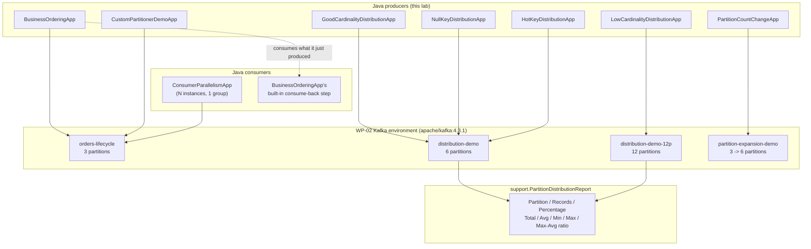

# Lab 03 — Partitioning & Ordering Engineering

## Quick Summary

- **Why this lab:** To turn "how many partitions should I create?" into an architecture question — what must be ordered together, what's the key's real traffic distribution, what parallelism is required, and what happens when the topology changes later.
- **How to run:** Start `platform/kafka/`, create the four lab topics (varying partition counts), then run the distribution experiments (`runGoodCardinalityDistribution`, `runNullKeyDistribution`, `runLowCardinalityDistribution`, `runHotKeyDistribution`), the mandatory partition-count-change experiment (`runPartitionMappingBefore`/`--alter --partitions 6`/`runPartitionMappingAfter`), and `./gradlew test`.
- **Expected input:** A running WP-02 cluster, JDK 21+; most experiments accept `-Pcount` (records to send) and default topic names, overridable via `-Ptopic`.
- **Expected output:** A real per-partition distribution report (records/percentage/max-avg ratio) for each key strategy; a measured, checkable remapping table after a partition-count change; a consumer-parallelism demo where extra consumers sit provably idle.
- **What we learned:** Kafka only orders within a partition — never across a whole topic. Good-cardinality keys distribute close to evenly (max/avg ≈1.02); null keys stick to one partition per batch (KIP-794), not round-robin; low-cardinality keys leave most partitions empty no matter how many you provision; a single hot key can put 91% of traffic on one partition on an otherwise healthy cluster. Increasing partition count changes where *future* records for a key land (verified via `murmur2(key) % N`) but never moves already-written data — partition count is capacity-planned state, not a free-to-flip autoscaling knob.

## Objective

This lab answers, and gives you personal, measured evidence for:

> **How do I choose a Kafka partitioning strategy that preserves the
> ordering my business requires without creating hot partitions or
> unnecessarily limiting scalability?**

By the end, you should no longer ask only "how many partitions should I
create?" You should ask: *what must be ordered together, what is the
traffic distribution of that key, what parallelism do we require, how will
this evolve, and what happens to our semantics if the partition topology
changes?* That shift — from a configuration question to an architecture
question — is this lab's actual goal. The full conceptual and Principal
Engineer depth behind every experiment here lives in
[`docs/partitioning/PARTITIONING_AND_ORDERING.md`](../../docs/partitioning/PARTITIONING_AND_ORDERING.md);
read it alongside this lab, not instead of it.

This lab does not implement consumer-group rebalance internals
(WP-05), replication/ISR (WP-07), transactions (WP-09), Kafka
Streams, Schema Registry, Connect, Spring Kafka, Kubernetes, Cruise
Control, multi-cluster, deep capacity planning, or security. It reuses
WP-03's native producer/consumer fundamentals — read
[`labs/lab-02-native-java-producer-consumer`](../lab-02-native-java-producer-consumer/README.md)
first if you haven't.

## Prerequisites

- Everything WP-03 required: the WP-02 Kafka environment running, a JDK
  21+ (this lab was built and validated on JDK 26 targeting Java 21
  bytecode, same as WP-03 — see that lab's README for the full rationale),
  Docker for the Testcontainers tests.
- Comfort with `labs/lab-02-native-java-producer-consumer` — this lab does
  not re-explain `KafkaProducer`/`KafkaConsumer` basics, the poll loop, or
  auto-commit; it builds directly on top of them.

### Why a separate project

This lab is its own self-contained Gradle project — same convention as
`lab-01` and `lab-02`, each of which owns its own build rather than
sharing one multi-module structure. The dependency set and versions
(Gradle 9.7.1, Java 21, `kafka-clients:4.3.1`, Testcontainers 2.0.5, JUnit
Jupiter 6.1.3) are identical to `lab-02`'s, copied rather than shared,
specifically so this work package didn't have to introduce a multi-module
Gradle restructuring as a side effect of a partitioning lab. If a future
work package finds real duplication pain across labs, that restructuring
is its own deliberate decision to make — not one to back into here.

## Architecture



Every distribution experiment (`GoodCardinality`, `NullKey`,
`LowCardinality`, `HotKey`) shares the same reporting utility, so its
output format is identical across experiments — only the input key
strategy changes, which is exactly the variable this lab wants isolated.

## Concepts

Kept brief — the full depth is in
[`docs/partitioning/PARTITIONING_AND_ORDERING.md`](../../docs/partitioning/PARTITIONING_AND_ORDERING.md).

| Term | In one sentence |
|---|---|
| Partition key | The value a producer uses to decide (via hashing) which partition a record goes to. |
| Partition affinity | The property that the same key consistently maps to the same partition, under a stable topology. |
| Cardinality | How many distinct values a key can realistically take. |
| Skew | How unevenly real traffic is spread across those values. |
| Hot key | A single key value that dominates traffic. |
| Hot partition | The partition a hot key mechanically maps to — a capacity problem even on a healthy cluster. |
| Sticky/adaptive partitioning | The (non-round-robin) strategy the client uses for records with no key. |
| Custom partitioner | A pluggable class implementing your own routing logic in place of the built-in hash-based one. |
| Key salting | Splitting one hot key into several to spread its load, at the cost of simple ordering. |

## Setup

1. The WP-02 Kafka environment must be running:

   ```bash
   docker compose -f platform/kafka/docker-compose.yml up -d
   ```

2. Create every topic this lab's experiments use. Partition counts are
   deliberately different per topic, matching what each experiment is
   built to demonstrate:

   ```bash
   docker exec kafka /opt/kafka/bin/kafka-topics.sh --bootstrap-server localhost:9092 \
     --create --topic orders-lifecycle --partitions 3 --replication-factor 1

   docker exec kafka /opt/kafka/bin/kafka-topics.sh --bootstrap-server localhost:9092 \
     --create --topic distribution-demo --partitions 6 --replication-factor 1

   docker exec kafka /opt/kafka/bin/kafka-topics.sh --bootstrap-server localhost:9092 \
     --create --topic distribution-demo-12p --partitions 12 --replication-factor 1

   docker exec kafka /opt/kafka/bin/kafka-topics.sh --bootstrap-server localhost:9092 \
     --create --topic partition-expansion-demo --partitions 3 --replication-factor 1
   ```

   `distribution-demo-12p` is deliberately over-provisioned (12 partitions)
   specifically for the low-cardinality experiment, to make "most of these
   partitions stayed empty" impossible to miss.

3. From this directory, build the project:

   ```bash
   ./gradlew build
   ```

   **Windows + Testcontainers:** if `./gradlew test` hangs instead of
   completing in well under a minute, see
   [`lab-02`'s Testcontainers troubleshooting note](../lab-02-native-java-producer-consumer/README.md#testcontainers-test-hangs-or-times-out)
   — the same `DOCKER_HOST` fix applies here unchanged.

### Kubernetes (k3d) alternative

```bash
platform-k8s/bootstrap-cluster.sh   # once
platform-k8s/kafka/setup.sh
```

Same host port (`localhost:9092`) as Docker Compose, so every
`./gradlew run...` command below works unchanged. Create topics via
`kubectl -n kafka exec deploy/kafka -- //opt/kafka/bin/kafka-topics.sh
...` instead of `docker exec` — see
[`platform-k8s/README.md`](../../platform-k8s/README.md). Cleanup:
`platform-k8s/kafka/cleanup.sh [--wipe]`.

## Commands

| Gradle task | Experiment |
|---|---|
| `./gradlew runBusinessOrdering` | Business ordering + per-partition ordering proof |
| `./gradlew runGoodCardinalityDistribution -Pcount=10000` | High-cardinality key distribution |
| `./gradlew runNullKeyDistribution -Pcount=10000` | Null-key distribution, measured |
| `./gradlew runLowCardinalityDistribution -Ptopic=distribution-demo-12p -Pcount=10000` | Low-cardinality key distribution |
| `./gradlew runHotKeyDistribution -Pcount=10000` | Hot-key / hot-partition distribution |
| `./gradlew runPartitionMappingBefore -Ptopic=partition-expansion-demo` | Partition-count-change experiment, phase 1 |
| `./gradlew runPartitionMappingAfter -Ptopic=partition-expansion-demo` | Partition-count-change experiment, phase 2 |
| `./gradlew runCustomPartitionerDemo` | Custom `Partitioner` in action |
| `./gradlew runConsumerParallelism -PclientId=<id>` | Consumer-parallelism ceiling (run multiple instances) |
| `./gradlew test` | The Testcontainers integration tests |

## Implementation

```text
src/main/java/com/kafkalab/partitioning/
  producer/
    BusinessOrderingApp.java              Experiment 1
    GoodCardinalityDistributionApp.java   Experiment 2
    NullKeyDistributionApp.java           Experiment 3
    LowCardinalityDistributionApp.java    Experiment 4
    HotKeyDistributionApp.java            Experiment 5
    PartitionCountChangeApp.java          Experiment 6 (mandatory)
    CustomPartitionerDemoApp.java         Experiment 7
  consumer/
    ConsumerParallelismApp.java           Experiment 8
  support/
    LabConfig.java                        Shared config reader (copied from lab-02)
    PartitionDistributionReport.java      Shared reporting utility
    TopicInspector.java                   Reads current partition count via AdminClient
    FirstLetterPartitioner.java           The educational custom Partitioner
```

### Performance experiment discipline

The distribution experiments (`GoodCardinality`, `NullKey`,
`LowCardinality`, `HotKey`) send thousands of records using **async sends
with a counting callback**, never `send(record).get()` per record — that
pattern would turn a distribution measurement into a synchronous network
round-trip benchmark, measuring the network instead of the partitioner.
Elapsed time is recorded and printed, but this lab is explicitly **not**
the performance-engineering module (a later WP owns that) — the timing
here exists only so you can see that these are lightweight, bounded
experiments, not a claim about production throughput.

`BusinessOrderingApp` and `PartitionCountChangeApp`, by contrast, block
per send (`.get()`) deliberately — they send a handful of records each,
where deterministic, readable, in-order console output matters more than
throughput.

### The partition-count-change experiment's local state

`PartitionCountChangeApp`'s "before" phase writes its observed mapping to
`partition-mapping-before.local.properties` in this project directory —
matching the `.local.properties` pattern the repository's root
`.gitignore` already excludes, so this generated experiment state is never
committed. The "after" phase reads it back automatically to compute the
comparison — see that class's Javadoc for the full mechanics.

## Expected output

Every result shown in this README's Experiment section below is real
output captured while building and validating this lab against the WP-02
Kafka environment — not illustrative text. Exact partitions, percentages,
and which keys remap will differ on your own run (they depend on the
Murmur2 hash of your exact key strings and on adaptive/sticky state that
depends on timing) — the *shape* of each result, and the claims tied to
it, are what should reproduce.

## Verification

- [ ] Produce order-lifecycle events keyed by order id and prove each
      order's events land on one partition, in order.
- [ ] Prove the raw, as-consumed order across a whole topic is an
      interleaving, not a global sequence.
- [ ] Run a high-cardinality distribution experiment and get a real
      Partition Distribution report (not fabricated numbers).
- [ ] Run a null-key distribution experiment and observe (not assume) its
      shape.
- [ ] Run a low-cardinality distribution experiment against a
      12-partition topic and see most partitions stay empty.
- [ ] Run a hot-key distribution experiment and see one partition
      dominate.
- [ ] Run the partition-count-change experiment end to end: before
      mapping, CLI-driven expansion, after mapping, real comparison.
- [ ] Confirm at least one remapped key, and check it against the
      doubling prediction if you expanded by an exact multiple.
- [ ] Run a custom partitioner and see its routing rule take effect.
- [ ] Run enough `ConsumerParallelismApp` instances to see at least one
      sit idle.
- [ ] Run `./gradlew test` and get three passing Testcontainers tests.
- [ ] Confirm WP-03's own tests (`lab-02`) still pass unmodified.

## Experiment

### Experiment 1 — Business ordering and the ordering guarantee

```bash
./gradlew runBusinessOrdering
```

Real result (order ids and exact partitions will vary by run; the shape
is what matters):

```text
key=order-1001 event=CREATED -> partition=0 offset=0
key=order-1001 event=PAID    -> partition=0 offset=1
key=order-1001 event=PACKED  -> partition=0 offset=2
key=order-1001 event=SHIPPED -> partition=0 offset=3
key=order-1002 event=CREATED -> partition=0 offset=4
...
key=order-1003 event=CREATED -> partition=1 offset=0
...
```

Then, consuming it all back:

```text
--- Raw consumption order (as poll() returned it) ---
partition=1 offset=0 key=order-1003 value=CREATED@...
partition=1 offset=1 key=order-1003 value=PAID@...
partition=1 offset=2 key=order-1003 value=PACKED@...
partition=1 offset=3 key=order-1003 value=SHIPPED@...
partition=0 offset=0 key=order-1001 value=CREATED@...
...
```

**What this proves:** `order-1003`'s entire four-event sequence was
consumed *before* `order-1001`'s, even though `order-1001` was produced
first — there is no global order to violate, because none exists. Yet
within each partition, and therefore within each order (since each order's
events shared one partition here), the sequence is exactly
`CREATED -> PAID -> PACKED -> SHIPPED`, every time — the per-partition
guarantee, doing the work business ordering actually needed.

### Experiment 2 — Good-cardinality distribution

```bash
./gradlew runGoodCardinalityDistribution -Pcount=10000
```

Real result:

```text
Sent 10000 high-cardinality records in 195ms (all callbacks completed: true)

Partition Distribution -- high-cardinality keys (10000 distinct orders)

Partition  Records    Percentage
0          1700        17.00%
1          1699        16.99%
2          1619        16.19%
3          1663        16.63%
4          1687        16.87%
5          1632        16.32%

Total       10000
Average     1666.67
Min         1619
Max         1700
Max/Avg     1.02
```

**What this proves:** 10,000 distinct keys produced a close-to-even split
across 6 partitions (`Max/Avg` of `1.02`) — good cardinality gave the
partitioner enough diversity to work with. It is not a promise of
mathematically perfect balance, and `1.02` is not a magic threshold — it's
this run's real number.

### Experiment 3 — Null-key distribution

```bash
./gradlew runNullKeyDistribution -Pcount=10000
```

Real result:

```text
Partition Distribution -- null-key records (10000 records)

Partition  Records    Percentage
0          1338        13.38%
1          1384        13.84%
2          0            0.00%
3          2088        20.88%
4          0            0.00%
5          5190        51.90%

Max/Avg     3.11
Empty partitions (0 records): 2 of 6
```

**What this proves, and refuses to claim:** this is dramatically uneven —
two empty partitions, one with 51.9% of all traffic — which is itself the
lesson. Null-key records are not round-robined; the actual mechanism
(KIP-794 adaptive sticky partitioning, see
[`docs/partitioning/PARTITIONING_AND_ORDERING.md`](../../docs/partitioning/PARTITIONING_AND_ORDERING.md))
sticks to one partition per batch, and this shape is a legitimate real
outcome of that — not a bug, and not something to generalize into a fixed
distribution rule either way.

### Experiment 4 — Low-cardinality distribution

```bash
./gradlew runLowCardinalityDistribution -Ptopic=distribution-demo-12p -Pcount=10000
```

Real result:

```text
Key -> partition (each of the 3 keys is internally consistent):
  IN -> partition 0
  UK -> partition 1
  US -> partition 8

Partition Distribution -- low-cardinality key (country: IN/US/UK) across 12 partitions

Partition  Records    Percentage
0          3318        33.18%
1          3277        32.77%
2..7,9..11 0            0.00%
8          3405        34.05%

Max/Avg     4.09
Empty partitions (0 records): 9 of 12

3 of 12 partitions received any traffic at all -- more partitions did not
create more parallelism here, because the key only had 3 distinct values.
```

**What this proves:** 9 of 12 provisioned partitions sat completely idle,
for the entire experiment. Adding partitions did nothing for this key
choice — the ceiling was the key's cardinality, not the topic's partition
count.

### Experiment 5 — Hot-key distribution

```bash
./gradlew runHotKeyDistribution -Pcount=10000
```

Real result:

```text
Records by key kind:
  normal (customer-normal-*)     1052 (10.5%)
  hot (customer-VIP)             8948 (89.5%)

Partition Distribution -- hot key (customer-VIP = 90% of traffic)

Partition  Records    Percentage
0          165          1.65%
1          185          1.85%
2          160          1.60%
3          197          1.97%
4          192          1.92%
5          9101        91.01%

Max/Avg     5.46
```

**What this proves:** one partition carried 91% of all traffic while
five others sat nearly idle — on a cluster with no failure at all. See
[`docs/partitioning/PARTITIONING_AND_ORDERING.md`](../../docs/partitioning/PARTITIONING_AND_ORDERING.md#hot-keys-and-hot-partitions)
for the diagnostic sequence this maps to in production.

### Experiment 6 — Partition-count change (mandatory)

```bash
./gradlew runPartitionMappingBefore -Ptopic=partition-expansion-demo
```

```text
Phase: before -- topic partition-expansion-demo currently has 3 partition(s)
  order-000001 -> partition 2
  ...
Saved this mapping to .../partition-mapping-before.local.properties
```

Now actually change the topology:

```bash
docker exec kafka /opt/kafka/bin/kafka-topics.sh --bootstrap-server localhost:9092 \
  --alter --topic partition-expansion-demo --partitions 6
```

```bash
./gradlew runPartitionMappingAfter -Ptopic=partition-expansion-demo
```

Real result:

```text
Comparing against the mapping saved before expansion (then 3 partitions, now 6):
Key            Before     After      Remapped?
order-000001   2          5          YES
order-000002   2          5          YES
order-000004   1          1          no
order-000007   0          3          YES
order-000023   1          4          YES
...

14 of 30 keys remapped to a different partition after the topology change.
Existing, already-written records did NOT move -- only where FUTURE
records for these keys land has changed. Kafka did not "rebalance"
old data across the new partitions; nothing in this client does that.
Partition count exactly doubled (3 -> 6): every remapped key's new partition matched old-partition or old-partition+3, as murmur2(key) % N predicts: true
```

**What this proves:** nearly half of 30 identical keys mapped to a
different partition after the topic grew from 3 to 6 partitions — with
**zero code changes**, just an operational partition-count change. And
because 6 is exactly double 3, every remap fit a precise, checkable
pattern (`newPartition ∈ {oldPartition, oldPartition + 3}`) — confirmed
against this run's real data, not just asserted. See
[`docs/partitioning/PARTITIONING_AND_ORDERING.md`](../../docs/partitioning/PARTITIONING_AND_ORDERING.md#increasing-partitions-is-not-simple-autoscaling)
for why this makes "just add partitions" an incomplete recommendation.

### Experiment 7 — Custom partitioner

```bash
./gradlew runCustomPartitionerDemo
```

```text
key=apple-1    -> partition=0 (custom FirstLetterPartitioner)
key=banana-2   -> partition=0 (custom FirstLetterPartitioner)
key=cherry-3   -> partition=0 (custom FirstLetterPartitioner)
key=walnut-4   -> partition=1 (custom FirstLetterPartitioner)
key=yam-5      -> partition=1 (custom FirstLetterPartitioner)
key=zebra-6    -> partition=1 (custom FirstLetterPartitioner)
```

**What this proves:** a routing rule the built-in hash-based partitioner
has no way to express — grouping by first letter — took effect exactly as
written. See `FirstLetterPartitioner`'s Javadoc for the compatibility-
contract cost this capability carries.

### Experiment 8 — Consumer parallelism ceiling

Run five instances, one group, against the 3-partition `orders-lifecycle`
topic:

```bash
./gradlew runConsumerParallelism -PclientId=consumer-a &
./gradlew runConsumerParallelism -PclientId=consumer-b &
./gradlew runConsumerParallelism -PclientId=consumer-c &
./gradlew runConsumerParallelism -PclientId=consumer-d &
./gradlew runConsumerParallelism -PclientId=consumer-e &
```

Real result:

```text
clientId=consumer-a: assigned partitions [orders-lifecycle-0]
clientId=consumer-b: assigned partitions [orders-lifecycle-1]
clientId=consumer-c: assigned partitions [orders-lifecycle-2]
clientId=consumer-d: assignment is EMPTY -- idle, no partitions owned.
clientId=consumer-e: assignment is EMPTY -- idle, no partitions owned.
```

**What this proves:** exactly three of five consumer processes received
work; the other two are fully running, fully healthy, and doing nothing,
because partition count — not consumer count — is the ceiling. Stop each
with Ctrl+C when done.

## Failure injection

### Hot partition

This is WP-04's "break it" exercise, per this repository's
break-it-intentionally philosophy — and the "failure" here is
architectural, not a crash:

```bash
./gradlew runGoodCardinalityDistribution -Pcount=10000   # balanced baseline
./gradlew runHotKeyDistribution -Pcount=10000             # skewed workload
```

Compare the two real reports side by side (Experiments 2 and 5 above):
`Max/Avg` goes from `1.02` (balanced) to `5.46` (severely skewed) with
**no change to the cluster at all** — same broker, same topic, same
partition count. The system does not need to crash to fail architecturally:

```text
cluster healthy + bad key distribution = uneven capacity / bottleneck
```

Recovery here isn't a broker restart — it's a key-strategy decision (a
different key, or key salting) informed by exactly this kind of
measurement. There is nothing to "fix" at the infrastructure layer; the
architecture itself needs to change.

## Troubleshooting

### `UNKNOWN_TOPIC_OR_PARTITION` on any experiment

Confirm the specific topic that experiment expects actually exists with
the right partition count — see [Setup](#setup). Each distribution
experiment defaults to `distribution-demo` except
`LowCardinalityDistributionApp`, which needs `-Ptopic=distribution-demo-12p`
explicitly (see the Commands table).

### `runPartitionMappingAfter` says no saved mapping found

Run `runPartitionMappingBefore` first, against the same topic, from this
same directory (the mapping file is local to this project directory).

### Distribution looks suspiciously perfect or suspiciously empty

Re-run with the topic's actual current partition count in mind —
`TopicInspector` reads it live via `AdminClient`, so if you point an
experiment at the wrong topic (e.g., a 1-partition topic), every record
will trivially land on partition 0. That's not a bug in the experiment;
it's a reminder to check which topic you're actually using.

### Testcontainers test hangs or times out

Same Windows/Docker-detection issue as `lab-02` — see
[that lab's Testcontainers troubleshooting note](../lab-02-native-java-producer-consumer/README.md#testcontainers-test-hangs-or-times-out).

## Cleanup

```bash
# Remove only this lab's topics, keeping the rest of the WP-02 environment:
docker exec kafka /opt/kafka/bin/kafka-topics.sh --bootstrap-server localhost:9092 --delete --topic orders-lifecycle
docker exec kafka /opt/kafka/bin/kafka-topics.sh --bootstrap-server localhost:9092 --delete --topic distribution-demo
docker exec kafka /opt/kafka/bin/kafka-topics.sh --bootstrap-server localhost:9092 --delete --topic distribution-demo-12p
docker exec kafka /opt/kafka/bin/kafka-topics.sh --bootstrap-server localhost:9092 --delete --topic partition-expansion-demo

# Safe stop / destructive reset of the whole environment: same as lab-01/lab-02.
docker compose -f platform/kafka/docker-compose.yml down        # keeps data
docker compose -f platform/kafka/docker-compose.yml down -v     # deletes everything
```

`partition-mapping-before.local.properties` (this project directory) is
gitignored local experiment state — delete it freely; Testcontainers'
container is cleaned up automatically at the end of `./gradlew test`.

## Production considerations

| Lab | Production |
|---|---|
| A few thousand to ten thousand events per experiment | Millions to billions of events |
| A handful of partitions, created by hand via the CLI | Capacity-planned partition topology, reviewed as a change |
| `String` keys (`order-000001`, `IN`, `customer-VIP`) | Governed domain keys, potentially with schema evolution concerns |
| A manual distribution report printed once | Metrics, dashboards, alerting, tracked continuously |
| Single broker (WP-02's environment) | Replicated multi-broker cluster, with rack awareness a later WP covers |
| One dimension of skew, deliberately simple | Organic, multi-dimensional workload skew |
| Manual `--alter --partitions` via the CLI | A reviewed, planned topology change with stakeholder sign-off |
| No sensitive data | Real privacy/security constraints on what key distributions can even be measured |

None of the right-hand column is a checklist to copy uncritically — see
[`docs/partitioning/PARTITIONING_AND_ORDERING.md`](../../docs/partitioning/PARTITIONING_AND_ORDERING.md)'s
Principal Engineer decision framework for how to reason about the actual
choice in front of you instead.

## Principal Engineer questions

**1. What exactly does Kafka order?**

Records within a single partition, in append order — nothing more, and
nothing less. A partition is the unit of both writing and reading order
guarantees; there is no unit above it that Kafka orders.

**2. Does Kafka provide topic-wide ordering?**

No. `BusinessOrderingApp`'s real output demonstrated this directly: an
entire order's four-event sequence was consumed before another order's
first event, purely because of partition assignment, not chronology.
"Topic-wide order" is not a thing Kafka tracks or provides.

**3. Why does a partition key matter?**

It is the input to the hashing decision (`murmur2(keyBytes) % partitions`)
that determines which partition — and therefore which ordering scope, which
consumer, and which load bucket — a record ends up in. Nearly everything
else in this document follows from that one fact.

**4. Why can the same key preserve business ordering?**

Because the same key, serialized the same way, against an unchanged
partition count, hashes to the same partition every time (verified against
the real `BuiltInPartitioner.partitionForKey` source) — and Kafka's
per-partition ordering guarantee then does the rest. Business ordering is
a side effect of partition affinity, not a separate mechanism.

**5. What happens when partition count changes?**

The modulus in `hash(key) % partitions` changes, so the same key can map
to a different partition for records produced afterward. `PartitionCountChangeApp`'s
real run showed 14 of 30 keys remap after a 3-to-6 partition change.
Existing records do not move; only where future records for a given key
land can change.

**6. Why can increasing partitions break an application's ordering
assumption?**

If a consumer (or downstream tooling) assumed "all of this business key's
history lives in one partition," a partition-count change can silently
split that history across two partitions going forward — per-partition
ordering still holds, but the application-level assumption built on top
of it does not survive unexamined.

**7. What is a hot partition?**

A partition receiving disproportionately more traffic than its peers —
`HotKeyDistributionApp`'s real run put 91% of all traffic on one of six
partitions. It can exist on a completely healthy cluster; it's an
architectural fact, not a failure signal from any broker.

**8. What is a hot key?**

A single key value that dominates traffic. Because a key maps to exactly
one partition, a hot key mechanically produces a hot partition — the two
are the same phenomenon viewed from the producer side and the broker side.

**9. Can a high-cardinality key still create skew?**

Yes — `HotKeyDistributionApp`'s key space (thousands of possible
`customer-normal-*` values, plus one `customer-VIP`) is high-cardinality
by any reasonable definition, and still produced a `5.46` max/avg ratio.
Cardinality describes how many values are *possible*; skew describes how
traffic is actually *distributed* across them. Both matter, independently.

**10. Why doesn't adding more partitions automatically fix a
low-cardinality key?**

Because the key's cardinality — not the partition count — caps how many
distinct partitions can ever be reached. `LowCardinalityDistributionApp`'s
real run left 9 of 12 partitions completely empty; a 13th, 20th, or 100th
partition would have fared no differently with only 3 distinct key
values feeding the hash.

**11. How does partition count limit consumer parallelism?**

A partition can be actively owned by at most one member of a consumer
group at a time, so the number of partitions is a hard ceiling on how many
group members can be doing useful work simultaneously.
`ConsumerParallelismApp`'s real five-instance run against a 3-partition
topic left two instances with a permanently empty assignment.

**12. Why is one partition sometimes correct?**

When the business genuinely requires total ordering across everything in
the topic, and the resulting throughput ceiling is acceptable — one
partition trivially guarantees the strongest possible ordering, because
there is only one log to write to and read from.

**13. Why is one partition often a scalability problem?**

Because it caps both producer distribution and consumer parallelism at
exactly one — no amount of consumer-side scaling helps a single-partition
topic, since only one consumer in a group can ever own that partition.

**14. Why isn't "more partitions" always better?**

More partitions cost real things — broker metadata, open file handles,
replication and leader-management overhead (once replication exists),
longer recovery work, more operational surface — and, per question 10,
don't help at all if the key choice is the actual bottleneck. Partitions
are a resource with real cost, not a free dial to turn up.

**15. When would explicit partitioning be justified?**

When a specific, deliberate routing decision genuinely can't be expressed
through a key — and you're willing to accept the topology coupling that
comes with it (see `ProducerExplicitPartitionApp` from WP-03 and the
strategy-comparison table above). It is the exception, not the default.

**16. What are the risks of a custom partitioner?**

It becomes a long-lived, cross-producer compatibility contract: every
producer writing to the topic must agree on its exact routing logic, a
change to that logic is an uncoordinated-migration risk across every
producer, and it inherits the same partition-count-change remapping
behavior as the built-in partitioner without exempting you from it — see
`CustomPartitionerDemoApp`'s Javadoc for the full list.

**17. What does key salting solve?**

It spreads one hot key's traffic across multiple partitions (`merchant-123`
becomes `merchant-123#0..N`), directly relieving the hot-partition
problem `HotKeyDistributionApp` demonstrated.

**18. What does key salting break?**

Simple total ordering for that key — a consumer that needs "all of
`merchant-123`'s events in one sequence" now has to read from and merge
across multiple partitions, which is exactly the guarantee un-salted
partitioning by that key was providing.

**19. How would you detect partition skew in production?**

Per-partition throughput and lag metrics, not just topic-level averages
(a topic-level average can hide exactly the kind of hotspot
`HotKeyDistributionApp` measured) — then correlate a hot partition back
to the key distribution actually producing it.

**20. How would you choose between `orderId`, `customerId`, and
`merchantId`?**

Run the ten-question decision framework in
[`docs/partitioning/PARTITIONING_AND_ORDERING.md`](../../docs/partitioning/PARTITIONING_AND_ORDERING.md#principal-engineer-decision-framework)
against each: what must actually be ordered together, what each key's
real (measured, not assumed) cardinality and frequency distribution look
like, what parallelism is required, and what a large merchant or a very
active customer would do to the resulting distribution. There is no
universal winner among the three — the right one depends on which
invariant the system is actually protecting.

**21. Why should partition count be capacity-planned rather than casually
autoscaled?**

Because, unlike an application replica count, it is architectural state
with a one-directional consequence attached: changing it changes future
key-to-partition mapping (question 5), and nothing un-splits a business
key's history across partitions once that's happened. It is not the same
kind of "scale it up and down freely" resource a Kubernetes deployment's
replica count is.

**22. What information would you request before approving a production
partition strategy?**

The real (measured) frequency distribution of the proposed key, the
actual ordering requirement it needs to protect and who owns that
requirement, expected traffic growth over a multi-year horizon, and an
explicit answer to what happens to consumers and downstream ordering
assumptions if partition count needs to change later — the same
information the payments-topic review scenario in
[`docs/partitioning/PARTITIONING_AND_ORDERING.md`](../../docs/partitioning/PARTITIONING_AND_ORDERING.md#principal-engineer-review-scenario)
walks through in full.
