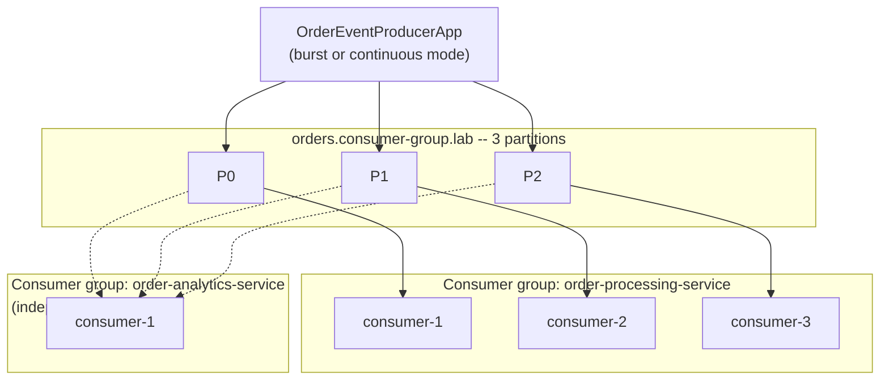

# Lab 04 — Consumer Groups & Rebalancing Engineering

## Quick Summary

- **Why this lab:** To prove, with real timestamps, how a consumer group actually divides work, what happens on join/leave, and why frequent rebalances have a real operational cost even on a perfectly healthy cluster.
- **How to run:** Start `platform/kafka/`, create the 3-partition lab topic, seed it (`runOrderProducer`), then run multiple `./gradlew runConsumer -PgroupId=<id> -PclientId=<id>` instances in separate terminals against the same group to watch ownership shift live; `./gradlew test` for the Testcontainers suite.
- **Expected input:** A running WP-02 cluster, JDK 21+; run 1–5+ consumer instances against a 3-partition topic to see the ceiling.
- **Expected output:** `PARTITIONS_REVOKED`/`PARTITIONS_ASSIGNED` log lines with real timestamps and partition lists; a 4th/5th consumer receiving a genuine, empty assignment; measured ~10s reassignment delay after an abrupt kill vs. near-instant reassignment on graceful shutdown.
- **What we learned:** Partition count is a hard ceiling on useful consumer-group parallelism — extra consumers beyond it are fully healthy and fully idle. Graceful departure costs almost nothing; an abruptly-killed consumer's partitions aren't reassigned until `session.timeout.ms` elapses (measured: ~9.7–10.9s against a 10s config). Under the eager `RangeAssignor` protocol, *every* member revokes its *entire* assignment on *every* rebalance, not just the partitions actually changing hands — this is why frequent rebalances hurt throughput even when each one resolves correctly. `max.poll.interval.ms` violations are detected by the background heartbeat thread independently of whether the slow foreground processing loop has even returned.

## Objective

This lab answers, with personal, measured, timestamped evidence:

> How does a Kafka consumer group actually divide work, what happens when
> a member joins or leaves, and why does that matter operationally?

By the end, you should be able to prove — not just recite — that
effective consumer parallelism is capped by partition count, that a
graceful departure and an abrupt failure produce completely different
reassignment timings, and that frequent rebalances have a real, measurable
cost even on a perfectly healthy cluster. The full conceptual and
Principal Engineer depth behind every experiment here lives in
[`docs/consumer-groups/CONSUMER_GROUPS_AND_REBALANCING.md`](../../docs/consumer-groups/CONSUMER_GROUPS_AND_REBALANCING.md);
read it alongside this lab.

This lab builds directly on
[`lab-02` (WP-03, native producer/consumer)](../lab-02-native-java-producer-consumer/README.md)
and
[`lab-03` (WP-04, partitioning)](../lab-03-partitioning-ordering/README.md)
without modifying either. It does not implement replication/ISR, Kafka
Streams, Schema Registry, Connect, Spring Kafka, transactions, or a
retry/DLQ architecture — those remain later work packages.

## Prerequisites

Same as `lab-02`/`lab-03`: the WP-02 Kafka environment running, a JDK 21+
(built and validated on JDK 26 targeting Java 21 bytecode), Docker for the
Testcontainers tests. Comfort with `lab-02`'s poll loop and graceful
`wakeup()`-based shutdown pattern is assumed — this lab reuses it rather
than re-explaining it.

### Why a separate project

Same convention as `lab-02` and `lab-03`: this lab is its own
self-contained Gradle project (identical Gradle 9.7.1 / Java 21 /
`kafka-clients:4.3.1` / Testcontainers 2.0.5 / JUnit Jupiter 6.1.3
versions, copied rather than shared) rather than a shared multi-module
build — see `lab-03`'s README for the rationale, not repeated here.

## Architecture



Both `GroupA` and `GroupB` read from the same three partitions
independently — the dashed lines are not a conflict with the solid ones;
see the "Independent consumer groups" experiment below for the real proof.
Every consumer here is a
[`ConsumerGroupMemberApp`](src/main/java/com/kafkalab/consumergroups/consumer/ConsumerGroupMemberApp.java)
instance, distinguished only by `-PclientId` and `-PgroupId`.

## Concepts

Kept brief — full depth is in
[`docs/consumer-groups/CONSUMER_GROUPS_AND_REBALANCING.md`](../../docs/consumer-groups/CONSUMER_GROUPS_AND_REBALANCING.md).

| Term | In one sentence |
|---|---|
| Consumer group | A named set of consumers dividing a topic's partitions between them. |
| Partition ownership | At most one member of a group actively owns a given partition at a time. |
| Rebalance | The process of re-dividing partitions among a group's current members. |
| `PARTITIONS_REVOKED` | Fired when this member is about to lose partitions, while it can still react. |
| `PARTITIONS_ASSIGNED` | Fired with the partitions this member now owns (can be empty). |
| `PARTITIONS_LOST` | Fired when partitions are taken away without a chance to react first. |
| `session.timeout.ms` | How long the coordinator waits without a heartbeat before declaring a member dead. |
| `max.poll.interval.ms` | How long between `poll()` calls before a member proactively leaves the group. |
| Static membership (`group.instance.id`) | An opt-in identity that survives a restart without triggering an immediate rebalance. |

## Setup

1. The WP-02 Kafka environment must be running:

   ```bash
   docker compose -f platform/kafka/docker-compose.yml up -d
   ```

2. Create this lab's topic with 3 partitions:

   ```bash
   docker exec kafka /opt/kafka/bin/kafka-topics.sh --bootstrap-server localhost:9092 \
     --create --topic orders.consumer-group.lab --partitions 3 --replication-factor 1
   ```

   Kafka itself will warn
   `topics with a period ('.') or underscore ('_') could collide` for
   metric names — a real, observed operational detail, not a lab
   simplification. This lab keeps the requested topic name anyway,
   specifically so that warning is something you see for yourself once,
   rather than something you're merely told about.

3. From this directory, build the project:

   ```bash
   ./gradlew build
   ```

   **Windows + Testcontainers:** if `./gradlew test` hangs, see
   [`lab-02`'s Testcontainers troubleshooting note](../lab-02-native-java-producer-consumer/README.md#testcontainers-test-hangs-or-times-out)
   — the same `DOCKER_HOST` fix applies unchanged.

## Commands

| Gradle task | Purpose |
|---|---|
| `./gradlew runOrderProducer -Pcount=30` | Seed the topic with a finite burst of keyed events. |
| `./gradlew runOrderProducer -Pmode=continuous -PdelayMs=200` | A continuous workload, for the rebalance-impact experiment. |
| `./gradlew runConsumer -PgroupId=<id> -PclientId=<id>` | Run one named consumer-group member. |
| `./gradlew runConsumer -PgroupId=<id> -PclientId=<id> -PprocessingDelayMs=<ms>` | Same, with a simulated per-record processing delay (slow-consumer experiment). |
| `./gradlew test` | The Testcontainers integration tests. |

Run `runConsumer` multiple times, in separate terminals, with the same
`-PgroupId` and different `-PclientId` values, to reproduce every ownership
and rebalancing experiment below.

## Implementation

```text
src/main/java/com/kafkalab/consumergroups/
  producer/
    OrderEventProducerApp.java     Seeds the topic (burst or continuous mode)
  consumer/
    ConsumerGroupMemberApp.java    One named group member, with full rebalance visibility
  support/
    LabConfig.java                 Shared config reader (copied from lab-02/lab-03)
```

`ConsumerGroupMemberApp` deliberately does not re-teach the poll loop or
auto-commit — `lab-02`'s `ConsumerApp` already does, thoroughly. What this
class adds is an explicit `ConsumerRebalanceListener`, logging
`PARTITIONS_REVOKED`/`PARTITIONS_ASSIGNED`/`PARTITIONS_LOST` with a
timestamp and the exact partition list, and three configuration values
shortened from Kafka's own defaults **specifically to make this lab's
failure-detection and slow-consumer experiments observable in a lab
session** (see that class's Javadoc for the exact values, defaults, and
reasoning — every one verified against the real `kafka-clients:4.3.1`
`ConsumerConfig` source, not assumed).

## Expected output

Every result shown in this README's Experiment section is real output
captured while building and validating this lab against the WP-02 Kafka
environment — not illustrative text. Exact timestamps, member IDs, and
which specific partition lands where will differ on your own run; the
*shape* of each result and the claims tied to it are what should
reproduce.

## Verification

- [ ] One consumer against 3 partitions owns all 3.
- [ ] Two consumers split 3 partitions (2-and-1, per `RangeAssignor`).
- [ ] Three consumers own exactly one partition each.
- [ ] A fourth and fifth consumer receive a real, empty
      `PARTITIONS_ASSIGNED` callback.
- [ ] Two independent groups both consume every record, independently,
      confirmed via `kafka-consumer-groups.sh --describe`.
- [ ] A consumer joining triggers a real, captured rebalance.
- [ ] A consumer leaving gracefully (proved via the Testcontainers test,
      given this environment's OS-signal limitation — see below) causes
      near-instant reassignment.
- [ ] An abruptly-killed consumer's partitions are reassigned only after
      a real, measured delay close to `session.timeout.ms`.
- [ ] A consumer processing too slowly triggers a real, verbatim
      `max.poll.interval.ms`-exceeded warning and a proactive
      `LeaveGroup`.
- [ ] `./gradlew test` passes all four Testcontainers tests.
- [ ] `lab-02` and `lab-03`'s own test suites still pass, unmodified.

## Experiment

### Experiment 1 — Partition ownership and consumer-group scaling

```bash
./gradlew runOrderProducer -Pcount=30
./gradlew runConsumer -PgroupId=order-processing-service -PclientId=consumer-1
```

Real result:

```text
consumer-1 | PARTITIONS_ASSIGNED | timestamp=2026-09-19T13:59:08.695Z | partitions=[orders.consumer-group.lab-0, orders.consumer-group.lab-1, orders.consumer-group.lab-2]
```

Add `consumer-2` (same group, new terminal):

```text
consumer-1 | PARTITIONS_REVOKED  | timestamp=2026-09-19T13:59:23.683Z | partitions=[P0, P1, P2]
consumer-1 | PARTITIONS_ASSIGNED | timestamp=2026-09-19T13:59:23.694Z | partitions=[P0, P1]
consumer-2 | PARTITIONS_ASSIGNED | timestamp=2026-09-19T13:59:23.708Z | partitions=[P2]
```

Add `consumer-3`:

```text
consumer-1 -> [P0]
consumer-2 -> [P1]
consumer-3 -> [P2]
```

Add `consumer-4` and `consumer-5`:

```text
consumer-4 | PARTITIONS_ASSIGNED | partitions=[]
consumer-5 | PARTITIONS_ASSIGNED | partitions=[]
```

**What this proves:** partition count is a hard ceiling on useful
consumer-group parallelism, not a soft suggestion — two fully-running,
correctly-joined consumers received a real, empty assignment because there
was nothing left to give them.

### Experiment 2 — Independent consumer groups

With data already produced above, start a consumer in a **different**
group:

```bash
./gradlew runConsumer -PgroupId=order-analytics-service -PclientId=consumer-1
```

Real CLI confirmation once both groups are caught up:

```text
GROUP                     PARTITION  CURRENT-OFFSET  LOG-END-OFFSET  LAG
order-analytics-service   0          8               8               0
order-analytics-service   1          15              15              0
order-analytics-service   2          7               7               0
order-processing-service  0          8               8               0
order-processing-service  1          15              15              0
order-processing-service  2          7               7               0
```

**What this proves:** both groups independently reached the same
log-end offsets with zero lag — a partition can be owned by only one
consumer *within* a group, but consumed independently by as many different
groups as exist.

### Experiment 3 — Rebalancing: join, graceful departure, abrupt failure

**A — join:** already demonstrated in Experiment 1.

**B — graceful departure:** proved directly (not via OS signal timing —
see [Troubleshooting](#windows-cannot-send-a-graceful-os-signal-to-a-background-consumer))
by
[`ConsumerGroupsRebalancingIntegrationTest.consumerLeavingCausesItsPartitionsToBeReassigned`](src/test/java/com/kafkalab/consumergroups/ConsumerGroupsRebalancingIntegrationTest.java):
a consumer's own `wakeup()`-based stop path sends `LeaveGroup`, and the
remaining member picks up every partition, asserted directly, with no
sleep-and-hope timing.

**C — abrupt failure**, run for real, twice:

```text
Trial 1: killed 14:02:15.886Z -> reassigned 14:02:25.594Z  (9.708s)
Trial 2: killed 14:03:45.442Z -> reassigned 14:03:56.310Z  (10.868s)
```

**What this proves:** graceful departure costs effectively nothing;
abrupt failure costs up to `session.timeout.ms` (10s in this lab, shortened
from Kafka's own 45s default) — both real trials landed close to that
configured value, confirming the coordinator's only way to notice a
silently-dead member is the absence of a heartbeat for that long.

### Experiment 4 — Rebalance impact under continuous load

```bash
./gradlew runOrderProducer -Pmode=continuous -PdelayMs=200
./gradlew runConsumer -PgroupId=rebalance-impact-demo -PclientId=consumer-1
./gradlew runConsumer -PgroupId=rebalance-impact-demo -PclientId=consumer-2
# then, after both have settled:
./gradlew runConsumer -PgroupId=rebalance-impact-demo -PclientId=consumer-3
```

Real, precisely-timestamped result when `consumer-3` joined:

```text
consumer-1 | PARTITIONS_REVOKED  | 14:03:23.290303100Z | [P0, P1]
consumer-2 | PARTITIONS_REVOKED  | 14:03:23.290303100Z | [P2]
consumer-1 | PARTITIONS_ASSIGNED | 14:03:23.300206600Z | [P0]
consumer-2 | PARTITIONS_ASSIGNED | 14:03:23.300206600Z | [P1]
consumer-3 | PARTITIONS_ASSIGNED | 14:03:23.311178900Z | [P2]
```

**What this proves:** `consumer-1` and `consumer-2` each revoked **every**
partition they owned, not just the one partition actually changing hands
— the real, observed cost of the negotiated `RangeAssignor`'s eager
rebalance protocol (confirmed via `protocol='range'` in every real log
this lab produced — see
[`docs/consumer-groups/CONSUMER_GROUPS_AND_REBALANCING.md`](../../docs/consumer-groups/CONSUMER_GROUPS_AND_REBALANCING.md#assignment-strategy-actually-used--verified-not-assumed)).
In this local lab the pause was on the order of 10ms; over a real network
with more members, that same stop-the-world window grows substantially —
this is precisely why frequent rebalances are operationally undesirable
even when every individual rebalance resolves correctly.

### Experiment 5 — Slow consumer / poison record

```bash
./gradlew runConsumer -PgroupId=slow-consumer-demo -PclientId=consumer-slow -PprocessingDelayMs=25000
```

Real, verbatim result (`max.poll.interval.ms` shortened to 20000 for this
lab):

```text
[kafka-coordinator-heartbeat-thread | slow-consumer-demo] WARN ConsumerCoordinator -
consumer poll timeout has expired. This means the time between subsequent calls to
poll() was longer than the configured max.poll.interval.ms, which typically implies
that the poll loop is spending too much time processing messages. You can address
this either by increasing max.poll.interval.ms or by reducing the maximum size of
batches returned in poll() with max.poll.records.

[kafka-coordinator-heartbeat-thread | slow-consumer-demo] INFO ConsumerCoordinator -
Member consumer-slow-... sending LeaveGroup request to coordinator ... due to
consumer poll timeout has expired.
```

**What this proves:** this fired from the **background heartbeat thread**,
roughly 20 seconds after assignment — *before* the foreground thread's
first 25-second processing delay had even finished. The background thread
detects a poll-interval violation and proactively leaves the group
independently of whether the slow foreground loop has returned — see
[`docs/consumer-groups/CONSUMER_GROUPS_AND_REBALANCING.md`](../../docs/consumer-groups/CONSUMER_GROUPS_AND_REBALANCING.md#slow-consumers-and-poison-records--real-result)
for what this means for a genuinely poison record in production.

## Failure injection

### Abrupt consumer failure

This is Experiment 3C, above — the dedicated "break it" exercise for this
lab. Run two consumers in one group, then:

```bash
# find the PID of one consumer and force-kill it (no graceful shutdown at all):
kill -9 <pid>            # Linux/macOS
taskkill /F /PID <pid>   # Windows
```

Watch the surviving consumer's log for `PARTITIONS_REVOKED` /
`PARTITIONS_ASSIGNED` and note the real elapsed time from the kill —
expect something close to this lab's configured `session.timeout.ms`
(10 seconds). Recovery is automatic: once the coordinator reassigns the
dead member's partitions, the survivor resumes consuming them from the
last committed offset — no manual intervention required, just the
observed delay.

## Troubleshooting

### Windows cannot send a graceful OS signal to a background consumer

Confirmed directly while validating this lab: `taskkill` without `/F`
against a background `java.exe` process refuses outright
(`This process can only be terminated forcefully`). This is a genuine
limitation of that specific automation path, not of graceful shutdown
itself — press **Ctrl+C** in a real interactive terminal running
`./gradlew runConsumer` instead, which does deliver the signal this
consumer's shutdown hook expects, or rely on
`ConsumerGroupsRebalancingIntegrationTest`'s direct, in-process proof of
the same mechanism.

### `UNKNOWN_TOPIC_OR_PARTITION`

Confirm `orders.consumer-group.lab` exists with 3 partitions — see
[Setup](#setup).

### A consumer never receives any records

Confirm you produced data first (`runOrderProducer`), and that you're
pointing at the same `-Pgroup Id`/`-Ptopic` you expect — a brand-new group
id always starts from `auto.offset.reset=earliest` in this lab, so it
should never appear silently empty if data actually exists.

### Testcontainers test hangs or times out

Same Windows/Docker-detection issue as `lab-02`/`lab-03` — see
[`lab-02`'s troubleshooting note](../lab-02-native-java-producer-consumer/README.md#testcontainers-test-hangs-or-times-out).

## Cleanup

```bash
docker exec kafka /opt/kafka/bin/kafka-topics.sh --bootstrap-server localhost:9092 --delete --topic orders.consumer-group.lab

docker compose -f platform/kafka/docker-compose.yml down        # keeps data
docker compose -f platform/kafka/docker-compose.yml down -v     # deletes everything
```

Testcontainers' own container is cleaned up automatically at the end of
`./gradlew test`.

## Production considerations

| Lab | Production |
|---|---|
| Up to 5 consumer processes on one machine | Consumer-group size capacity-planned against partition count (WP-04) |
| `taskkill /F` to simulate failure | Real crashes, OOM kills, node failures, network partitions |
| One broker (WP-02's environment) | A cluster where the coordinator itself can fail over |
| Manually observed rebalance timestamps | Continuous rebalance-rate/duration metrics, alerted on |
| `RangeAssignor` observed by default | A deliberate, evaluated choice of assignor/protocol |
| Shortened `session.timeout.ms`/`max.poll.interval.ms` for observability | Values chosen from a real failure-detection-latency vs. false-positive-eviction trade-off |
| No retry/DLQ handling for the slow-consumer scenario | A designed poison-record strategy (a later work package) |

See
[`docs/consumer-groups/CONSUMER_GROUPS_AND_REBALANCING.md`](../../docs/consumer-groups/CONSUMER_GROUPS_AND_REBALANCING.md)
for the full reasoning behind each row.

## Principal Engineer questions

**1. Why can't ten consumers in the same group fully utilize a
three-partition topic?**

Because a partition can be actively owned by only one member of a group
at a time — with three partitions, at most three members can be doing
real work simultaneously, no matter how many join. `Experiment 1`'s real
result showed consumers 4 and 5 receive a genuine, correctly-delivered
**empty** assignment, not an error — they are working exactly as designed,
just with nothing to do.

**2. What exactly causes a consumer-group rebalance?**

Any change to group membership or subscribed-topic metadata: a consumer
joining, a consumer leaving (gracefully or not), a consumer being declared
dead (session timeout or poll-interval violation), or a change to the
topic's partition count. Every one of these was demonstrated directly in
this lab's experiments.

**3. What happens to partition ownership during consumer failure?**

Nothing changes until the coordinator actually notices — which, for an
abrupt failure with no `LeaveGroup`, takes up to `session.timeout.ms`
(real measured trials: 9.7s and 10.9s against a 10s configured timeout).
Only after that delay are the failed member's partitions reassigned to
surviving members, who then resume from the last *committed* offset for
each.

**4. Why can frequent rebalances hurt throughput and latency?**

Under the eager protocol actually negotiated in this lab (`RangeAssignor`,
confirmed via `protocol='range'` in real logs), **every** member revokes
its **entire** assignment on **every** rebalance, not just members whose
ownership is actually changing — Experiment 4's real timestamps show two
consumers simultaneously giving up all their partitions to accommodate one
new member. Repeated rebalances mean repeated stop-the-world pauses across
the whole group, plus re-delivery of anything fetched-but-not-committed
before each one.

**5. What is the difference between session timeout and max poll
interval?**

`session.timeout.ms` is about **heartbeat liveness** — is this member's
background thread still checking in at all. `max.poll.interval.ms` is
about **processing-loop liveness** — is this member's foreground thread
still calling `poll()` often enough. This lab's real slow-consumer result
makes the distinction concrete: the background heartbeat thread detected
and acted on a `max.poll.interval.ms` violation entirely on its own,
independent of whether the foreground thread's heartbeats (governed by
`session.timeout.ms`) were otherwise fine.

**6. How does Kubernetes autoscaling interact with Kafka consumer
groups?**

Scale-up adds real parallelism only up to the partition count (question
1) and costs a rebalance for the *existing* members too, under the eager
protocol. Scale-down costs a graceful (Experiment B) or abrupt
(Experiment C) departure for every removed pod, depending on whether the
autoscaler respects the pod's shutdown grace period. An autoscaler with no
awareness of partition count can create exactly the "frequent rebalances"
cost question 4 describes, purely from routine scaling events.

**7. Why can adding consumers sometimes temporarily make performance
worse?**

Because adding one member triggers a rebalance that, under the eager
protocol, pauses **every** existing member simultaneously (Experiment 4's
real evidence) — for that brief window, consumption across the *entire*
group stops, not just the fraction of work moving to the new member. Only
after the pause does the group's aggregate throughput actually improve
(if it does at all — see question 1's ceiling).

**8. How do cooperative rebalancing approaches reduce disruption?**

`CooperativeStickyAssignor` — available in this lab's client but not the
protocol actually negotiated by default (verified: `protocol='range'`) —
lets members keep consuming partitions they are **not** losing, revoking
only the specific partitions actually moving, across up to two rebalance
rounds instead of the eager protocol's single full-stop round. It narrows
the "nobody is consuming this partition" window Experiment 4 measured; it
does not eliminate rebalancing itself.

**9. How would you diagnose a consumer group with rapidly increasing
lag?**

Check whether the group is actively rebalancing (frequent
`PARTITIONS_REVOKED`/`ASSIGNED` cycles — this lab's listener output is
exactly that signal, made visible), check per-partition lag rather than
only the group aggregate (WP-04's "a topic-level average can hide a
partition-level hotspot" applies to consumer lag too), and check whether
individual members are hitting `max.poll.interval.ms` violations
(Experiment 5's real warning is the exact log line to search for) before
assuming the cluster itself is slow.

**10. When should you increase consumers versus increase partitions?**

Increase consumers only up to the current partition count — beyond that,
extra consumers are provably idle (Experiment 1). Once consumer count
already matches partition count and more parallelism is genuinely needed,
partition count itself must grow — which is WP-04's territory entirely,
including its own real consequence (key remapping for future records,
verified there) that this lab's rebalancing costs are a separate concern
from.
