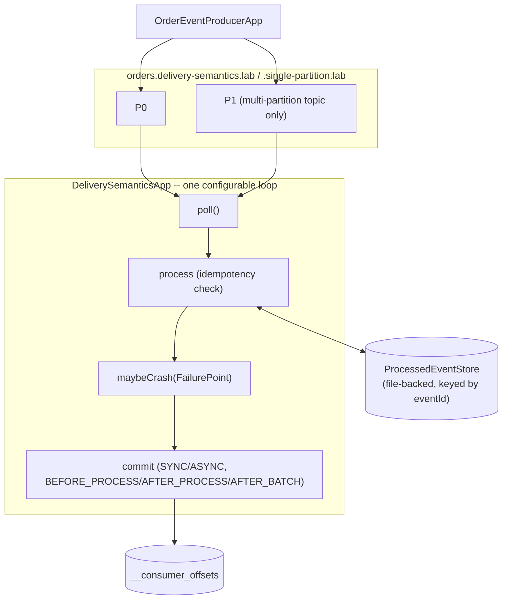

# Lab 05 — Offset Management & Delivery Semantics

## Objective

This lab answers, with real, captured, timestamped evidence:

> What is the actual difference between a record's offset, a consumer's
> position, and a group's committed offset — and how does the order of
> "process" versus "commit" determine whether a crash loses a record
> forever or reprocesses it?

By the end, you should be able to prove — not just recite — the
at-most-once loss window, the at-least-once duplicate window, why
auto-commit and manual commit trade risk differently, why batch-commit
granularity directly determines how much gets reprocessed after a
partial failure, and why commit strategy and rebalance handling cannot
be designed independently of each other. The full conceptual and
Principal Engineer depth behind every experiment here lives in
[`docs/delivery-semantics/DELIVERY_SEMANTICS_AND_OFFSET_MANAGEMENT.md`](../../docs/delivery-semantics/DELIVERY_SEMANTICS_AND_OFFSET_MANAGEMENT.md);
read it alongside this lab.

This lab builds directly on
[`lab-02` (WP-03, native producer/consumer)](../lab-02-native-java-producer-consumer/README.md)
and
[`lab-04` (WP-05, consumer groups and rebalancing)](../lab-04-consumer-groups-rebalancing/README.md)
without modifying either. It does not implement Kafka's idempotent
producers or transactions, the transactional outbox pattern, or a
production-grade idempotent-consumer/dedup-table implementation — those
remain WP-09, WP-12, and WP-13 respectively; see the conceptual doc's
"Scope note" for exactly why.

## Prerequisites

Same as `lab-02`/`lab-04`: the WP-02 Kafka environment running, a JDK 21+
(built and validated on JDK 26 targeting Java 21 bytecode), Docker for
the Testcontainers tests. Comfort with `lab-04`'s
`ConsumerRebalanceListener` and `wakeup()`-based shutdown pattern is
assumed — this lab reuses both rather than re-explaining them.

### Why a separate project

Same convention as every prior lab: this lab is its own self-contained
Gradle project (identical Gradle 9.7.1 / Java 21 / `kafka-clients:4.3.1`
/ Testcontainers 2.0.5 / JUnit Jupiter 6.1.3 versions, copied rather than
shared) rather than a shared multi-module build — see `lab-03`'s README
for the rationale, not repeated here.

## Architecture



Every experiment in this lab runs through the same
[`DeliverySemanticsApp`](src/main/java/com/kafkalab/deliverysemantics/consumer/DeliverySemanticsApp.java)
loop, parameterized by Gradle `-P` properties — see "Why one app instead
of many," below. A second, much simpler app,
[`OffsetLifecycleApp`](src/main/java/com/kafkalab/deliverysemantics/consumer/OffsetLifecycleApp.java),
exists solely for the offset-fundamentals experiment (record offset vs.
position vs. committed offset vs. restart vs. `auto.offset.reset`),
which does not need crash injection at all.

### Why one app instead of many

At-most-once, at-least-once, `commitSync` vs. `commitAsync`, auto-commit
vs. manual, batch-commit boundaries, idempotent processing, and the
rebalance interaction are not eight independent topics — they are eight
different settings on the *same* real poll-process-commit loop, and they
genuinely interact (an idempotent consumer changes what "duplicate"
means; commit granularity changes what a crash mid-batch actually loses;
auto-commit removes the application's control over both). One
configurable class, driven entirely by its `Config` record, keeps that
interaction real instead of simulated across eight near-duplicate
classes that would each only show one slice in isolation.

## Concepts

Kept brief — full depth is in
[`docs/delivery-semantics/DELIVERY_SEMANTICS_AND_OFFSET_MANAGEMENT.md`](../../docs/delivery-semantics/DELIVERY_SEMANTICS_AND_OFFSET_MANAGEMENT.md).

| Term | In one sentence |
|---|---|
| Record offset | A fixed property of a record, assigned once by the partition leader. |
| Consumer position | This consumer's own in-memory "next offset to fetch" bookmark — advances the instant `poll()` returns, whether or not the app has processed anything yet. |
| Committed offset | What the group has durably told Kafka is safe to resume from — lives in `__consumer_offsets`, changes only on an explicit (or auto-) commit. |
| At-most-once | Commit before processing — never reprocessed, can be permanently lost. |
| At-least-once | Process before committing — never silently lost, can be reprocessed (duplicated). |
| Idempotent consumer | An application-level "have I done this before?" check that makes a duplicate delivery harmless. |
| `FailurePoint` | This lab's deterministic, named crash-injection point (`BEFORE_PROCESS`, `AFTER_PROCESS_BEFORE_COMMIT`, `AFTER_COMMIT_BEFORE_PROCESS`) — reproducible on demand, never a random kill. |

## Setup

1. The WP-02 Kafka environment must be running:

   ```bash
   docker compose -f platform/kafka/docker-compose.yml up -d
   ```

2. Create this lab's topics:

   ```bash
   docker exec kafka /opt/kafka/bin/kafka-topics.sh --bootstrap-server localhost:9092 \
     --create --topic orders.delivery-semantics.lab --partitions 2 --replication-factor 1

   docker exec kafka /opt/kafka/bin/kafka-topics.sh --bootstrap-server localhost:9092 \
     --create --topic orders.delivery-semantics.single-partition.lab --partitions 1 --replication-factor 1
   ```

   The single-partition topic exists specifically so the at-most-once,
   at-least-once, idempotent, and batch-boundary experiments below have
   fully deterministic, sequential offsets to reason about — the
   2-partition topic is used only for the per-partition-independence and
   rebalance experiments, where more than one partition is the point.

3. From this directory, build the project:

   ```bash
   ./gradlew build
   ```

   **Windows + Testcontainers:** if `./gradlew test` hangs, see
   [`lab-02`'s Testcontainers troubleshooting note](../lab-02-native-java-producer-consumer/README.md#testcontainers-test-hangs-or-times-out)
   — the same `DOCKER_HOST` fix applies unchanged.

## Commands

| Gradle task | Purpose |
|---|---|
| `./gradlew runProducer -Ptopic=<t> -Pcount=<n> -PstartEventNumber=<n>` | Seed a topic with sequential, `eventId`-tagged order events. |
| `./gradlew runOffsetLifecycle -PgroupId=<id> -PmaxRecords=<n>` | The offset-fundamentals experiment (position vs. committed vs. restart vs. `auto.offset.reset`). |
| `./gradlew runDeliverySemantics -P...` | The crash-injection-capable consumer — see the flag reference below. |
| `./gradlew test` | The Testcontainers integration tests. |

`runDeliverySemantics` flag reference (every flag has a sensible
default — see `build.gradle`):

| Flag | Values | Meaning |
|---|---|---|
| `-PcommitTiming` | `BEFORE_PROCESS`, `AFTER_PROCESS` (default), `AFTER_BATCH` | When this record's (or this batch's) offset is committed relative to processing. |
| `-PcommitMode` | `SYNC` (default), `ASYNC` | `commitSync()` vs. `commitAsync()`. |
| `-PfailurePoint` | `NONE` (default), `BEFORE_PROCESS`, `AFTER_PROCESS_BEFORE_COMMIT`, `AFTER_COMMIT_BEFORE_PROCESS` | Where to throw a `SimulatedCrashException`. |
| `-PcrashAtEventId` | an `eventId`, or empty (default) | Only crash at this specific record; empty crashes at every record hitting `failurePoint`. |
| `-PfailAtEventId` | an `eventId`, or empty (default) | A *business* failure (not a crash) at this record — halts the current batch; used for the batch-boundary experiment. |
| `-Pidempotent` | `true`, `false` (default) | Check/record `eventId`s in a durable `ProcessedEventStore` before applying a side effect. |
| `-PautoCommit` | `true`, `false` (default) | `enable.auto.commit=true`, skipping every manual commit call in this loop. |
| `-PmaxRecords` | an integer, `0` = unbounded (default) | Stop after this many successfully-processed (non-duplicate) records. |
| `-PprocessingDelayMs` | milliseconds, `0` (default) | An artificial per-record delay — used for the rebalance-interaction experiment. |

## Implementation

```text
src/main/java/com/kafkalab/deliverysemantics/
  producer/
    OrderEventProducerApp.java      Seeds a topic with eventId-tagged, keyed order events
  consumer/
    OffsetLifecycleApp.java         Offset fundamentals: position vs. committed vs. restart vs. auto.offset.reset
    DeliverySemanticsApp.java       The configurable crash-injection poll-process-commit loop
  support/
    OrderEvent.java                 The record value's wire format (eventId|customerId|amount)
    FailurePoint.java               The 4-value deterministic crash-injection enum
    SimulatedCrashException.java    Thrown at a configured FailurePoint; never caught gracefully
    ProcessedEventStore.java        File-backed idempotency store, keyed by eventId, scoped per group
    LabConfig.java                  Shared config reader (copied from lab-02/03/04, extended with typed getters)
```

`DeliverySemanticsApp.run()` is a `static` method taking an
already-constructed `KafkaConsumer` and `ProcessedEventStore` as
parameters — deliberately, so both `main()` (the real CLI entry point,
which exits abruptly via `System.exit(1)` on a `SimulatedCrashException`,
matching a real crash) and this lab's integration tests (which catch the
same exception directly and construct a fresh `KafkaConsumer` to
simulate a deterministic, in-process restart) drive the exact same
production code path. See that class's Javadoc for the full per-record
loop pseudocode and — importantly — the documented account of a real
bug this lab's own validation caught and fixed (see "A commit-on-revoke
design that looked right and was not" in the conceptual doc).

## Expected output

Every result shown in this README's Experiment section is real output
captured while building and validating this lab against the WP-02 Kafka
environment — not illustrative text. Exact timestamps, member IDs, and
producer-assigned partitions will differ on your own run; the *shape* of
each result and the claims tied to it are what should reproduce.

## Verification

- [ ] `OffsetLifecycleApp` shows `position != committed offset` for a
      partially-committed batch, and a restart replays exactly the
      uncommitted tail.
- [ ] At-least-once (`AFTER_PROCESS_BEFORE_COMMIT`) reprocesses exactly
      one record after a crash.
- [ ] At-most-once (`AFTER_COMMIT_BEFORE_PROCESS`) permanently skips
      exactly one record after a crash.
- [ ] Idempotent mode (`idempotent=true`) shows `DUPLICATE_SKIPPED` for
      the same redelivered record, instead of reprocessing it.
- [ ] Auto-commit crashing before its interval elapses replays the
      *entire* processed batch, strictly more than manual per-record
      commit would.
- [ ] `AFTER_BATCH` commit with a mid-batch failure replays strictly
      more records than `AFTER_PROCESS` commit with the same failure.
- [ ] Two partitions on the same topic/group show independent committed
      offsets via `kafka-consumer-groups.sh --describe`.
- [ ] `./gradlew test` passes all 6 Testcontainers tests.
- [ ] `lab-02`, `lab-03`, and `lab-04`'s own test suites still pass,
      unmodified.

## Experiment

### Experiment 1 — Offset fundamentals: position vs. committed vs. restart vs. `auto.offset.reset`

```bash
./gradlew runProducer -Ptopic=orders.delivery-semantics.lab -Pcount=5
./gradlew runOffsetLifecycle -PgroupId=offset-lifecycle-demo -PmaxRecords=4
```

Real result (phase 1 — first run, deliberately committing everything
except the last fetched record):

```text
fetched record: partition=0 recordOffset=0 key=CUSTOMER-101 value=eventId=ORDER-1001|...
  -> consumer position for partition=0 is now 4 (next offset to fetch)
...
committed offsets after committing everything except the last fetched record:
  partition=0 committed=OffsetAndMetadata{offset=3, ...} position=4  <-- position != committed offset
```

Real result (phase 2 — a second, independent consumer instance, same
group, simulating a restart):

```text
replayed record: partition=0 recordOffset=3 key=CUSTOMER-101 value=eventId=ORDER-1005|...
  this restart resumed at the last committed offset (3) -- not at phase 1's in-memory position
```

**What this proves:** `position` advances the instant `poll()` returns
records, independent of whether the application loop has actually
finished with them; only a committed offset survives a restart. See the
conceptual doc's "Offset fundamentals" section for the full result,
including the `auto.offset.reset` phase.

### Experiment 2 — At-least-once: process, then commit

```bash
./gradlew runProducer -Ptopic=orders.delivery-semantics.single-partition.lab -Pcount=5
./gradlew runDeliverySemantics -Ptopic=orders.delivery-semantics.single-partition.lab \
  -PgroupId=at-least-once-demo -PclientId=consumer-1 \
  -PcommitTiming=AFTER_PROCESS -PfailurePoint=AFTER_PROCESS_BEFORE_COMMIT -PcrashAtEventId=ORDER-1003
```

Real result:

```text
consumer-1 | partition=0 | offset=2 | eventId=ORDER-1003 | attempt=1 | status=SUCCESS
consumer-1 | SIMULATED_CRASH | Simulated crash at AFTER_PROCESS_BEFORE_COMMIT for eventId=ORDER-1003
consumer-1 | exiting abruptly WITHOUT consumer.close() -- no LeaveGroup is sent, ...
```

Restart (fresh consumer instance, same group):

```bash
./gradlew runDeliverySemantics -Ptopic=orders.delivery-semantics.single-partition.lab \
  -PgroupId=at-least-once-demo -PclientId=consumer-2 -PmaxRecords=2
```

```text
consumer-2 | partition=0 | offset=2 | eventId=ORDER-1003 | attempt=1 | status=SUCCESS   <-- reprocessed
consumer-2 | partition=0 | eventId=ORDER-1003 | commitSync -> COMMITTED committedOffset=3
```

**What this proves:** `ORDER-1003` was processed twice — once before
the crash, once again after restart. At-least-once delivery working
exactly as designed.

### Experiment 3 — At-most-once: commit, then process

```bash
./gradlew runDeliverySemantics -Ptopic=orders.delivery-semantics.single-partition.lab \
  -PgroupId=at-most-once-demo -PclientId=consumer-1 \
  -PcommitTiming=BEFORE_PROCESS -PfailurePoint=AFTER_COMMIT_BEFORE_PROCESS -PcrashAtEventId=ORDER-1003
```

Real result:

```text
consumer-1 | partition=0 | eventId=ORDER-1003 | commitSync -> COMMITTED committedOffset=3
consumer-1 | SIMULATED_CRASH | Simulated crash at AFTER_COMMIT_BEFORE_PROCESS for eventId=ORDER-1003
```

Restart:

```text
consumer-2 | partition=0 | offset=3 | eventId=ORDER-1004 | attempt=1 | status=SUCCESS   <-- jumps straight past 1003
```

**What this proves:** `ORDER-1003` is gone permanently — not delayed,
not retried. The sharpest possible illustration of why committing before
processing is dangerous.

### Experiment 4 — Idempotent consumer

Same crash point as Experiment 2, `-Pidempotent=true`:

```bash
./gradlew runDeliverySemantics -Ptopic=orders.delivery-semantics.single-partition.lab \
  -PgroupId=idempotent-demo-clean -PclientId=consumer-1 -Pidempotent=true \
  -PcommitTiming=AFTER_PROCESS -PfailurePoint=AFTER_PROCESS_BEFORE_COMMIT -PcrashAtEventId=ORDER-1008
# ... crash, then restart with -PclientId=consumer-2 -Pidempotent=true
```

Real result on restart:

```text
consumer-2 | partition=0 | offset=7 | eventId=ORDER-1008 | attempt=1 | status=DUPLICATE_SKIPPED
consumer-2 | partition=0 | eventId=ORDER-1008 | commitSync -> COMMITTED committedOffset=8
```

**What this proves:** Kafka still redelivered `ORDER-1008` — identical
to Experiment 2. The difference is entirely in the application: its
business effect was not reapplied, because a durable idempotency check
recognized it. Offset still advances (so the consumer doesn't spin on
the duplicate forever).

### Experiment 5 — Auto-commit vs. manual commit

```bash
./gradlew runProducer -Ptopic=orders.delivery-semantics.single-partition.lab -Pcount=6 -PstartEventNumber=16
./gradlew runDeliverySemantics -Ptopic=orders.delivery-semantics.single-partition.lab \
  -PgroupId=auto-commit-demo -PclientId=consumer-1 -PautoCommit=true \
  -PfailurePoint=AFTER_PROCESS_BEFORE_COMMIT -PcrashAtEventId=ORDER-1018
```

Real result — 18 records processed in well under the 5-second default
auto-commit interval, then crashed:

```text
consumer-1 | partition=0 | offset=17 | eventId=ORDER-1018 | attempt=1 | status=SUCCESS
consumer-1 | SIMULATED_CRASH | Simulated crash at AFTER_PROCESS_BEFORE_COMMIT for eventId=ORDER-1018
```

```text
$ kafka-consumer-groups.sh --describe --group auto-commit-demo
GROUP             TOPIC  PARTITION  CURRENT-OFFSET  LOG-END-OFFSET  LAG
auto-commit-demo  ...    0          -               21              -
```

**What this proves:** zero offsets committed — all 18 records replay
from scratch on restart. A materially larger duplicate blast radius than
Experiment 2's single duplicate, because the auto-commit interval simply
hadn't elapsed yet. Not "auto-commit is broken" — auto-commit did
exactly what its interval says it will.

### Experiment 6 — Batch-commit boundaries: whole-batch vs. safe partial progress

Same failure (`-PfailAtEventId=ORDER-1014`, a *business* failure, not a
crash), same data, two commit strategies:

```bash
# AFTER_BATCH:
./gradlew runDeliverySemantics ... -PcommitTiming=AFTER_BATCH -PfailAtEventId=ORDER-1014
```

```text
consumer-2 | partition=0 | offset=12 | eventId=ORDER-1013 | status=SUCCESS
consumer-2 | partition=0 | offset=13 | eventId=ORDER-1014 | status=FAILED
consumer-2 | BATCH_NOT_COMMITTED | whole-batch-commit semantics: ...

$ kafka-consumer-groups.sh --describe --group batch-boundary-demo-2
... CURRENT-OFFSET=10  LOG-END-OFFSET=15  LAG=5
```

```bash
# AFTER_PROCESS, identical failure:
./gradlew runDeliverySemantics ... -PcommitTiming=AFTER_PROCESS -PfailAtEventId=ORDER-1014
```

```text
consumer-2 | partition=0 | eventId=ORDER-1013 | commitSync -> COMMITTED committedOffset=13
consumer-2 | partition=0 | offset=13 | eventId=ORDER-1014 | status=FAILED

$ kafka-consumer-groups.sh --describe --group batch-boundary-safe-demo
... CURRENT-OFFSET=13  LOG-END-OFFSET=15  LAG=2
```

**What this proves:** identical failure, identical data — 5 records must
be replayed under whole-batch-commit versus 2 under per-record commit.
Purely a function of commit granularity. See the conceptual doc for the
partition-ordering implication (replay is always "from the committed
offset forward, in order," never a selective skip).

### Experiment 7 — Per-partition offset independence

```bash
./gradlew runProducer -Ptopic=orders.delivery-semantics.lab -Pcount=12 -PstartEventNumber=100
./gradlew runDeliverySemantics -Ptopic=orders.delivery-semantics.lab -PgroupId=per-partition-demo ...
```

Real result once fully caught up:

```text
$ kafka-consumer-groups.sh --describe --group per-partition-demo
GROUP               TOPIC                          PARTITION  CURRENT-OFFSET  LOG-END-OFFSET  LAG
per-partition-demo  orders.delivery-semantics.lab  0          13              13              0
per-partition-demo  orders.delivery-semantics.lab  1          4               4               0
```

**What this proves:** each `(group, topic, partition)` tracks its own
committed offset entirely independently — partition 0 reached 13,
partition 1 reached 4, both fully caught up, neither influenced by the
other's progress.

### Experiment 8 — Rebalance and commit strategy interaction

```bash
./gradlew runProducer -Ptopic=orders.delivery-semantics.lab -Pcount=8 -PstartEventNumber=200
./gradlew runDeliverySemantics -Ptopic=orders.delivery-semantics.lab \
  -PgroupId=rebalance-interaction-demo -PclientId=consumer-1 \
  -PcommitTiming=AFTER_BATCH -PprocessingDelayMs=1500
```

Real, unplanned, and highly instructive result — `consumer-1` took
longer than `max.poll.interval.ms` (20s default) to finish processing
one large poll batch (24 records × 1.5s each), and its own background
heartbeat thread proactively evicted it from the group mid-batch:

```text
consumer-1 | partition=1 | offset=5 | eventId=ORDER-1204 | status=SUCCESS

ConsumerCoordinator - Failing OffsetCommit request since the consumer is not
  part of an active group

Exception in thread "main" org.apache.kafka.clients.consumer.CommitFailedException:
  Offset commit cannot be completed since the consumer is not part of an active
  group for auto partition assignment; it is likely that the consumer was kicked
  out of the group.
```

Every one of the 24 records had already been successfully processed.
`AFTER_BATCH`'s single end-of-batch commit call is what finally
discovered the eviction — and by then, none of those 24 offsets could be
committed at all. A second consumer joining afterward started from
offset 0 on that partition and began replaying the entire batch.

**What this proves:** a large batch under `AFTER_BATCH` commit timing is
an implicit bet that the whole batch finishes inside
`max.poll.interval.ms`. A rebalance (here, self-inflicted by a slow
batch, but identical in effect to one triggered by a new member joining
or an existing one leaving) can invalidate an entire batch's pending
commit in one blow, no matter how much of it already succeeded — see
the conceptual doc's "Rebalance and commit strategy" section for the
full account, including a real bug this exact experiment caught and
fixed in this lab's own code.

## Failure injection

Every experiment above **is** this lab's failure-injection content —
every one of them is a real, deterministic, reproducible simulated crash
or business failure, using the `FailurePoint`/`failAtEventId` mechanism
specifically so none of it depends on randomly killing a process. See
[`SimulatedCrashException`](src/main/java/com/kafkalab/deliverysemantics/support/SimulatedCrashException.java)'s
Javadoc for exactly how a "crash" here differs from a graceful shutdown
(no `consumer.close()`, no `LeaveGroup`), and why that distinction
matters for how quickly a partition becomes available for reassignment.

## Troubleshooting

### A `DeliverySemanticsApp` run seems to hang in `poll()` forever

Check the group's committed offset first:
`kafka-consumer-groups.sh --describe --group <id>`. If `CURRENT-OFFSET`
already equals `LOG-END-OFFSET`, there is nothing left to fetch — this
is expected, not a hang, if a prior run already consumed everything for
that group. This is exactly how this lab's own real
`onPartitionsRevoked` bug was discovered and confirmed (see the
conceptual doc) — a thread dump showing the main thread parked in
`ClassicKafkaConsumer.poll` was the fastest way to confirm it was
genuinely waiting for data, not deadlocked.

### `CommitFailedException`

Expected and instructive if you configured `-PprocessingDelayMs` high
enough (combined with enough records) to exceed `max.poll.interval.ms`
— see Experiment 8. If unexpected, check whether another consumer in
the same group evicted this one via a normal rebalance.

### `UNKNOWN_TOPIC_OR_PARTITION`

Confirm both lab topics exist — see [Setup](#setup).

### Testcontainers test hangs or times out

Same Windows/Docker-detection issue as every prior lab — see
[`lab-02`'s troubleshooting note](../lab-02-native-java-producer-consumer/README.md#testcontainers-test-hangs-or-times-out).

## Cleanup

```bash
docker exec kafka /opt/kafka/bin/kafka-topics.sh --bootstrap-server localhost:9092 --delete --topic orders.delivery-semantics.lab
docker exec kafka /opt/kafka/bin/kafka-topics.sh --bootstrap-server localhost:9092 --delete --topic orders.delivery-semantics.single-partition.lab

docker compose -f platform/kafka/docker-compose.yml down        # keeps data
docker compose -f platform/kafka/docker-compose.yml down -v     # deletes everything
```

The `ProcessedEventStore` also writes small flat files under
`%TEMP%/kafka-lab-05-processed-events/<groupId>.txt` (or the OS
equivalent) — delete that directory to reset every idempotent-consumer
experiment's durable state, or call `ProcessedEventStore.reset()`
directly, as this lab's own tests do.

Testcontainers' own container is cleaned up automatically at the end of
`./gradlew test`.

## Production considerations

| Lab | Production |
|---|---|
| `System.exit(1)` on a configured `FailurePoint` | A real crash: OOM kill, node failure, `kill -9`, scheduler eviction |
| Flat-file `ProcessedEventStore`, single process | A real dedup store (table with a unique constraint, or a keyed cache), sized for real event volume/retention |
| One commit strategy per experiment, chosen to demonstrate a specific risk | One commit strategy per consumer, chosen deliberately once, matched to that consumer's actual duplicate cost |
| Manually triggered evictions/rebalances | Rebalances from real deploys, autoscaling, genuine failures, at production cadence |
| Small, hand-produced topics | Partition counts and volumes sized for real throughput needs (WP-04) |
| stdout logging only | Consumer lag, commit-failure rate, and rebalance frequency alerted on (WP-16) |

See
[`docs/delivery-semantics/DELIVERY_SEMANTICS_AND_OFFSET_MANAGEMENT.md`](../../docs/delivery-semantics/DELIVERY_SEMANTICS_AND_OFFSET_MANAGEMENT.md)
for the full reasoning behind each row, the delivery-semantics
comparison table, and the dual-write problem.

## Principal Engineer questions

The full, detailed answers to all 14 questions this work package poses
live in
[`docs/delivery-semantics/DELIVERY_SEMANTICS_AND_OFFSET_MANAGEMENT.md`](../../docs/delivery-semantics/DELIVERY_SEMANTICS_AND_OFFSET_MANAGEMENT.md#principal-engineer-questions),
each grounded in this lab's own real, captured results rather than
restated abstractly here. In summary, this lab's experiments were
designed to let you answer, from evidence:

1. What is the difference between "processed" and "committed"?
2. Why does at-least-once require idempotent consumers?
3. When would you choose `earliest` vs. `latest` for `auto.offset.reset`?
4. What's the danger of `commitAsync()` retries specifically?
5. Why is commit-then-process rarely the right default?
6. How do you decide the right commit granularity?
7. What does Kafka's exactly-once semantics actually guarantee, and what does it not?
8. What is the dual-write problem, concretely?
9. Why can't ordinary offset commits alone solve the dual-write problem?
10. What's the actual difference between idempotent-consumer and transactional-outbox?
11. Doesn't a non-transactional idempotency check just move the dual-write problem down one level?
12. How does static membership interact with commit strategy?
13. Why does `AFTER_BATCH` show a strictly worse outcome than `AFTER_PROCESS` here, and is it ever still right?
14. What would you check first if consumer lag spiked after a deploy?
