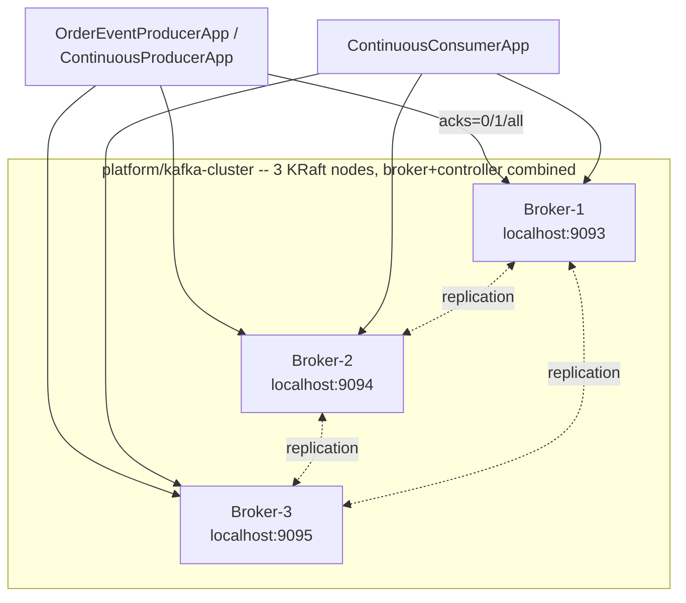

# Lab 06 — Replication, ISR & Broker Failure

## Objective

This lab answers, with real, captured, timestamped evidence, against a
genuine 3-node KRaft cluster:

> What exactly happens to a Kafka partition when its leader broker dies?
> How do replication factor, ISR, `acks`, and `min.insync.replicas`
> interact?

By the end, you should be able to prove — not just recite — that
`Replicas ≠ ISR`, that RF=1 has zero fault tolerance while RF=2 survives
a leader failure cleanly, that `acks=all` is enforced against
`min.insync.replicas` rather than against replication factor, and that a
recovering broker does not instantly return to full duty. The full
conceptual and Principal Engineer depth behind every experiment here
lives in
[`docs/replication/REPLICATION_ISR_AND_BROKER_FAILURE.md`](../../docs/replication/REPLICATION_ISR_AND_BROKER_FAILURE.md);
read it alongside this lab.

This lab builds on
[`lab-02` (WP-03, native producer/consumer)](../lab-02-native-java-producer-consumer/README.md)
and
[`lab-05` (WP-06, offset management & delivery semantics)](../lab-05-offset-management-delivery-semantics/README.md)
without modifying either. It does not implement KRaft controller-quorum
failure (WP-08), Kafka transactions/EOS (WP-09), Schema Registry
(WP-10), CDC/Debezium (WP-11), or the transactional outbox (WP-12) —
this lab is scoped to data-plane replication and broker failure only.

## Prerequisites

A JDK 21+ (built and validated on JDK 26 targeting Java 21 bytecode),
Docker for both the multi-broker environment and the Testcontainers
tests. Comfort with `lab-02`'s poll loop and `lab-05`'s crash-injection
framing is assumed.

### Why a separate project

Same convention as every prior lab: this lab is its own self-contained
Gradle project (identical Gradle 9.7.1 / Java 21 / `kafka-clients:4.3.1`
/ Testcontainers 2.0.5 / JUnit Jupiter 6.1.3 versions) rather than a
shared multi-module build.

## Architecture



See [`platform/kafka-cluster/README.md`](../../platform/kafka-cluster/README.md)
for the full topology, port scheme, and startup/shutdown commands.

## Concepts

Kept brief — full depth is in
[`docs/replication/REPLICATION_ISR_AND_BROKER_FAILURE.md`](../../docs/replication/REPLICATION_ISR_AND_BROKER_FAILURE.md).

| Term | In one sentence |
|---|---|
| Replicas | Every broker assigned to hold a copy of a partition — fixed at creation, doesn't change when a broker dies. |
| ISR | The subset of Replicas currently caught up enough to be trusted for `acks=all` — changes continuously. |
| Leader | The one replica (always in ISR) that clients actually talk to. |
| `acks=0/1/all` | Fire-and-forget / leader-only / full-ISR acknowledgment. |
| `min.insync.replicas` | The minimum ISR size `acks=all` requires before accepting a write. |
| Unclean leader election | Electing a leader from *outside* ISR — trades availability for possible data loss; disabled by default. |

## Setup

1. Start the multi-broker cluster:

   ```bash
   docker compose -f platform/kafka-cluster/docker-compose.yml up -d
   ```

   See [`platform/kafka-cluster/README.md`](../../platform/kafka-cluster/README.md)
   for verifying all three brokers registered.

2. Create this lab's topics:

   ```bash
   docker exec kafka-broker-1 /opt/kafka/bin/kafka-topics.sh --bootstrap-server kafka-broker-1:19092 \
     --create --topic replicated-orders --partitions 3 --replication-factor 3

   docker exec kafka-broker-1 /opt/kafka/bin/kafka-topics.sh --bootstrap-server kafka-broker-1:19092 \
     --create --topic minisr-demo --partitions 1 --replication-factor 3 --config min.insync.replicas=2

   docker exec kafka-broker-1 /opt/kafka/bin/kafka-topics.sh --bootstrap-server kafka-broker-1:19092 \
     --create --topic rf1-demo --partitions 1 --replication-factor 1

   docker exec kafka-broker-1 /opt/kafka/bin/kafka-topics.sh --bootstrap-server kafka-broker-1:19092 \
     --create --topic rf2-demo --partitions 1 --replication-factor 2
   ```

3. From this directory, build the project:

   ```bash
   ./gradlew build
   ```

   **Windows + Testcontainers:** if `./gradlew test` hangs, see
   [`lab-02`'s Testcontainers troubleshooting note](../lab-02-native-java-producer-consumer/README.md#testcontainers-test-hangs-or-times-out).

## Commands

| Gradle task | Purpose |
|---|---|
| `./gradlew runProducer -Ptopic=<t> -Packs=<0\|1\|all> -Psync=<bool> -Pidempotence=<bool>` | Burst-produce, configurable acks/sync-mode — used for Experiments 6, 7, 8. |
| `./gradlew runContinuousProducer -Ppartition=0 -PdelayMs=400` | Produce indefinitely to one fixed partition — kill/restart a broker while it runs (Experiment 4/13). |
| `./gradlew runContinuousConsumer -PgroupId=<id>` | Consume indefinitely, alone in its own group — kill/restart a broker while it runs (Experiment 14). |
| `./gradlew test` | The Testcontainers integration tests (own isolated 3-broker cluster, ports 19401-19403). |

## Implementation

```text
src/main/java/com/kafkalab/replication/
  producer/
    OrderEventProducerApp.java      Burst producer; configurable acks/sync/idempotence
    ContinuousProducerApp.java      Long-running, single-partition, outer-loop retry + ADMIN_QUERY leader logging
  consumer/
    ContinuousConsumerApp.java      Long-running, single-consumer-group, for the failover experiment
  support/
    OrderEvent.java                  Wire format
    PartitionMetadataLookup.java     AdminClient wrapper -- deliberately separate from the send/poll path
    LabConfig.java                   Shared config reader
src/test/java/com/kafkalab/replication/
  support/ThreeBrokerKafkaCluster.java   Testcontainers-driven 3-node KRaft cluster (mirrors platform/kafka-cluster/)
  ReplicationIsrBrokerFailureIntegrationTest.java
```

See `ContinuousProducerApp`'s Javadoc for exactly what "attempt" and
"leader" mean in its log output, and why neither is fabricated beyond
what the Kafka client API actually exposes.

## Expected output

Every result in this README's Experiment section is real output captured
while building and validating this lab against the actual 3-broker
cluster — not illustrative text. Exact timestamps, which broker becomes
leader, and recovery durations will differ on your own run (leader
assignment is not deterministic across runs); the *shape* of each result
is what should reproduce.

## Verification

- [ ] `replicated-orders` describes with `Leader`/`Replicas`/`Isr` populated per partition.
- [ ] Killing a leader broker elects a new one and previously-produced records remain consumable.
- [ ] `Replicas` stays constant across a broker failure; `Isr` shrinks and later re-expands.
- [ ] RF=1's sole replica dying makes the partition `Leader: none`.
- [ ] RF=2 survives one broker failure via clean leader failover.
- [ ] `acks=0` always reports `offset=-1`.
- [ ] An `acks=all` write succeeds with ISR exactly at `min.insync.replicas` and is rejected below it.
- [ ] `./gradlew test` passes all 6 Testcontainers tests.
- [ ] `lab-02` through `lab-05`'s own test suites still pass, unmodified.

## Experiment

### Experiment 1-3 — Cluster formation, topic replication, leader/follower

See [Setup](#setup) for cluster/topic creation and verification commands,
and the conceptual doc's "The three numbers that describe a partition's
replication state" for the full real `--describe` output and the
Leader/Replicas/ISR distinction.

### Experiment 4 — Broker failure

```bash
./gradlew runContinuousProducer -Ppartition=0 -PdelayMs=400 -PleaderCheckEveryN=3
# in another terminal, once it's running against partition 0's leader (broker-2 in this run):
docker kill kafka-broker-2
```

Real, captured (full sequence in the conceptual doc):

```text
eventId=ORDER-CP-33 ... attempt=1 result=FAILED ... TimeoutException
eventId=ORDER-CP-33 ... attempt=2 result=FAILED ... TimeoutException
eventId=ORDER-CP-33 ... attempt=3 result=FAILED ... TimeoutException
eventId=ORDER-CP-33 ... offset=34 attempt=4 result=SUCCESS latencyMs=262
ADMIN_QUERY ... leader=3 replicas=[2, 3, 1] isr=[3, 1]
```

**What this proves:** ~9.7 seconds from kill to resumed production, 3
failed outer-loop attempts against the dead leader, then success against
the newly-elected one. `Replicas` unchanged; `Isr` shrank.

### Experiment 5 — Broker recovery

```bash
docker start kafka-broker-2
```

Real, captured (~20s later):

```text
Isr: 1,2,3
```

**What this proves:** broker 2 rejoined ISR, but partition 0's leader
stayed on broker 3 — restart and leadership return are two different
events. See the conceptual doc for the `auto.leader.rebalance.enable`
explanation.

### Experiment 6 — Replication factor

```bash
./gradlew runProducer -Ptopic=rf1-demo -Pcount=2
docker kill kafka-broker-3   # rf1-demo's sole replica
docker exec kafka-broker-2 /opt/kafka/bin/kafka-topics.sh --bootstrap-server kafka-broker-2:19092 --describe --topic rf1-demo
```

Real result: `Leader: none`. Contrast with `rf2-demo` (leader killed
instead, replica on the other broker survives): clean failover, produce
still succeeds. Full evidence in the conceptual doc's "Replication
factor" section.

### Experiment 7 — `acks`

```bash
./gradlew runProducer -Packs=0 -Psync=true -Pcount=5
./gradlew runProducer -Packs=1 -Psync=true -Pcount=5
./gradlew runProducer -Packs=all -Psync=true -Pcount=5
```

Real result: `acks=0` always reports `offset=-1`. See the conceptual
doc's "honest negative result" for why `acks=1` vs. `acks=all` showed no
meaningful latency difference at this lab's scale, and why that's a real
finding, not a gap in the experiment.

### Experiment 8 — `min.insync.replicas` (the central experiment)

```bash
./gradlew runProducer -Ptopic=minisr-demo -Packs=all -Psync=true -Pcount=1  # ISR=3, succeeds
docker kill kafka-broker-3
./gradlew runProducer -Ptopic=minisr-demo -Packs=all -Psync=true -Pcount=1  # ISR=2, still succeeds
docker kill kafka-broker-1
./gradlew runProducer -Ptopic=minisr-demo -Packs=all -Pidempotence=false -Psync=true -Pcount=1  # ISR would be 1
```

Real result: the last attempt failed with `TimeoutException` after the
full delivery timeout, rather than an immediate clean rejection — traced
to a genuine structural discovery this lab made while building it: in
this lab's combined broker+controller topology, crossing
`min.insync.replicas` here also breaks controller-quorum majority. Full
account, plus the automated test's clean reproduction using a
topology-safe RF=2 topic, in the conceptual doc's `min.insync.replicas`
section — **read it before running this one**, it explains a real
"unexpected result" rather than a bug in this lab.

Restore with `docker start kafka-broker-1 kafka-broker-3` afterward.

### Experiment 13 — Producer retry during broker failure

This is Experiment 4, above — `ContinuousProducerApp` **is** the
producer-retry experiment; see its Javadoc and the conceptual doc for
the full attempt-by-attempt evidence and exactly what "attempt" and
"leader" do and don't mean in its output.

### Experiment 14 — Consumer behavior during broker failure

```bash
./gradlew runContinuousProducer -Ppartition=0 -PdelayMs=400
./gradlew runContinuousConsumer -PgroupId=consumer-failover-demo
# in another terminal, once both are running:
docker kill kafka-broker-3   # whichever broker currently leads partition 0
```

Real result: ~13.3 seconds of `DisconnectException`/coordinator-
rediscovery churn, then consumption resumed automatically. See the
conceptual doc's "Consumer behavior during broker failure" section for
the full log and the explicit leader-election-vs-rebalance distinction
this experiment is designed to keep unambiguous (one consumer, one
group — a rebalance is structurally impossible here).

## Failure injection

Every experiment above **is** this lab's failure-injection content —
`docker kill`/`docker start` against a real container, never a mock.
Unlike `lab-05`'s in-process `SimulatedCrashException`, broker failure
here is injected at the infrastructure level, because the thing being
tested (replication across real, separate broker processes) cannot be
faithfully simulated inside a single JVM.

## Troubleshooting

### `AdminClient`/CLI commands hang or throw `UnknownHostException`/connection-refused when run via `docker exec`

Use the **internal** listener (`kafka-broker-N:19092`), never
`localhost:909X`, when running CLI tools via `docker exec` — see
[`platform/kafka-cluster/README.md`](../../platform/kafka-cluster/README.md)
for exactly why, discovered for real while building this lab.

### A `min.insync.replicas` produce attempt hangs for a long time instead of failing quickly

If the producer is idempotent (the client default), its startup
`InitProducerId` handshake can itself block for `max.block.ms` if the
broker it needs is unreachable — pass `-Pidempotence=false` for this
specific experiment, as the README's Experiment 8 does. See
`OrderEventProducerApp`'s inline comment for the full account of this
being discovered live while building this lab.

### `kafka-topics.sh --describe` shows a stale ISR after killing 2 of 3 brokers

Expected in this lab's combined-role topology — see the conceptual
doc's "structural discovery" in the `min.insync.replicas` section. This
is not a hang; confirm with a thread dump or simply wait for controller
quorum majority to be restored (bring a killed broker back).

### Testcontainers test hangs or times out

Same Windows/Docker-detection issue as every prior lab — see
[`lab-02`'s troubleshooting note](../lab-02-native-java-producer-consumer/README.md#testcontainers-test-hangs-or-times-out).

## Cleanup

```bash
docker exec kafka-broker-1 /opt/kafka/bin/kafka-topics.sh --bootstrap-server kafka-broker-1:19092 --delete --topic replicated-orders
docker exec kafka-broker-1 /opt/kafka/bin/kafka-topics.sh --bootstrap-server kafka-broker-1:19092 --delete --topic minisr-demo
docker exec kafka-broker-1 /opt/kafka/bin/kafka-topics.sh --bootstrap-server kafka-broker-1:19092 --delete --topic rf1-demo
docker exec kafka-broker-1 /opt/kafka/bin/kafka-topics.sh --bootstrap-server kafka-broker-1:19092 --delete --topic rf2-demo

docker compose -f platform/kafka-cluster/docker-compose.yml down        # keeps data
docker compose -f platform/kafka-cluster/docker-compose.yml down -v     # deletes everything
```

The WP-02 single-node environment (`platform/kafka/`) is entirely
unaffected by any of the above.

## Production considerations

See the conceptual doc's [Production considerations](../../docs/replication/REPLICATION_ISR_AND_BROKER_FAILURE.md#production-considerations)
table for the full reasoning — summary: separate controller/broker roles
at real scale, expect real network latency to make `acks=1` vs.
`acks=all` differences visible (unlike this lab's loopback network), and
alert on `UnderReplicatedPartitions`/ISR-shrink metrics rather than
polling `kafka-topics --describe` by hand.

## Principal Engineer questions

The full, detailed answers to all 11 questions this work package poses
live in
[`docs/replication/REPLICATION_ISR_AND_BROKER_FAILURE.md`](../../docs/replication/REPLICATION_ISR_AND_BROKER_FAILURE.md#principal-engineer-questions),
each grounded in this lab's own real, captured results:

1. Why isn't replication factor alone a durability guarantee?
2. What exactly is ISR?
3. What happens when the partition leader dies?
4. Why can `acks=all` still be misunderstood?
5. How does `min.insync.replicas` affect availability?
6. RF=3/minISR=2 vs. RF=3/minISR=1 — what trade-off changes?
7. Why might a restarted broker not immediately join ISR?
8. Leader election vs. consumer-group rebalance?
9. When can Kafka lose acknowledged records?
10. How would you diagnose under-replicated partitions in production?
11. What configuration would you choose for a financial transaction topic, and what trade-offs would you explicitly document?
