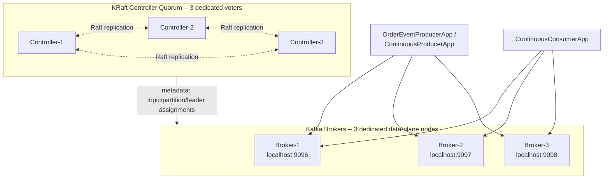

# Lab 07 — KRaft Controller Quorum & Failure

## Quick Summary

- **Why this lab:** To prove, against a real dedicated-role KRaft cluster (separate controllers and brokers), that the control plane and data plane are genuinely independent failure domains — and where that independence stops holding.
- **How to run:** Start `platform/kraft-quorum/` (3 dedicated controllers + 3 dedicated brokers), create the lab topic, then `docker kill` individual controller containers (one, then two of three) while running `runContinuousProducer`/`runContinuousConsumer`, and inspect quorum state with `./gradlew describeQuorum`; `./gradlew test` for the isolated Testcontainers suite.
- **Expected input:** Docker, JDK 21+; real controller kills via `docker kill kafka-controller-N`.
- **Expected output:** A new controller leader elected within ~6s of a kill; ordinary produce/consume traffic showing zero interruption across a controller kill; metadata mutations (create/alter/delete) succeeding with 2/3 controllers but failing/timing out with only 1/3 — while `--list` still works even then.
- **What we learned:** One controller failure is not a control-plane outage as long as majority (2 of 3) remains — ordinary data-plane traffic is completely indifferent to controller failure, as long as no partition leader also changes. But "existing traffic continues" during total quorum loss does *not* mean the cluster can react to a *new* failure: electing a new partition leader is itself a metadata mutation, so a broker dying while quorum is unavailable produces a sustained, non-self-healing outage for that partition until quorum returns — the exact seam connecting WP-07 (replication) and WP-08 (KRaft quorum).

## Objective

This lab answers, with real, captured, timestamped evidence, against a
genuine dedicated-role KRaft cluster:

> What exactly happens when the active KRaft controller fails? Why can
> Kafka continue serving existing data when the metadata quorum is
> impaired, yet fail certain administrative operations?

By the end, you should be able to prove — not just recite — that a
3-voter quorum tolerates exactly one controller failure, that ordinary
produce/consume traffic is entirely indifferent to controller failure
as long as no partition leader also changes, that metadata mutations
require quorum majority while some read-only operations don't, and that
"the data plane kept working" does not mean "the cluster can recover
from a new failure." The full conceptual and Principal Engineer depth
behind every experiment here lives in
[`docs/kraft/KRAFT_CONTROLLER_QUORUM_AND_FAILURE.md`](../../docs/kraft/KRAFT_CONTROLLER_QUORUM_AND_FAILURE.md);
read it alongside this lab.

This lab builds on
[`lab-02` (WP-03, native producer/consumer)](../lab-02-native-java-producer-consumer/README.md)
and connects directly to
[`lab-06` (WP-07, replication, ISR & broker failure)](../lab-06-replication-isr-broker-failure/README.md)
without modifying either. It does not implement Kafka transactions/EOS
(WP-09), schema evolution (WP-10), Kafka Connect/CDC (WP-11), the
transactional outbox (WP-12), or a full production monitoring stack
(WP-16) — this lab is scoped to KRaft control-plane architecture and
failure behavior only.

## Prerequisites

A JDK 21+ (built and validated on JDK 26 targeting Java 21 bytecode),
Docker for both the multi-node environment and the Testcontainers
tests. Comfort with `lab-06`'s broker-failure experiments and real
`kafka-topics --describe` evidence is assumed.

### Why a separate project

Same convention as every prior lab: this lab is its own self-contained
Gradle project (identical Gradle 9.7.1 / Java 21 / `kafka-clients:4.3.1`
/ Testcontainers 2.0.5 / JUnit Jupiter 6.1.3 versions).

## Architecture



See [`platform/kraft-quorum/README.md`](../../platform/kraft-quorum/README.md)
for the full topology, why it deliberately differs from WP-07's
combined-role cluster, and startup/shutdown commands.

## Concepts

Kept brief — full depth is in
[`docs/kraft/KRAFT_CONTROLLER_QUORUM_AND_FAILURE.md`](../../docs/kraft/KRAFT_CONTROLLER_QUORUM_AND_FAILURE.md).

| Term | In one sentence |
|---|---|
| Controller quorum | The set of KRaft voter nodes that replicate and commit Kafka's cluster metadata via Raft consensus. |
| Active controller | The one voter currently authorized to commit new metadata — the quorum's Raft leader. |
| Majority | `floor(n/2)+1` voters; a 3-voter quorum's majority is 2, tolerating exactly 1 failure. |
| Observer | A non-voting node (every broker, in this lab) that replicates the metadata log but cannot vote or become leader. |
| Control plane | Controller quorum, metadata mutations, cluster management. |
| Data plane | Producers, partition leaders, consumers, replication. |

## Setup

1. Start the dedicated controller/broker cluster:

   ```bash
   docker compose -f platform/kraft-quorum/docker-compose.yml up -d
   ```

   See [`platform/kraft-quorum/README.md`](../../platform/kraft-quorum/README.md)
   for verifying the quorum formed and brokers registered as observers.

2. Create this lab's topic:

   ```bash
   docker exec kraft-quorum-broker-1 /opt/kafka/bin/kafka-topics.sh \
     --bootstrap-server kraft-quorum-broker-1:19092 \
     --create --topic quorum-orders --partitions 3 --replication-factor 3
   ```

3. From this directory, build the project:

   ```bash
   ./gradlew build
   ```

   **Windows + Testcontainers:** if `./gradlew test` hangs, see
   [`lab-02`'s Testcontainers troubleshooting note](../lab-02-native-java-producer-consumer/README.md#testcontainers-test-hangs-or-times-out).

## Commands

| Gradle task | Purpose |
|---|---|
| `./gradlew runProducer -Pcount=<n>` | Burst-produce order events (synchronous by default). |
| `./gradlew runContinuousProducer -PdelayMs=400` | Produce indefinitely to the existing topic — never creates a topic or mutates metadata, on purpose. |
| `./gradlew runContinuousConsumer -PgroupId=<id>` | Consume indefinitely, for the same data-plane-continuity experiments. |
| `./gradlew describeQuorum` | Print quorum status via `AdminClient.describeMetadataQuorum()` — the Java-API equivalent of `kafka-metadata-quorum.sh describe --status`. |
| `./gradlew test` | The Testcontainers integration tests (own isolated dedicated-role cluster). |

## Implementation

```text
src/main/java/com/kafkalab/controllerquorum/
  producer/
    OrderEventProducerApp.java      Burst producer, synchronous by default
    ContinuousProducerApp.java      Long-running -- never mutates metadata, only produces
  consumer/
    ContinuousConsumerApp.java      Long-running consumer for the same experiments
  support/
    OrderEvent.java                  Wire format
    LabConfig.java                   Shared config reader
    DescribeQuorumApp.java           Admin.describeMetadataQuorum() CLI wrapper
src/test/java/com/kafkalab/controllerquorum/
  support/ControllerQuorumCluster.java   Testcontainers-driven dedicated-role KRaft cluster
  ControllerQuorumFailureIntegrationTest.java
```

## Expected output

Every result in this README's Experiment section is real output
captured while building and validating this lab against the actual
dedicated-role cluster — not illustrative text. Exact timestamps and
which specific controller becomes leader will differ on your own run;
the *shape* of each result is what should reproduce.

## Verification

- [ ] `describe --status` shows 3 voters and 3 observers (the brokers).
- [ ] Killing the active controller elects a new leader among the survivors.
- [ ] Ordinary produce/consume traffic is unaffected by a controller failure.
- [ ] Metadata operations (create/alter/delete/describe) succeed with 2/3 controllers.
- [ ] Metadata mutations fail/time out with only 1/3 controllers; `--list` notably still works.
- [ ] Existing produce/consume traffic survives total quorum loss.
- [ ] A partition-leader failure during quorum loss produces a sustained, non-self-healing outage for that partition.
- [ ] Restoring quorum majority resumes both metadata operations and the stuck partition.
- [ ] `./gradlew test` passes all 5 Testcontainers tests.
- [ ] `lab-02` through `lab-06`'s own test suites still pass, unmodified.

## Experiment

### Experiments 2-4 — Quorum fundamentals, inspection, active controller

```bash
docker exec kraft-quorum-broker-1 /opt/kafka/bin/kafka-metadata-quorum.sh \
  --bootstrap-server kraft-quorum-broker-1:19092 describe --status
```

Real result:

```text
LeaderId:               3
LeaderEpoch:            1
CurrentVoters:          [{"id": 1, ...}, {"id": 2, ...}, {"id": 3, ...}]
CurrentObservers:       [{"id": 4, ...}, {"id": 5, ...}, {"id": 6, ...}]
```

**What this proves:** the 3 brokers are observers, not voters — real,
direct evidence of the role separation this lab's topology exists to
demonstrate (contrast with `lab-06`'s cluster, where this same field is
always empty). See the conceptual doc for every field explained and the
majority-math behind "3 controllers, majority = 2."

### Experiment 5 — Controller leader failure

```bash
docker kill kafka-controller-3   # whichever controller is currently LeaderId
```

Real result within ~6 seconds:

```text
LeaderId:               2      # was 3
LeaderEpoch:            3      # was 1
```

**What this proves:** a new leader was elected from the surviving
voters — do not assume which one in advance.

### Experiment 6 — Data-plane traffic during controller failure

```bash
./gradlew runContinuousProducer &
./gradlew runContinuousConsumer &
docker kill kafka-controller-2   # the current leader
```

Real result: producer and consumer logs show **zero interruption**
across the exact kill timestamp — no error, no latency spike. See the
conceptual doc's control-plane-vs-data-plane table for why.

### Experiment 7 — Metadata operations with 2/3 controllers

```bash
docker exec kraft-quorum-broker-1 /opt/kafka/bin/kafka-topics.sh --bootstrap-server kraft-quorum-broker-1:19092 \
  --create --topic disposable-topic --partitions 1 --replication-factor 1
```

Real result: `Created topic disposable-topic.` — succeeded normally
with one controller down. Create, alter-config, describe, and delete
all succeeded in this lab's real run. **One controller failure ≠
control-plane outage**, as long as majority remains.

### Experiments 8-9 — Quorum loss and blocked metadata operations

```bash
docker kill kafka-controller-1 kafka-controller-3   # only 1 of 3 remains
```

Real, captured — **not uniform across operations**:

```text
kafka-metadata-quorum.sh describe --status  -> TimeoutException
kafka-topics.sh --list                      -> SUCCEEDS (broker's local metadata cache)
kafka-topics.sh --describe --topic <name>   -> FAILS (an internal listPartitionReassignments call needs the controller)
kafka-topics.sh --create ...                -> FAILS (TimeoutException / DisconnectException)
kafka-configs.sh --alter ...                 -> FAILS (TimeoutException / DisconnectException)
```

**What this proves:** do not assume every operation fails identically —
see the conceptual doc's full table and explanation of exactly why
`--list` differs from `--describe`.

### Experiment 10 — Existing traffic during total quorum loss

With the same quorum-loss state as above and the continuous
producer/consumer still running:

Real result: traffic continued **completely uninterrupted for over 30
seconds** with zero controller-quorum majority.

### Experiment 11 — Broker failure while quorum is unavailable (connects WP-07 and WP-08)

```bash
docker kill kraft-quorum-broker-2   # the broker leading the partition being produced to
```

Real, captured — this is the critical result:

```text
04:00:02.678Z  eventId=ORDER-CP-1199 ... result=SUCCESS
                       <- broker (partition leader) killed ->
04:00:09.081Z  eventId=ORDER-CP-1200 result=FAILED exception=TimeoutException
... (sustained failure, no self-recovery, for as long as quorum stayed down) ...
```

**What this proves:** "existing traffic continues" (Experiment 10) does
**not** mean "the cluster can react to a new failure." Electing a new
partition leader is itself a metadata mutation, and with no quorum
available to process it, the partition is stuck — permanently, until
quorum returns. See the conceptual doc for the full account and why
this is the experiment that ties WP-07 and WP-08 together.

### Experiment 12 — Controller recovery

```bash
docker start kafka-controller-1   # majority (2/3) returns
```

Real result: within 15 seconds, `create-topic` succeeded again, and the
stuck partition from Experiment 11 got a new leader — both producer and
consumer resumed automatically, no manual intervention.

## Failure injection

Every experiment above **is** this lab's failure-injection content —
`docker kill`/`docker start` against real containers, never a mock,
exactly like `lab-06`. Unlike a data-plane broker kill, a controller
kill exercises an entirely separate failure domain, which is the whole
point of this lab's dedicated-role topology.

## Troubleshooting

### CLI commands hang or fail with `UnknownHostException` when run via `docker exec`

Use the **internal** listener (`kraft-quorum-broker-N:19092`), never
`localhost:909X`, when running CLI tools via `docker exec` — see
[`platform/kraft-quorum/README.md`](../../platform/kraft-quorum/README.md).

### `kafka-topics.sh --describe` hangs or fails, but `--list` works fine

Expected with controller quorum unavailable — see this README's
Experiment 8-9 and the conceptual doc's explanation of the internal
`listPartitionReassignments` call `--describe` bundles in.

### Testcontainers test hangs or times out

Same Windows/Docker-detection issue as every prior lab — see
[`lab-02`'s troubleshooting note](../lab-02-native-java-producer-consumer/README.md#testcontainers-test-hangs-or-times-out).

## Cleanup

```bash
docker exec kraft-quorum-broker-1 /opt/kafka/bin/kafka-topics.sh \
  --bootstrap-server kraft-quorum-broker-1:19092 --delete --topic quorum-orders

docker compose -f platform/kraft-quorum/docker-compose.yml down        # keeps data
docker compose -f platform/kraft-quorum/docker-compose.yml down -v     # deletes everything
```

The WP-02 (`platform/kafka/`) and WP-07 (`platform/kafka-cluster/`)
environments are entirely unaffected.

## Production considerations

See the conceptual doc's [Production architecture discussion](../../docs/kraft/KRAFT_CONTROLLER_QUORUM_AND_FAILURE.md#production-architecture-discussion)
for the full reasoning — summary: dedicated controllers make sense once
data-plane load is large enough to risk destabilizing the control
plane; a small/cost-sensitive cluster may reasonably accept the
combined-role coupling `lab-06` identified instead. No single topology
is correct for every deployment size.

## Principal Engineer questions

The full, detailed answers to all 12 questions this work package poses
live in
[`docs/kraft/KRAFT_CONTROLLER_QUORUM_AND_FAILURE.md`](../../docs/kraft/KRAFT_CONTROLLER_QUORUM_AND_FAILURE.md#principal-engineer-questions),
each grounded in this lab's own real, captured results:

1. What problem does the KRaft controller solve?
2. What is stored in Kafka's metadata log?
3. Why are three controllers commonly used?
4. What happens when the active controller dies?
5. Can Kafka operate with two of three controllers?
6. What happens with only one of three controllers?
7. Can producers continue when controller quorum is unavailable?
8. Why can existing traffic continue while topic creation fails?
9. Controller leader vs. partition leader?
10. What happens if a partition leader fails while controller quorum is unavailable?
11. Why separate controllers and brokers in larger production clusters?
12. How would you diagnose a KRaft quorum problem in production?
